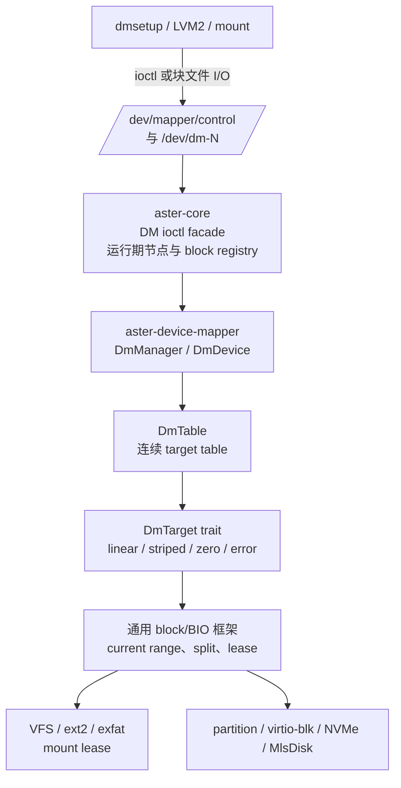
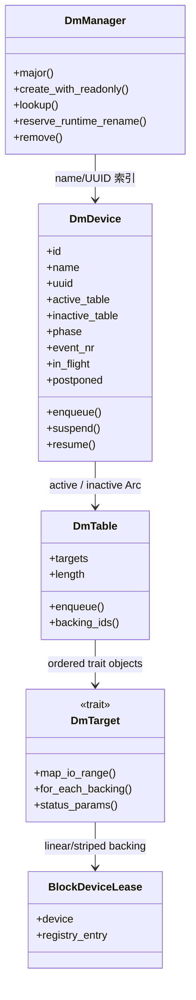
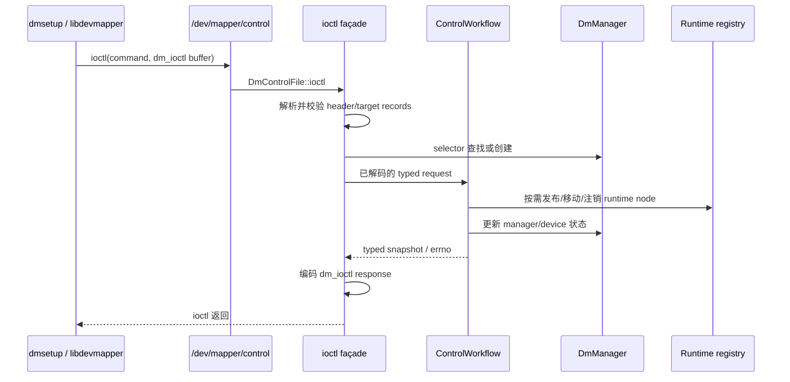
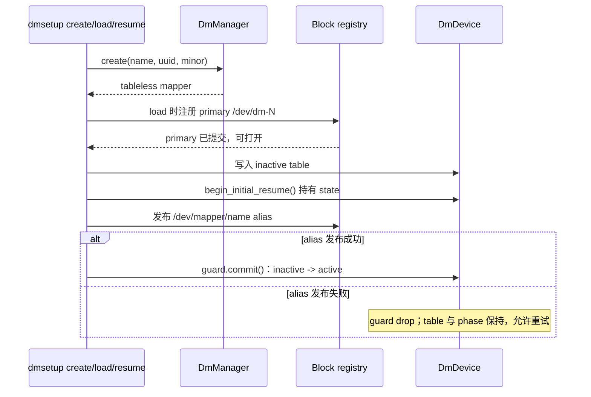
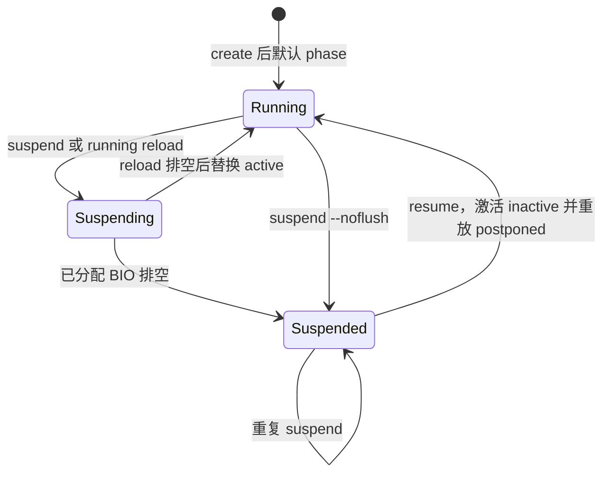
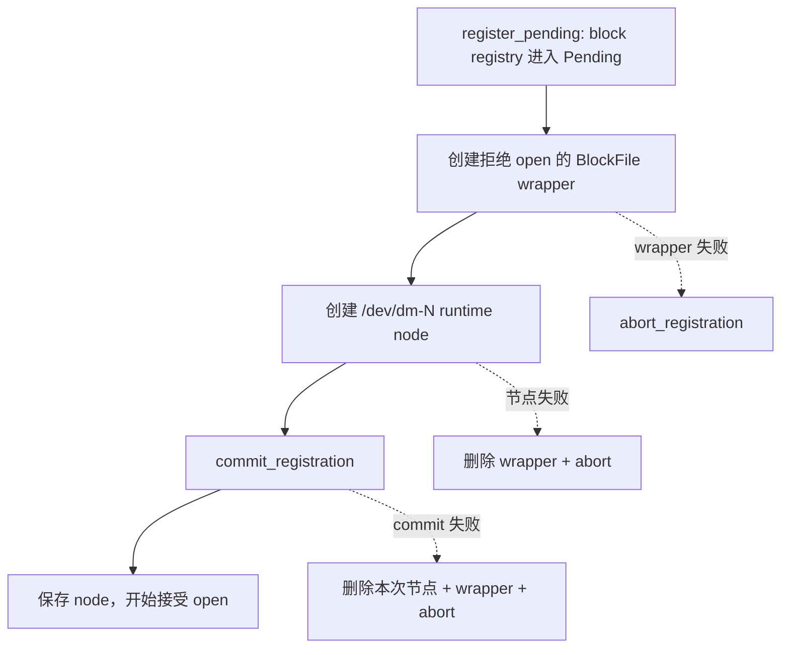
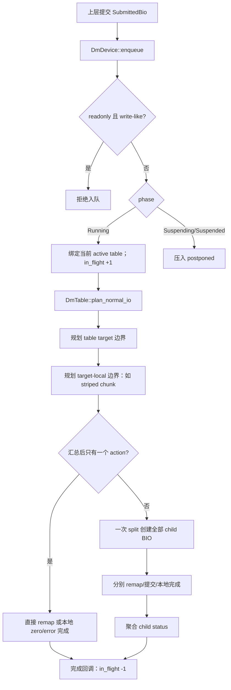
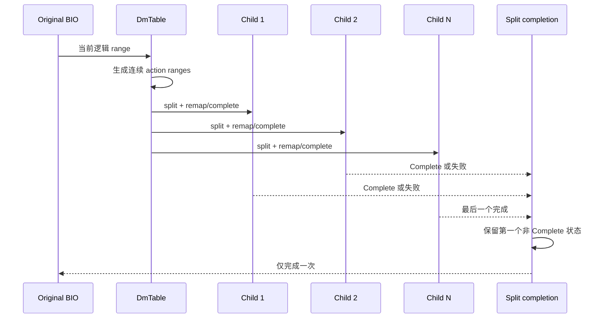
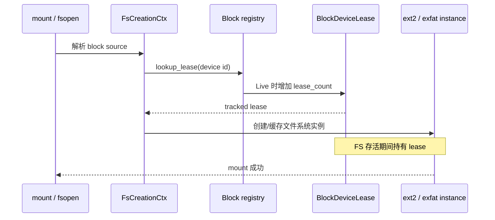

# Asterinas Device Mapper 技术设计与实现说明

> **文档定位**：面向代码评审、维护与后续 target 扩展的实现型技术文档。
> **源码基线**：`dm` 分支当前工作区，核验日期：2026-09-17。
> **事实来源**：本文关于当前行为的结论以源码为准；[non-device-mapper-change-rationale.md](non-device-mapper-change-rationale.md) 仅用于交叉核对改动文件范围，不替代源码。
> **图示说明**：本文所有图均为 Mermaid 源码图，可随 Markdown 一同版本管理与 review。图中省略了与主路径无关的通用 VFS、调度和驱动细节。

## 执行摘要

Asterinas 当前的 Device Mapper（DM）实现将 Linux 用户态的 `/dev/mapper/control` ioctl ABI 接入独立的 `aster-device-mapper` crate，并将 mapper 作为可在运行期注册、打开、挂载和注销的块设备。实现覆盖 `linear`、`striped`、`zero` 和 `error` target；支持连续多 segment table、跨 target/chunk 的 BIO 拆分、子 BIO 完成聚合、table reload、suspend/resume、rename、remove、status、deps 和 wait 等控制面语义。

实现的关键不是单次 I/O 能否落到 backing device，而是保持以下边界正确：

1. **控制面与数据面分层**：ioctl ABI、devtmpfs 节点和 VFS registry 留在 `aster-core`；mapper 状态机、table 和 target 留在独立 DM crate。
2. **运行期发布事务**：首次 table load 发布 `/dev/dm-N`，首次 resume 再发布 `/dev/mapper/<name>` 并激活 table；失败时保留可重试状态。
3. **I/O 代际隔离**：运行期 table replacement 会排空已分配 BIO；`--noflush` suspend 保留旧 BIO 的 table 引用，后续 BIO 延迟到 resume 后按新 table 重放。
4. **堆叠 I/O 语义**：BIO 同时保存提交时的原始 range 与当前 block layer 的 range；DM/partition 仅重映射当前 range，driver 使用重映射后的 range。
5. **生命周期保护**：tracked `BlockDeviceLease` 被 table target 和已挂载文件系统长期持有，阻止 backing 或 mapper 在仍被使用时注销。

当前实现不是完整 Linux DM 生态的宣称：不支持 DM-on-DM stacking、deferred remove、IMA measurement、snapshot/mirror/crypt 等复杂 target，也不覆盖 udev、sysfs 和完整 queue-stacking 语义。

---

## 1. 文档范围、阅读方式与事实约定

### 1.1 目标读者

- 评审 DM control ABI、mapper 生命周期和 I/O 正确性的内核维护者；
- 需要定位 dmsetup/LVM2 用户可见行为的开发者；
- 后续新增 target 或调整 block/BIO 框架的实现者。

### 1.2 本文回答的问题

1. 用户态 `dmsetup`/LVM2 命令如何进入 Asterinas 内核？
2. mapper 的 name、UUID、minor、设备节点、table 和 I/O 状态如何共同演进？
3. 一次跨 target 或跨 striped chunk 的 BIO 如何被映射、拆分和完成？
4. mapper、backing device 与文件系统 mount 如何避免资源提前释放？
5. 当前能力的实现边界、错误路径和测试代码覆盖在哪里？

### 1.3 事实、设计约束与限制

| 标记 | 含义 | 采用方式 |
|---|---|---|
| **当前实现** | 可由当前工作区源码直接核验的行为 | 正文默认采用此类表述，并给出源码链接 |
| **设计约束** | 由当前状态机、资源所有权或 ABI 边界要求推出的不变量 | 说明违反后的错误或竞态风险 |
| **当前限制** | 源码明确拒绝、未实现或无法承诺的能力 | 不将其描述为已兼容行为 |
| **验证覆盖** | 测试代码或系统 suite 的覆盖设计 | 不等同于本轮实际已执行的测试结果 |

### 1.4 术语

| 术语 | 含义 |
|---|---|
| mapper | 一个 `DmDevice`，既是控制面对象，也是 `BlockDevice` 实现 |
| table | 一个不可变的 `DmTable`，由连续的 target 组成 |
| target | table 中负责一个逻辑 sector 子区间映射的实现，例如 linear 或 striped |
| logical range | 上层对 mapper 可见的 sector 区间 |
| current range | 当前 block layer 实际应处理的 BIO sector 区间 |
| active / inactive table | 当前服务 I/O 的 table 与已装载、等待激活的 table |
| primary node | `/dev/dm-N` 运行期块设备节点 |
| mapper alias | 指向 primary node 的 `/dev/mapper/<name>` 符号链接 |
| tracked lease | 绑定 block registry 条目、会增加 `lease_count` 的 `BlockDeviceLease` |
| postponed BIO | mapper suspended 时已接受、尚未绑定 table generation 的 BIO |

### 1.5 阅读导览

本文不是按源码目录顺序罗列实现，而是沿三条可独立阅读、最终汇合的主线组织：

| 阅读目标 | 建议路径 | 最终应建立的认识 |
|---|---|---|
| 先理解系统全貌 | 执行摘要 → 第 3 章 → 第 12 章 | 用户命令如何穿过 ABI、状态机、table 和 block layer |
| 评审控制面 | 第 4～6 章 → 第 11 章 | 设备身份、节点、table slot、事件和失败回滚如何保持一致 |
| 评审数据面 | 第 7～10 章 → 第 11 章 | sector 如何映射、BIO 如何拆分、完成与资源寿命如何闭合 |
| 扩展新 target | 第 7～8 章 → 第 14.4 节 → 附录 C | target 接口、几何验证、I/O action、测试证据的最小闭环 |

如果只需要回答“一个 dmsetup 命令最后改了什么”，先看第 3.4 节的动作地图；如果要定位数据错误，优先从第 7.4～7.6 节的数学模型和第 8 章的两级拆分开始；如果要定位 remove、reload 或 mount busy，优先看第 6、9、11 章。

---

## 2. 问题定义与设计目标

### 2.1 原始块设备模型的不足

普通块设备通常在启动期注册，单个 BIO 的逻辑 sector 可以直接交给 driver。DM 改变了这两个前提：

- mapper 由 ioctl 在运行期创建，必须动态分配 major/minor、创建和删除节点；
- 上层一次 I/O 可跨多个 target 或 stripe chunk，需要拆成多个底层 BIO；
- mapper 和 backing device 可被 table、打开的 block file 或文件系统 mount 同时持有；
- table reload、suspend 和 remove 与异步 I/O 并发，不能简单依赖裸 `Arc` 生命周期。

因此，DM 的实现不仅是将 sector 加上 offset，还要为运行期设备发布、I/O generation、回滚和资源持有定义统一边界。

### 2.2 当前目标

- 提供 Linux DM control ioctl 的基础用户态入口，供 dmsetup/LVM2 使用；
- 支持 linear、striped、zero、error 的 table 解析、status、deps 和 I/O；
- 支持连续 multi-segment table 及跨边界 I/O；
- 让 mapper 可作为普通块设备被打开并作为 ext2/exfat mount source；
- 明确区分 driver 支持的 range I/O 与显式 `NotSupported`；
- 通过 crate ktest、initramfs 回归和 NixOS/LVM2 suite 分层保护语义。

### 2.3 非目标与边界

| 项目 | 当前结论 |
|---|---|
| DM stacking | 不支持。`DmTable::new_targets` 拒绝以 `DmDevice` 作为 backing，见 [table.rs:49-76](../kernel/core/comps/device-mapper/src/table.rs#L49-L76)。 |
| target 覆盖 | 仅有 `linear`、`striped`、`zero`、`error`；未登记 target 在解析期拒绝。 |
| deferred remove | 不支持，控制面返回不支持错误。 |
| IMA measurement | 不支持。 |
| 完整 Linux 设备生态 | 不承诺 udev、sysfs、复杂 queue stacking、复杂 target 家族的完整兼容。 |
| 后端 discard/write-zeroes | 依赖具体 driver；例如 NVMe 当前显式返回 `NotSupported`。 |

---

## 3. 总体架构与职责边界

### 3.1 分层架构

**图 1：DM 的控制面、数据面与通用框架边界。** 用户态 ABI 与路径管理不进入 DM crate；DM crate 不依赖 VFS/ioctl 细节；通用 block 框架不依赖具体 DM target。

### 3.2 分层责任表

| 层 | 主要模块 | 当前职责 | 不应承担的职责 |
|---|---|---|---|
| ioctl façade | [device_mapper.rs](../kernel/core/src/device/misc/device_mapper.rs) | 解析/校验 `dm_ioctl`，命令解码，errno 映射，输出编码 | 不持有 table 具体实现 |
| typed workflow | [control.rs](../kernel/core/src/device/misc/device_mapper/control.rs) | 编排 create/load/remove/rename/transition/query | 不直接处理 raw 用户 buffer |
| runtime registry | [block.rs](../kernel/core/src/device/registry/block.rs) | `/dev/dm-N`、alias、open count、注册/注销回滚 | 不解释 target 映射 |
| DM core | `manager.rs`、`device.rs`、`table.rs` | mapper 身份、状态机、table 生命周期、I/O 分派 | 不依赖 VFS 或 ioctl ABI |
| target | `target/*` | 参数解析、几何校验、映射 action、deps/status | 不注册设备节点 |
| block/BIO | [bio.rs](../kernel/core/comps/block/src/bio.rs) | current range、remap、split、完成聚合 | 不认识 DM 语义 |
| block registry / lease | [registry/block.rs](../kernel/core/src/device/registry/block.rs)、`aster-block` | registry Live 生命周期、`BlockDeviceLease` 与注销互斥 | 不解释 DM target 映射 |

### 3.3 crate 调用方向

`aster-core` 依赖 `aster-device-mapper` 来承接 ABI 语义；DM crate 只通过 `aster-block` 使用抽象的 `BlockDevice`、BIO 与 lease。这个方向让新增 target 主要局限在 DM crate，不需要把 concrete target 分支扩散到 ioctl、VFS 或 driver 层。

### 3.4 从用户动作到内核对象的动作地图

下表把用户实际看到的命令与内部提交点放在同一条线上。它比单独阅读 ioctl 编号更适合定位“命令已经返回，但哪个对象尚未可用”一类问题。

| 用户动作 | 控制入口 | DM core 变化 | runtime/VFS 变化 | 数据面结果 |
|---|---|---|---|---|
| `dmsetup create --notable name` | `DM_DEV_CREATE` | 创建 tableless `DmDevice`，分配身份 | 不发布块节点 | 不可进行映射 I/O |
| `dmsetup load name --table ...` | `DM_TABLE_LOAD` | 解析并写入 inactive table | 首次 load 发布 `/dev/dm-N` | primary 可打开，但无 active table 时 I/O 失败 |
| `dmsetup resume name` | `DM_DEV_SUSPEND`，无 suspend flag | inactive 提交为 active，phase 进入 Running | 首次 resume 发布 alias | 新 BIO 使用 active generation |
| `dmsetup suspend name` | `DM_DEV_SUSPEND`，带 suspend flag | 阻止新 BIO 绑定 table，等待已分配 BIO 排空 | 节点仍存在 | 后续 BIO postponed |
| `dmsetup suspend --noflush name` | 同上并带 noflush 语义 | 不等旧 generation；立即 Suspended | 节点仍存在 | 旧 BIO 继续，新 BIO postponed |
| running 状态下 `dmsetup load` | `DM_TABLE_LOAD` | 只更新 inactive table，不排空当前 I/O | 节点不变 | active generation 继续服务 |
| running 状态下 `dmsetup resume` | `DM_DEV_SUSPEND`，无 suspend flag | 若存在 replacement inactive table，先 drain，再原子替换 active generation | 节点不变 | 替换完成后新 BIO 使用新 table |
| `dmsetup rename` / `--setuuid` | `DM_DEV_RENAME` | 更新 name 或 UUID 索引 | name rename 事务移动 alias | sector 映射不变 |
| `dmsetup remove` | `DM_DEV_REMOVE` | runtime 注销成功后从 manager 脱离 | 删除 alias/primary；busy 时失败 | 不接受新 I/O，postponed 最终失败 |
| `mount /dev/mapper/name ...` | block open + FS create | 不改变 table | FS 持有 mapper tracked lease | remove 在 mount 存活时返回 Busy |

### 3.5 DM 专属实现与通用内核框架改动

DM 功能跨越多个 crate，但并非所有相关改动都应归入“DM core”。区分这两类边界有助于后续评审复用性和回归范围。

| 类别 | 代表模块 | 为什么存在 | 对其他块设备的影响 |
|---|---|---|---|
| DM 专属 | `aster-device-mapper`、control ioctl façade、runtime coordinator | 实现 Linux DM ABI、mapper 状态机、table 和 target | 只在使用 DM 时生效 |
| 通用 BIO 能力 | original/current range、split、完成链 | 让任意 stacked block layer 安全重映射和拆分 BIO | partition、未来其他虚拟块设备也可复用 |
| 通用 registry 事务 | Pending/Live/Removing、runtime node 回滚 | 支持运行期块设备安全发布和注销 | 不应绑定到 target 名称或 DM ioctl |
| 通用 lease | `BlockDeviceLease`、VFS mount source lease | 区分 Rust 对象保活与 registry 中“仍可安全使用” | backing 和所有可挂载块设备均受益 |
| 后端适配 | driver 使用 current range、显式 `NotSupported` | 让 remap 后地址和能力边界传到最终设备 | 不能因 DM 存在而伪造 driver 能力 |

---

## 4. 核心对象、资源所有权与不变量

### 4.1 对象关系

**图 2：核心对象与持有关系。** `Arc<DmTable>` 和 target 内的 `BlockDeviceLease` 使已分配 BIO 所依赖的 table/backing 在完成前仍然存活。

### 4.2 `DmManager`：身份与编号

`DmManager` 动态申请名为 `device-mapper` 的 block major，并维护：

- `by_name: name → Arc<DmDevice>`；
- `name_by_uuid: uuid → name`；
- `reserved_runtime_names`：运行期 alias rename 尚未提交时的名称 reservation；
- `IdAlloc` 管理的 minor 分配。

实现见 [manager.rs:17-55](../kernel/core/comps/device-mapper/src/manager.rs#L17-L55) 与 [manager.rs:100-178](../kernel/core/comps/device-mapper/src/manager.rs#L100-L178)。`DmDeviceIdOwner` 在最后一个 `DmDevice` 引用释放时才归还 minor，避免仍被 table、workflow 或 I/O 回调持有的对象与编号过早复用，见 [manager.rs:23-48](../kernel/core/comps/device-mapper/src/manager.rs#L23-L48)。

### 4.3 `DmDevice`：控制面状态和 I/O 入口汇合点

`DmDevice` 同时实现 mapper 身份、状态机和 `BlockDevice`，其关键字段如下：

| 字段组 | 作用 |
|---|---|
| `name`、`uuid`、`id_owner` | Linux 可见身份和 major:minor 所有权 |
| `lifecycle` | 串行化同一 mapper 的控制面突变 |
| `readonly` | 拒绝 write-like BIO；discard/write-zeroes 同样属于 write-like |
| `state.active/inactive` | table generation 与 phase |
| `state.postponed` | suspended 时已接受、等待 resume 重放的 BIO |
| `io.in_flight`、`drained` | flush suspend 与 running reload 的 drain barrier |
| `event_nr`、`events` | wait 的事件计数和等待队列 |

实现见 [device.rs:32-143](../kernel/core/comps/device-mapper/src/device.rs#L32-L143)。

### 4.4 全局不变量

1. 在不存在进行中的 rename/remove 事务时，manager 的 name/UUID 索引、mapper minor 与已发布 alias（如存在）共同指向同一 mapper 实例。运行期 rename 的中间状态由 lifecycle guard、名称 reservation 与失败回退机制隔离；只有事务 commit 后才形成新的稳定一致状态。
2. table 非空、从逻辑 sector 0 开始、所有 target 无空洞且连续。
3. `active` table 才接收 running 状态下的映射 I/O；`inactive` table 只能等待激活或被替换。
4. 每个已被 mapper 接受的上层 BIO 最终只完成一次；同步 `enqueue` 失败可能直接返回错误而不进入 completion，不能把两者混称。拆分出的 child 完成后才决定父 BIO 的结果；postponed replay 与 split/enqueue-error 的组合仍需专项验证。
5. tracked lease 存在时 registry 不得开始或提交设备注销。
6. 运行期 rename/remove 失败不能让 manager 索引、节点或别名进入无法重试的半完成状态。

---

## 5. Linux 控制面与 ioctl 工作流

### 5.1 ABI 入口

`DmControlFile::ioctl()` 所在的 [device_mapper.rs](../kernel/core/src/device/misc/device_mapper.rs) 负责 Linux `dm_ioctl` buffer 的复制、结构校验、命令分派和结果写回；typed workflow 则位于 [control.rs](../kernel/core/src/device/misc/device_mapper/control.rs)。这一分离使 raw ABI 边界与领域状态机边界不混杂。

**图 3：控制命令的 ABI 与领域工作流分层。** raw buffer 在 ioctl façade 终止；workflow 只接收已验证的请求对象。

### 5.2 ABI 固定边界与 selector 规则

当前 façade 只接受完整的 312 字节对齐 header，`dm_ioctl` 的 `data_start` 必须不小于 header、位于 `data_size` 内且按 8 字节对齐；单次 ioctl buffer 上限为 1 MiB。ABI 版本检查使用 `[4, 48, 0]`，不是把 target 版本数组误当成 DM ABI 版本。未知 command 返回 `ENOTTY`，未知或不适用 flag 则在命令级校验中返回相应参数错误，见 [device_mapper.rs:65-131](../kernel/core/src/device/misc/device_mapper.rs#L65-L131)、[device_mapper.rs:309-340](../kernel/core/src/device/misc/device_mapper.rs#L309-L340)。

设备查找遵循 UUID → name → `dev` 的优先级；多个 selector 同时出现时，不应按“任意字段都参与匹配”理解。输出 record 还必须满足 8 字节对齐和 `next` 链约束；容量不足时不写半条 record，保留已经写入的完整记录并设置 `DM_BUFFER_FULL_FLAG`。

### 5.3 已实现命令语义矩阵

| 用户语义 | 典型 ioctl | 主要领域动作 | 关键状态/输出 |
|---|---|---|---|
| 查询版本/target | `DM_VERSION`、`DM_LIST_VERSIONS`、`DM_GET_TARGET_VERSION` | 从静态 ABI 或 target catalog 读取 | ABI 版本、target 名称/版本 |
| 列举设备 | `DM_LIST_DEVICES` | snapshot 当前可见 mapper 身份 | name、dev 与 UUID 扩展记录 |
| create | `DM_DEV_CREATE` | `DmManager::create_with_readonly` | tableless mapper；尚无 runtime node |
| load table | `DM_TABLE_LOAD` | 解析 target、构造 immutable table、发布 primary、写入 inactive | `/dev/dm-N` 可见；table 仍 inactive |
| resume | `DM_DEV_SUSPEND`（无 suspend flag） | 首次 alias 发布或 table 切换 | active table、running 状态 |
| suspend | `DM_DEV_SUSPEND` | drain 或 noflush postponed | suspended 状态 |
| remove | `DM_DEV_REMOVE` | runtime 注销成功后再从 manager 索引移除 | 单 mapper 的 busy、回滚或隔离路径 |
| remove all | `DM_REMOVE_ALL` | 对快照中的 mapper 逐个 best-effort remove；单个失败保留并继续处理其余设备 | 返回成功移除数量；不是单设备 remove 的别名 |
| rename | `DM_DEV_RENAME` | UUID 索引更新或 runtime alias 事务移动 | name/UUID、alias 一致 |
| clear table | `DM_TABLE_CLEAR` | 清除 inactive table | active generation 不因 clear 自动改变 |
| status/table/deps | `DM_DEV_STATUS`、`DM_TABLE_STATUS`、`DM_TABLE_DEPS` | snapshot active/inactive table | 状态、target records、backing IDs |
| wait | `DM_DEV_WAIT` | 等待 `event_nr != input` | 信号中断转换为 restart 语义 |

### 5.4 create、load 与首次 resume

#### create：只建立控制面对象

`ControlWorkflow::create()` 调用 `DmManager::create_with_readonly()`，见 [control.rs:273-283](../kernel/core/src/device/misc/device_mapper/control.rs#L273-L283)。此时 mapper 有 name/UUID/minor 和 manager 索引，但没有 table、没有 `/dev/dm-N`、没有 mapper alias。这样 table 解析失败不会产生半注册设备。

#### load：先发布 primary，再改变不可逆状态

table load 在 ioctl 层完成 target 解析与 table 全量校验后，调用 workflow。`load_table_with_primary()` 先执行 `publish_primary`，成功后才按请求将 readonly **单向置位**并写入 inactive slot，见 [control.rs:285-314](../kernel/core/src/device/misc/device_mapper/control.rs#L285-L314)。因此 primary 注册失败不会改变 readonly 或 inactive table，调用者可以修复环境后重试；后续不带 readonly flag 的 load 不会清除已经置位的 readonly。

#### first resume：alias 与 active table 的提交边界

首次 resume 由 runtime coordinator 先发布 `/dev/mapper/<name>`，再通过 `InitialResumeGuard::commit()` 将 inactive table 转为 active。guard 持有 `state` 锁；若 alias 发布失败，guard drop 不改变 table/phase，从而保留可重试状态，见 [device.rs:93-130](../kernel/core/comps/device-mapper/src/device.rs#L93-L130) 与 [device.rs:368-386](../kernel/core/comps/device-mapper/src/device.rs#L368-L386)。

**图 4：首个 table 的发布顺序。** primary node 与 alias 的发布时间不同：load 后 primary 已存在，但尚无 active table；首次 resume 在持有 `state` 锁期间发布 alias，随后提交 active table，因此并发 BIO 不会在 alias 已发布但仍处于 inactive 的 table 上被分派。

### 5.5 suspend/resume 与 table generation

`DmDevice` 有 `Running`、`Suspending`、`Suspended` 三种 phase，见 [device.rs:32-37](../kernel/core/comps/device-mapper/src/device.rs#L32-L37)。

**图 5：mapper phase 与 table generation 的关系。** 初次创建时无 active table；首次 resume 要同时满足 inactive table 存在和 alias 发布成功。

| 操作 | 当前实现行为 |
|---|---|
| 普通 suspend | `Running → Suspending`，等待 `in_flight == 0` 后进入 `Suspended`，见 [device.rs:320-343](../kernel/core/comps/device-mapper/src/device.rs#L320-L343)。 |
| `--noflush` suspend | 不等待旧 BIO；旧 BIO 持有原 table，后续 BIO 进入 `postponed`，见 [device.rs:345-365](../kernel/core/comps/device-mapper/src/device.rs#L345-L365)。 |
| running 状态 load | 仅替换 inactive slot；当前 active table 和已分派 BIO 不变，不在 load 阶段执行 drain。 |
| running 状态激活 replacement | 后续无 suspend flag 的 resume 先置 `Suspending`，排空旧 generation，再将 inactive 原子替换为 active 并恢复 Running，见 [device.rs:393-447](../kernel/core/comps/device-mapper/src/device.rs#L393-L447)。 |
| suspended 状态 resume | 将 inactive 替换为 active，然后按提交顺序重放 `postponed`。 |
| 无 table resume | active 与 inactive 都为空时返回无效状态。 |
| running 且无 inactive 的 resume | 成功且等价于幂等 resume。 |

普通 suspend 的“drain”只等待已经分派到 mapper generation 的 BIO 完成：它不会主动构造 `BioType::Flush`，也不等价于 filesystem freeze 或块设备缓存持久化。当前 drain 没有超时；`postponed` 队列也没有显式容量上限，因而长时间 suspend 下的等待和内存占用属于运维与后续演进边界。

`take_postponed_for_replay()` 在仍持有 `state` 锁时先把 postponed 数量加到 `in_flight`，避免紧随其后的 suspend 误判 I/O 已排空，见 [device.rs:179-193](../kernel/core/comps/device-mapper/src/device.rs#L179-L193)。

### 5.6 remove、rename 与 wait

#### remove 的提交顺序

`ControlWorkflow::remove()` 的顺序是：

1. runtime registry 注销 primary 和 alias；
2. 失败 postponed BIO；
3. 增加 event number 并唤醒 waiters；
4. 从 manager 索引移除。

实现见 [control.rs:316-340](../kernel/core/src/device/misc/device_mapper/control.rs#L316-L340)。因此 runtime 注销失败时，postponed BIO、event 和 manager 索引都保持不变，操作可重试。

`DM_REMOVE_ALL` 不复用“一个失败即整体失败”的事务模型。workflow 对调用时取得的 mapper 快照逐个执行上述 guarded remove；某个设备因 open、lease 或 runtime 节点故障删除失败时，该设备保持原状或处于既定隔离状态，但遍历继续处理其余设备，并统计成功数量，见 [control.rs:342-362](../kernel/core/src/device/misc/device_mapper/control.rs#L342-L362)。

#### rename 的两类事务

- **UUID rename**：仅更新 manager UUID 反向索引和 device UUID，不移动节点。
- **name rename，未发布 runtime**：直接更新 manager 索引和 device name。
- **name rename，已发布 alias**：先 reservation 新名称，移动 alias，最后提交索引和 device name；alias 移动失败时 reservation 的 `Drop` 只释放新名字，旧状态不变，见 [manager.rs:57-97](../kernel/core/comps/device-mapper/src/manager.rs#L57-L97) 与 [manager.rs:219-245](../kernel/core/comps/device-mapper/src/manager.rs#L219-L245)。

#### event wait 的边界

`wait_event()` 的满足条件严格为 `event_nr != input`，event 从 0 开始并以 wrapping addition 推进，见 [device.rs:460-488](../kernel/core/comps/device-mapper/src/device.rs#L460-L488)。当前 event 由 rename/remove workflow 发布；table load/clear、suspend 和 resume 不会推进 event number。因此它不是“所有生命周期变化”的完整通知机制。remove 唤醒 waiter 后，ioctl 层还会检查 manager 是否仍拥有同一 mapper 实例；若同名对象已被重建，旧 waiter 可返回 `ENXIO`，避免 ABA 混淆。当前 wait 响应只回写 header，`target_count = 0`；它不是 table/status record 查询。设置与当前值相同的 UUID 虽可能没有身份变化，仍可能由外层成功 workflow 发布 event，调用者不应把 event number 当成字段差异计数器。

---

## 6. 运行期 block device 注册、节点与注销事务

### 6.1 节点模型

| 节点 | 类型 | 建立时机 | 作用 |
|---|---|---|---|
| `/dev/mapper/control` | 字符设备 | misc 初始化 | Linux DM ioctl 入口 |
| `/dev/dm-N` | 块设备 primary | 首次成功 load table | mapper 的实际 block device 节点 |
| `/dev/mapper/<name>` | 指向 `../dm-N` 的 symlink | 首次成功 resume | dmsetup/LVM2 用户可见 alias |

primary 注册后的 block file 可被 open；但无 active table 时，默认元数据与 I/O 拒绝语义由 [`DmDevice::metadata()` / `DmDevice::enqueue()`](../kernel/core/comps/device-mapper/src/device.rs) 定义，runtime block file 只提供打开与请求转交入口。

### 6.2 primary 注册的 pending/commit 事务

**图 6：primary 节点发布事务。** 只有 `commit_registration` 成功后 wrapper 才接受 open。实现见 [block.rs:667-705](../kernel/core/src/device/registry/block.rs#L667-L705)。

### 6.3 open count、lease 与注销条件

`BlockFile` 维护 `accepting_opens` 和 `open_count`，打开成功后计数增加、文件句柄 drop 时减少，见 [block.rs:158-164](../kernel/core/src/device/registry/block.rs#L158-L164) 与 [block.rs:275-306](../kernel/core/src/device/registry/block.rs#L275-L306)。它与 table backing lease、BIO in-flight 是不同概念：

| 保护机制 | 保护对象 | 何时增加 | 对 remove 的影响 |
|---|---|---|---|
| `open_count` | 已打开的 `/dev/dm-N` 文件 | `BlockFile::open` 成功 | 停止 open 时返回 `EBUSY` |
| tracked `lease_count` | registry 中 Live 的 block device | `lookup_lease` 成功 | `begin_unregister`/`commit_unregister` 返回 Busy |
| `in_flight` | 已分配给 mapper table 的 BIO | `DmDevice::enqueue` 接收运行态 BIO | 用于 suspend/reload drain；remove 不主动等待 |

### 6.4 remove 的回滚与隔离

注销流程先停止新 open，随后 `begin_unregister` 将 registry 从 Live 转为 Removing，再按 alias、primary、registry wrapper 的顺序处理。实现见 [block.rs:592-657](../kernel/core/src/device/registry/block.rs#L592-L657)。

- alias 或 primary 删除失败时，代码尝试恢复已删除节点并 abort 注销；
- 如果恢复也失败，保留 `PendingBlockDeviceUnregistration` 于 `Removing`，使对象从正常 lookup/list 中隐藏，后续 remove 仍可重试；
- 删除仅操作仍由本注册拥有的 `Path`；`ENOENT`/`ESTALE` 被视为已清理，避免误删其他节点，见 [block.rs:708-715](../kernel/core/src/device/registry/block.rs#L708-L715)。

这是“失败隔离”而非静默吞错：无法安全恢复的运行期注册不再继续正常服务，但 domain object 也不会被提前从 manager 删除。

---

## 7. Table 与 target 设计

### 7.1 `DmTable` 的结构和建表不变量

`DmTable` 是有序、不可变 target 列表，构造时要求：

- target 数量非零；
- 第一个 target 从逻辑 sector 0 开始；
- 每个 target 起点等于前一 target 终点；
- 不允许 backing 为 `DmDevice`。

实现见 [table.rs:29-76](../kernel/core/comps/device-mapper/src/table.rs#L29-L76)。这些约束使 table 的 logical capacity 等于最后一个 target 终点，且 `bio_parts()` 可以按连续区间推进 cursor。

### 7.2 target 统一接口

target trait object 承担：

- Linux 可见名称与版本；
- logical range、参数状态和依赖枚举；
- target-local I/O 映射，输出 `TargetIoAction`。

`TargetIoAction` 分为 `Remap`、`Error`、`Zero`：

| Action | 含义 | table 执行方式 |
|---|---|---|
| `Remap` | 指向一个 backing device 与新的 sector start | 重写 child/current BIO range 后提交 backing |
| `Error` | 该 logical range 的 I/O 必须失败 | 直接以 `IoError` 完成 |
| `Zero` | 虚拟全零存储 | read 填零；写类操作直接成功 |

### 7.3 已实现 target 语义

| Target | 参数与 backing | 映射语义 | 特殊 I/O | 依赖 |
|---|---|---|---|---|
| linear | `<dev> <offset>`；单 tracked lease | `backing_start + logical_offset` | 透传给 backing | 1 个 |
| striped | stripe 数、chunk、每条 stripe 的 `<dev offset>`；多个 lease | row/stripe/chunk offset 轮转，chunk 内连续 | 跨 chunk 拆分 | 多个 |
| zero | 无 backing、无参数 | 生成 `Zero` action | read 置零；写/discard/write-zeroes/flush 成功 | 0 |
| error | 无 backing、无参数 | 生成 `Error` action | 非 flush I/O 为 `IoError`；纯无 backing table flush 成功 | 0 |

linear target 对 logical length、加法溢出和 backing 容量做校验；striped 还校验 stripe 数、非零 chunk、参数数量、几何计算与每条 stripe 所需容量。当前实现**不要求** chunk size 是 2 的幂，也不要求 target 长度组成完整 stripe row；partial final row 会按各 stripe 实际承载的 sector 数分别验证容量。例如长度 10、`N=2`、`C=4` 时，两条 backing 分别需要 6 和 4 sectors，而不是平均各 5 sectors。target 解析和映射入口分别位于 `target/linear.rs`、`target/striped.rs`、`target/zero.rs`、`target/error.rs`。

### 7.4 linear：固定偏移映射模型

对 logical range `[L₀, L₀ + n)` 内的扇区 `L`，linear target 先计算 target-local offset：

\[
\operatorname{offset} = L - L₀
\]

再将它加到 backing 起点 `B₀`：

\[
B(L) = B₀ + (L - L₀)
\]

实现使用 `TargetRange::offset_of()` 和 checked addition，而不是把逻辑起点与 backing 起点转换成一个可能溢出的有符号 delta。这样既覆盖逻辑起点大于 backing 起点的情形，也能在 range 或 backing 端点溢出时拒绝建表。

**例：** linear table `0 8 linear 8:0 100` 把逻辑 `[0, 8)` 映射到 backing `[100, 108)`；逻辑 sector `3` 的 target-local offset 为 `3`，最终访问 backing sector `103`。如果该 target 位于 table 的逻辑 `[16, 24)`，则逻辑 sector `19` 仍只计算相对 target 起点的 offset `3`，映射结果依旧为 `103`。

### 7.5 striped：row、stripe 和 chunk 的数学模型

striped target 的 `stripe_count` 个 backing 共享一个 `chunk_size`。一个完整 row 的逻辑宽度为：

\[
W = \operatorname{stripe\_count} \times \operatorname{chunk\_size}
\]

对 target-local offset `o`，源码按以下顺序计算：

| 中间量 | 公式 | 含义 |
|---|---|---|
| `row` | `o / W` | 第几个完整 row |
| `within_row` | `o % W` | row 内偏移 |
| `stripe_index` | `within_row / chunk_size` | 本 sector 所在 backing |
| `chunk_offset` | `within_row % chunk_size` | backing chunk 内偏移 |
| `backing_offset` | `row × chunk_size + chunk_offset` | 对应 backing 内偏移 |
| `backing_sector` | `backing_start[stripe_index] + backing_offset` | 最终 backing sector |

**例：** 两路 striped、chunk size 为 `4`，逻辑 target 从 `0` 开始，两个 backing 起点分别为 `100` 和 `1000`。其前 16 个逻辑 sector 的分布为：

| 逻辑范围 | backing | backing 范围 | 说明 |
|---|---|---|---|
| `[0, 4)` | stripe 0 | `[100, 104)` | row 0 的第一个 chunk |
| `[4, 8)` | stripe 1 | `[1000, 1004)` | row 0 的第二个 chunk |
| `[8, 12)` | stripe 0 | `[104, 108)` | row 1 的第一个 chunk |
| `[12, 16)` | stripe 1 | `[1004, 1008)` | row 1 的第二个 chunk |

因此逻辑 sector `10` 的 `o=10`，`row=1`、`within_row=2`、`stripe_index=0`、`chunk_offset=2`，最终为 backing sector `106`。

### 7.6 为什么 striped 必须在 chunk 边界拆分

同一 logical BIO 可能跨越多个 chunk；单个 child 只有在其范围内共享同一个 backing 和连续 backing sector 时才能直接 remap。`StripedTarget::map_range()` 因此在每个 chunk 边界切分，保证一个 action 不跨越 stripe 选择或 backing offset 不连续的位置。

例如两路、chunk size `4` 的 BIO `[2, 10)` 会被拆为 `[2, 4)`、`[4, 8)`、`[8, 10)`：三段分别落在 stripe 0、stripe 1、stripe 0。即使首尾两段最终落在同一 backing，也不能合并，因为它们属于不同 row，且 backing sector 之间不是当前 action 可直接表示的同一连续区间。

### 7.7 table 查询语义

- `backing_ids()` 按首次出现顺序去重，用于 `DM_TABLE_DEPS`，见 [table.rs:127-139](../kernel/core/comps/device-mapper/src/table.rs#L127-L139)。
- table/status 查询按 active 或 inactive slot 选择 table；target record 在 ABI encoder 需要时按 cursor 延迟格式化，见 [control.rs:117-155](../kernel/core/src/device/misc/device_mapper/control.rs#L117-L155)。linear 的 runtime status 参数为空；striped runtime status 中生成的 `A` 是固定格式字段，不代表已经实现 backing 健康监控。
- `metadata()` 用 table 长度作为容量，并取所有 backing 的最小 `max_nr_segments_per_bio`；当前不会按后端的最大扇区数或 descriptor 限制进一步拆 BIO，见 [table.rs:99-115](../kernel/core/comps/device-mapper/src/table.rs#L99-L115)。

---

## 8. BIO 数据面：current range、映射、拆分与完成聚合

### 8.1 原始 range 与当前层 range

`BioMetadata.sid_range` 保存提交时的原始逻辑 range；`SubmittedBio.current_sid_range` 是当前 block layer 应处理的 range。`remap_sid_start()` 只重写 current range 的起点并保持长度，见 [bio.rs:263-314](../kernel/core/comps/block/src/bio.rs#L263-L314)。

这一区分允许通用 block layer 表达逐层 remap；当前 partition 与 DM 都使用该契约，但 `DmTable` 明确拒绝 `DmDevice` backing，因此它不能作为“当前已经支持 DM-on-DM stacking”的证据。range 还具有分层语义：父 BIO 保留其提交时 original range；split 创建 child 时，child 的 original range 是该 child 在父 BIO **当前坐标系**中的子区间；child remap 后仅 current range 变化。数据 segment 按 byte slice 共享底层 payload，不复制整个请求缓冲区。

### 8.2 普通 I/O 分派流程

**图 7：普通 BIO 的分派与完成路径。** `postponed` BIO 已被 mapper 接受，但尚未选择 table generation；它们仅在 resume 后分派。

### 8.3 target boundary 与 chunk boundary 的拆分

`DmTable::bio_parts()` 从当前 range 的 start 逐步查找覆盖 target，并切到该 target logical end，见 [table.rs:229-255](../kernel/core/comps/device-mapper/src/table.rs#L229-L255)。当前实现的 `target_at()` 是按 target 顺序线性扫描；这会使大 table 的查找成本随 target 数量增长，但不改变映射语义。对 striped target，target-local mapping 进一步按 chunk 边界产生 action。因此，一个用户 BIO 可因：

1. 跨多个 table target；
2. 在 striped target 内跨多个 chunk；
3. 同时跨 table 和 chunk。

以下统一教学 table 由 linear A `[0,16)`（backing 起点 100）和 striped `[16,48)`（`N=2`、`C=4`，backing B/C 起点 200/300）组成。BIO `[14,30)` 按当前公式先由 table 边界规划成 `[14,16)` 与 `[16,30)`，再把 striped 部分规划为 `[16,20)`、`[20,24)`、`[24,28)`、`[28,30)` 四个 action。最终由 `execute_normal_io()` 汇总 action 后**只调用一次** `SubmittedBio::split()` 创建 child；“两级拆分”描述的是规划边界，而不是嵌套两次 BIO split。该例是手算推导，不表示本轮已经执行了这一具体运行测试：

| mapper 区间 | backing 区间 | 长度 |
|---|---|---:|
| `[14,16)` | A `[114,116)` | 2 |
| `[16,20)` | B `[200,204)` | 4 |
| `[20,24)` | C `[300,304)` | 4 |
| `[24,28)` | B `[204,208)` | 4 |
| `[28,30)` | C `[304,306)` | 2 |

总长度为 `16 sectors = 8192 bytes`。

### 8.4 子 BIO 完成聚合

`SubmittedBio::split()` 要求 child ranges 非空、连续、从原 current range 起点开始并精确覆盖结束位置。普通 I/O 的 segment 按 byte range 切片；discard/write-zeroes 仅复制 range、不携带 data segment，见 [bio.rs:316-423](../kernel/core/comps/block/src/bio.rs#L316-L423)。

**图 8：拆分 BIO 的完成聚合。** `SplitBioCompletion` 用 remaining count 判断最后一个 child，并以 CAS 记录第一个非成功状态，见 [bio.rs:529-557](../kernel/core/comps/block/src/bio.rs#L529-L557)。当前没有 sibling 取消、重试或聚合超时；任一 child 永不完成会使父 BIO 保持未完成。

### 8.5 zero、error 与 flush

- **zero**：读路径填充每个 segment 的零；在 mapper 非 readonly 时，写、discard、write-zeroes 和 flush 成功完成。readonly 检查发生在 target action 之前，因此 readonly mapper 上的 write-like BIO 不会由 zero target 兜底为成功，见 [table.rs:314-327](../kernel/core/comps/device-mapper/src/table.rs#L314-L327)。
- **error**：所有非 flush I/O 直接 `IoError`。
- **flush**：不按 logical range 找 target，而是收集 table 中唯一 backing ID，向每个 backing 提交一个空 range flush BIO；无 backing table 立即成功，见 [table.rs:257-301](../kernel/core/comps/device-mapper/src/table.rs#L257-L301)。`FlushCompletion` 的聚合规则与 split 相同，见 [table.rs:329-370](../kernel/core/comps/device-mapper/src/table.rs#L329-L370)。

---

## 9. BlockDeviceLease、VFS 与文件系统集成

### 9.1 lease 的问题定义

仅持有 `Arc<dyn BlockDevice>` 只能延长 Rust 对象寿命，不能阻止 registry 将设备从用户可见路径和可查找集合中注销。DM table 的 backing 和已 mount 的文件系统都需要“设备仍为 Live”的语义，因此引入 `BlockDeviceLease`。

### 9.2 tracked 与 untracked lease

| 形式 | 来源 | 是否阻止注销 | 当前用途 |
|---|---|---|---|
| tracked lease | `aster_block::lookup_lease` | 是；增加 registry `lease_count` | target backing、普通 VFS block mount source |
| untracked lease | `BlockDeviceLease::new_untracked` | 否；仅保活 `Arc` | 内部预解析入口 |

`lookup_lease` 仅对 Live 设备成功；`begin_unregister` 和 `commit_unregister` 都要求 `lease_count == 0`。进入 Removing 后不再发出新 lease。这是 remove 与 table/mount 生命周期的核心接口边界。

### 9.3 mount 路径

**图 9：文件系统 mount 的 tracked lease 传递。** VFS source 解析和 ext2/exfat 实例共同确保 mapper 或 backing 不会在已挂载时被注销。

`FsCreationCtx` 将 source 保存为 `Pending` 或 `Resolved(BlockDeviceLease)`；传统 `mount(2)` 和新 mount API 都最终调用同一创建路径。ext2/exfat 把 lease 保存在 filesystem 对象中，而 FS cache 仅保存 weak reference，见 [registry.rs](../kernel/core/src/fs/vfs/fs_apis/registry.rs)、[ext2 fs_type.rs](../kernel/core/src/fs/fs_impls/ext2/fs_type.rs) 和 [exfat fs.rs](../kernel/core/src/fs/fs_impls/exfat/fs.rs)。

### 9.4 资源生命周期总结

| 持有者 | 持有资源 | 释放时机 | 保证 |
|---|---|---|---|
| linear/striped target | backing tracked lease | table 及其完成中的 BIO 全部释放后 | backing 不可注销 |
| `DmDevice` active/inactive | `Arc<DmTable>` | table replacement/remove 后无引用 | table generation 可被旧 BIO 安全使用 |
| I/O completion closure | `Arc<DmTable>` | 对应 lower BIO 完成 | 替换 active table 不会释放正在使用的 backing lease |
| ext2/exfat FS | mount source lease | FS 实例释放 | 已挂载 mapper 不可被 remove |
| `OpenBlockFile` | device `Arc` + open count | fd 关闭 | runtime remove 拒绝 busy open |

---

## 10. 后端驱动、partition 与用户态 block file

### 10.1 request queue 与 partition

request queue 按 **current range** 合并相邻且同类型的 BIO，driver 接收的 range 已包含 DM/partition 的 remap。partition 则对 current range 加分区 start 后转发。这使 `DM → partition → driver` 的组合不会使用过时的上层 logical offset。

### 10.2 range I/O 与后端能力

| 后端 | read/write | flush | discard/write-zeroes | 关键边界 |
|---|---|---|---|---|
| virtio-blk | 支持，使用 current range | feature 未协商时直接成功 | 受 DISCARD/WRITE_ZEROES feature、对齐和长度限制约束 | 过大 descriptor 数当前未由 DM 自动拆分 |
| NVMe | 支持，按 `max_io_bytes` 拆命令 | 支持 | 当前均为 `NotSupported` | 不把未实现 range I/O 伪装为成功 |
| MlsDisk | 支持 | `sync()` 成功即 Complete | 当前均为 `NotSupported` | 非块对齐写会 read-modify-write |

这一层的 `NotSupported` 会沿 block file ioctl/range I/O 转换为用户可见错误；文档和测试不得把“某 target 可处理该 action”误写为“所有 backing driver 都实现了该命令”。

### 10.3 block file ABI 边界

`OpenBlockFile` 对 read/write 处理设备容量与 EOF/ENOSPC，对 `BLKDISCARD`/`BLKZEROOUT` 先验证用户 byte range 的 sector 对齐、溢出和设备边界，再提交 range BIO，见 [block.rs:309-402](../kernel/core/src/device/registry/block.rs#L309-L402) 与 [block.rs:424-497](../kernel/core/src/device/registry/block.rs#L424-L497)。这保证 driver 只接收已转换、扇区对齐的范围。

---

## 11. 锁、并发与异常路径

### 11.1 锁和等待对象

| 对象 | 保护内容 | 并发约束 |
|---|---|---|
| `DmManager.inner` | name/UUID 索引、runtime rename reservation | 不在持有全局 manager 锁时等待 device lifecycle |
| `DmDevice.lifecycle` | 同一 mapper 的控制面变更 | 可跨 I/O drain 持有；先于 `state` 获取 |
| `DmDevice.state` | phase、active/inactive、postponed、event | 短临界区；不在其内执行 lower I/O |
| `DmIoState.in_flight` | 已分配 BIO 计数 | 原子更新；`drained` 等待归零 |
| `BlockFile.lifecycle` | runtime node、alias、unregistration 序列 | 串行化 node/alias 修改 |
| block registry 条目 | Live/Pending/Removing、lease count | lease 与 unregister 的状态门 |

`lock_lifecycle()` 的源码注释明确规定：生命周期锁可跨 BIO drain 持有，必须先于 `state` 获取，且不得在持有 manager 锁时获取，见 [device.rs:164-170](../kernel/core/comps/device-mapper/src/device.rs#L164-L170)。

### 11.2 关键竞态及其处理

| 场景 | 风险 | 当前处理 |
|---|---|---|
| running table reload 与旧 I/O | 旧 BIO 使用已替换 table/backing | 先进入 Suspending，drain 后替换；完成闭包持有旧 table |
| noflush suspend 与后续 I/O | 后续 I/O 错误绑定旧 table | 后续 BIO 入 postponed；resume 后绑定当前 active table |
| rename 与 remove | alias 移动时对象被删除或重命名 | caller 持 lifecycle；manager reservation 保护新名称 |
| wait 与 remove/create 同名 | 等待时持有旧 `Arc`，醒来后可能同名重建 | wait 不持 lifecycle；恢复后检查 manager 是否仍拥有同一实例 |
| remove 与 mount/table backing | 用户可见节点先消失或 backing 失效 | tracked lease 使 unregister 返回 Busy |
| runtime node 删除失败 | 索引先删导致不可恢复 | runtime 注销完成前不从 manager 删除；失败尝试恢复或隔离 |

### 11.3 错误处理原则

1. **ABI 边界先验证**：buffer、名称、range、target 参数和容量几何在进入核心对象前验证。
2. **发布先于状态提交**：primary/alias 发布可能失败，因而放在 readonly/table/name 等不可逆状态前。
3. **先可见资源后 domain detach**：remove 先完成 runtime 注销，再发布 event、移除 manager 索引。
4. **不能安全恢复则隔离**：节点恢复再次失败时保留 Removing state，不将不一致对象继续作为正常 Live 设备暴露。
5. **延迟重放 BIO 必须完成**：postponed BIO 已被接受；重放路径通过 `complete_as_io_error_on_drop()` 防止 enqueue 失败后原请求永久停在 Submit。

---

## 12. 端到端场景

### 12.1 linear mapper 的首次启用与挂载

1. 用户态 create 建立 tableless mapper；
2. table load 解析 `<dev> <offset>`，取得 backing tracked lease，创建 linear target 和 immutable table；
3. 首次 load 注册 `/dev/dm-N`，table 放入 inactive；
4. resume 发布 alias，并提交 active table；
5. `mount` 以 mapper block node 解析 tracked lease；ext2/exfat 保存该 lease；
6. I/O 由 linear 将 current range 加固定 offset 后提交 backing；
7. mount 或 table 仍持有 lease 时，remove 因 Busy 失败。

### 12.2 mixed linear + striped 跨边界 I/O

1. `DmTable` 保证第一个 linear segment 与后续 striped segment 连续；
2. `bio_parts()` 先识别 BIO 跨越的 table target 边界；
3. striped target 再为其局部范围规划 chunk 边界；
4. 两级规划结果汇总为连续的 remap 或本地 action；
5. `execute_normal_io()` 只调用一次 `SubmittedBio::split()` 创建所有 child；
6. 所有 child 完成后，`SplitBioCompletion` 才完成原 BIO。

这条路径说明“table-level boundary”与“target-local boundary”是两个规划层次，而不是嵌套执行两次 BIO split；因此也不能只以 linear 的单 offset 模型理解 striped table。

### 12.3 suspend --noflush 后的 table replacement

1. 已分配到旧 active table 的 BIO 保持其 table `Arc` 并继续完成；
2. mapper 立即进入 Suspended；之后的 BIO 进入 postponed，不绑定旧 table；
3. load 新 inactive table；
4. resume 把新 table 设为 active，并在 state 锁内预留 postponed 的 `in_flight` 计数；
5. postponed BIO 依提交顺序通过新 table 重放。

### 12.4 busy remove 与可重试失败

- 若 `/dev/dm-N` 仍有 open block file，停止 open 失败并返回 `EBUSY`；
- 若 mapper/backing 的 registry lease 未清零，`begin_unregister` 返回 Busy；
- 若节点删除失败，流程尝试恢复节点与 alias 并 abort；
- 仅当 runtime 注销成功，workflow 才失败 postponed BIO、发事件、移除 manager 索引。

---

## 13. 验证结构与覆盖映射

### 13.1 分层验证策略

| 层级 | 入口 | 验证对象 | 不替代的内容 |
|---|---|---|---|
| 静态检查 | `git diff --check`、format 检查 | 文档/源码格式和工作区异常 | 编译与语义 |
| DM crate ktest | 在 `kernel/core/comps/device-mapper` 执行 `CONSOLE=ttyS0 cargo osdk test ...` | target、table、split、completion、状态机 | 用户态 ABI 与真实 driver |
| core ktest | 在 `kernel/core` 执行 `CONSOLE=ttyS0 cargo osdk test --kcmd-args=earlycon ...` | control ioctl façade 的命令 helper、registry、table lifecycle | LVM2/filesystem 互操作 |
| initramfs C 回归 | `REGRESSION_TESTS=device/device_mapper` focused regression | raw control ABI、runtime node/alias rollback、ext2 mount lease、range ioctl 与 WAIT signal/restart | 完整 target 数据面和 LVM2 编排 |
| NixOS system suite | `run_dm_system_tests.sh --<suite>` | dmsetup/LVM2、真实块设备、ext2、reboot 恢复 | 内部失败分支的精确定位 |

通用测试分层和 selector 说明见 [test.md](test.md)；当前六个 canonical DM suite、40/180 秒超时、release 默认值和串行约束以 [AGENTS.md](../AGENTS.md)、[device-mapper-progress.md](../log/device-mapper-progress.md) 与实际脚本为准。

### 13.2 当前测试代码覆盖

| 能力 | 代码级覆盖 |
|---|---|
| table 连续性、linear remap、跨 target split | `device-mapper/src/table.rs` ktest |
| striped 参数、容量、chunk mapping | `target/striped.rs` ktest |
| zero/error、flush fan-out、child completion 错误聚合 | `table.rs` ktest |
| suspend drain、postponed replay、readonly | `device.rs` ktest |
| control ioctl façade的 buffer、flag、selector、命令 helper 与领域行为 | `kernel/core/.../device_mapper.rs` ktest；部分测试直接调用内部 handler，不能替代完整 userspace ioctl copy/dispatch 入口验证 |
| original/current BIO range、range-only split | `block/src/bio.rs` ktest |
| lease 阻止注销和 Removing 阶段 | `block/src/lib.rs` ktest |
| focused DM 用户 ABI | `test/initramfs/src/regression/device/device_mapper.c` |
| dmsetup/LVM2 用户可见语义 | control-plane、dataplane、topology、linear/striped/mixed system suites |

### 13.3 Linux ABI 实现与证据边界

下表描述当前实现范围与可追溯证据类型，不表示本次文档修订已重新执行对应测试。

| 能力 | 实现状态 | 当前可追溯证据 | 明确边界 |
|---|---|---|---|
| create/load/status/deps/rename/remove | 已实现 | ioctl façade 源码、command helper ktest、对应 system suite | helper 级测试不等同于完整 userspace ioctl 往返 |
| `DM_DEV_WAIT` 当前 header 回写与特殊分流 | 已实现 | ioctl helper/模块 ktest，以及 focused C 的 rename/setuuid waiter | helper 证据与用户态 ABI 证据分层记录 |
| `DM_DEV_WAIT` 的中断与 restart 语义 | 已实现并通过 focused guest 回归 | 无 `SA_RESTART` 时返回 `EINTR`；带 `SA_RESTART` 时 signal handler 已执行、原 ioctl 在事件前不返回，并在 rename 后成功回填 header | focused C 为单一 DM ELF，不代表完整 initramfs regression |
| `dmsetup wait` stale/current event 语义 | system suite 覆盖 | control-plane suite 的测试范围 | 本文不将历史 suite 视为本轮执行结果 |
| deferred remove、IMA measurement | 明确不支持 | 控制面实现与限制说明 | 不承诺 Linux 完整兼容 |
| readonly 清除、DM-on-DM stacking、复杂 target | 有意收窄或未实现 | 当前 API/table 验证与 target catalog | 不应按 Linux 同名功能推断支持 |

### 13.4 initramfs 回归的明确边界

`device_mapper.c` 当前覆盖 raw control ABI、linear table load、runtime primary/alias 发布失败回滚、ext2 mount lease、`BLKDISCARD`/`BLKZEROOUT` byte-range 校验、无 `SA_RESTART` 的 `EINTR` 对照，以及带 `SA_RESTART` 的 WAIT signal/restart 与 rename/setuuid 唤醒。它不证明真实块 I/O 内容、跨 target split、flush fan-out、error/striped target 数据面或 LVM2 编排；评审时仍不得用该 focused C 回归替代 DM core ktest 或 NixOS system suite。

### 13.5 系统验收选择

| 变更类型 | 至少关注的 suite |
|---|---|
| ioctl、节点、status/deps、rename/event/remove | `--control-plane` |
| table/target/BIO split/zero/error | ktest 后 `--dataplane` |
| linear 及跨 PV/filesystem/reboot | `--linear-integration` |
| striped 映射与扩缩容 | `--striped-integration` |
| mixed table | `--mixed-integration` |
| PV/VG/LV 生命周期 | `--lvm2-topology` |

QEMU、ktest 和 NixOS system test 必须串行，避免镜像和测试盘锁冲突；命令应优先在 `myAsterinas` 容器的 `/root/asterinas` 执行。

---

## 14. 当前限制、风险与后续演进

### 14.1 与 Linux DM 的能力边界对照

该表只用于说明接口和设计层级差异，不给出未经测量的“兼容百分比”或性能数字。

| 维度 | Linux DM 常见能力 | Asterinas 当前实现 | 评审结论 |
|---|---|---|---|
| control ABI | 完整 `dm-ioctl` 命令族及扩展 | 覆盖当前 dmsetup/LVM2 路径所需的基础命令；部分扩展明确不支持 | 按具体命令和 flag 判定，不宣称完整兼容 |
| target framework | 大量内核 target，可由模块扩展 | 静态 catalog：linear、striped、zero、error | trait/catalog 已形成扩展点，但 target 数量有限 |
| table replacement | suspend/resume、active/inactive table | 支持 drain reload 与 noflush postponed replay | 语义应以当前 phase/state 实现为准 |
| stacked DM | DM 可作为另一 DM 的 backing | 建表时明确拒绝 `DmDevice` backing | 当前不支持，不能借 original/current range 推断已支持 |
| BIO routing | 按 table target 与 target-specific boundary 规划并拆分 | table boundary + striped chunk 两级规划，汇总后一次实际 split | 已覆盖当前 target，不等于完整 queue limit stacking |
| flush | 向 table 的相关 backing 传播并聚合 | 向唯一 backing fan-out；无 backing table 直接成功 | 当前语义完整覆盖已实现 target |
| runtime nodes | 通常与 udev/devtmpfs 协作 | 内核 runtime coordinator 管理 primary 与 alias | 不承诺完整 udev/sysfs 行为 |
| remove | 包括 deferred remove 等模式 | 支持即时 remove 与 Busy/回滚/隔离；不支持 deferred remove | 失败可重试比命令数量更重要 |
| event/wait | 多类状态变化可推进 event | 当前 rename/remove 推进 event | 不应把 wait 描述成完整生命周期订阅 |
| queue limits | 复杂限制聚合与再拆分 | 聚合最小 segment 数；未按所有后端上限自动拆分 | 大 I/O/复杂后端仍有能力边界 |

### 14.2 当前限制

1. 不支持 DM-on-DM stacking；
2. target catalog 仅包含 linear、striped、zero、error；
3. table target 查找是线性扫描；
4. DM 不按 backing max I/O size、queue descriptor 上限自动再拆 BIO；
5. `DM_DEV_WAIT` event 仅由 rename/remove 推进，不是完整 table/lifecycle 变更订阅；
6. readonly 当前为单向置位；
7. NVMe discard/write-zeroes 当前为显式不支持；
8. primary 注册与首次 alias 发布是不同阶段，因此 load 后、首次 resume 前 primary 可打开但没有 active table。

### 14.3 评审高风险点

| 风险 | 应检查的事实 |
|---|---|
| 数据正确性 | logical range 连续性、linear offset、striped row/chunk 计算、split 覆盖完整性 |
| 完成正确性 | 已成功接收的 BIO 任意 child error 的聚合、父 BIO 仅完成一次、延迟重放不会遗失完成；同步 enqueue 失败与 replay × split × enqueue-error 组合另行验证 |
| 生命周期 | pending/commit/abort 顺序，primary/alias 所有权校验，Removing 隔离 |
| 并发 | lifecycle/state 锁顺序、reload drain、noflush 旧/新 generation 分离、wait ABA 检查 |
| 用户可见语义 | node/alias 时机、open count、lease busy、status/event/errno |
| 后端能力 | range I/O 不支持是否显式向上传播，而非被错误地报告成功 |

### 14.4 扩展 target 的最小接入清单

新增 target 应至少完成：

1. 参数解析与溢出/几何/backing 容量验证；
2. `DmTarget` 映射 action、status、deps 与版本元数据；
3. target-local boundary 拆分策略；
4. zero/error/flush/range I/O 的明确语义；
5. table 级 completion 和生命周期语义下的 ktest；
6. 对应 dmsetup/LVM2 用户可见验收（若适用）。

对于 snapshot、mirror 等需要 metadata、写时复制或多个 I/O 生命周期的 target，还必须重新评审锁粒度、恢复语义、lease 持有和 failure atomicity；不能仅复用 linear 的 offset 映射模型。

### 14.5 新 target 的实现模板

建议把新 target 的工作拆成四个提交边界，而不是先把 parser、I/O 和用户态验收混在一起：

| 阶段 | 必须回答的问题 | 典型产物 |
|---|---|---|
| 身份与解析 | target 名称、版本、参数 token 和非法输入是什么？ | metadata、catalog entry、typed parser、错误测试 |
| 几何与依赖 | logical range 如何覆盖，backing 是否足够，依赖如何枚举？ | checked geometry、lease 持有、deps/status 测试 |
| I/O action | 一个 logical range 是否对应一个连续 backing range？何时必须 split 或本地完成？ | `map_io_range()`、action 边界测试、错误聚合测试 |
| 控制面验收 | dmsetup/LVM2 能否加载、查询、暂停、恢复和移除？ | control/data-plane suite 或针对性回归 |

每个 target 都应给出至少一个“手算可复核”的映射例子、一个端点/溢出例子和一个失败完成例子。需要 metadata 或异步后台状态的 target，还应单独说明恢复、崩溃和 remove 的所有权关系；这部分不能由现有 `zero`/`linear` 模板自动推出。

---

## 15. 结论

Asterinas Device Mapper 的当前实现以独立 DM core 承接 mapper/table/target 语义，以 `aster-core` 承接 Linux ioctl 与运行期设备发布，以通用 BIO/lease 框架承接 stacked I/O 和资源生命周期。其核心价值是把“控制命令成功”与“用户可安全打开、挂载、重载和移除 mapper”统一为可核验的事务和状态机边界。

评审应优先验证三条主线：

1. **发布和注销是否具备失败可恢复性**；
2. **BIO 是否在跨 target/chunk 与 table generation 切换时保持单次、正确完成**；
3. **open、lease、mount、remove 是否共同维护了运行期块设备的生命周期不变量**。

---

## 附录 A：源码导读地图

| 层 | 主要文件 | 评审入口 |
|---|---|---|
| DM 对外 API | [lib.rs](../kernel/core/comps/device-mapper/src/lib.rs) | 导出对象、错误和 target 模块 |
| manager | [manager.rs](../kernel/core/comps/device-mapper/src/manager.rs) | name/UUID/minor、rename reservation、实例一致性 |
| device | [device.rs](../kernel/core/comps/device-mapper/src/device.rs) | phase、table slots、in-flight、postponed、readonly、event |
| table | [table.rs](../kernel/core/comps/device-mapper/src/table.rs) | 连续性、split、action、flush、聚合 |
| targets | [target/](../kernel/core/comps/device-mapper/src/target/) | target catalog、parse、几何、status/deps |
| ioctl ABI | [device_mapper.rs](../kernel/core/src/device/misc/device_mapper.rs) | raw buffer、命令解析、selector、response |
| workflow | [control.rs](../kernel/core/src/device/misc/device_mapper/control.rs) | typed lifecycle/query workflow |
| runtime coordinator | [runtime.rs](../kernel/core/src/device/misc/device_mapper/runtime.rs) | primary/alias 的发布、rename、注销编排 |
| block registry | [registry/block.rs](../kernel/core/src/device/registry/block.rs) | node、alias、open、pending/Removing、回滚 |
| BIO | [bio.rs](../kernel/core/comps/block/src/bio.rs) | current range、remap、split、completion |
| block registry/lease | [block lib.rs](../kernel/core/comps/block/src/lib.rs) | pending/live/removing 与 lease count |
| mount source | [VFS registry.rs](../kernel/core/src/fs/vfs/fs_apis/registry.rs) | `FsCreationCtx` 与 `lookup_lease` |
| ext2/exfat | [ext2](../kernel/core/src/fs/fs_impls/ext2/) / [exfat](../kernel/core/src/fs/fs_impls/exfat/) | filesystem 持有 lease |
| driver | [virtio block](../kernel/core/comps/virtio/src/device/block/) / [NVMe block](../kernel/core/comps/nvme/src/device/block_device.rs) | current range 与 range-I/O 后端能力 |

## 附录 B：评审检查清单

- [ ] create、load、first resume 的节点和 table 可见性顺序与失败回滚一致；
- [ ] manager name/UUID/minor 索引不会在 rename/remove 失败时分裂；
- [ ] table target ranges 非空、连续且从 0 开始；
- [ ] DM 不意外接受 DmDevice 作为 backing；
- [ ] 每次 remap 仅修改 BIO current range，不破坏原始 metadata range；
- [ ] split child 覆盖父 BIO 全范围，并且父 BIO 只完成一次；
- [ ] flush 只向唯一 backing fan-out，且正确聚合失败状态；
- [ ] running reload 与 noflush suspend 对旧/新 table generation 的边界明确；
- [ ] tracked lease、open count 和 in-flight 的职责没有混淆；
- [ ] runtime remove 的节点恢复或隔离路径不会过早删除 manager object；
- [ ] 后端 `NotSupported` 能向用户可见路径传播；
- [ ] 测试结论区分“测试代码覆盖”与“实际已执行结果”。
