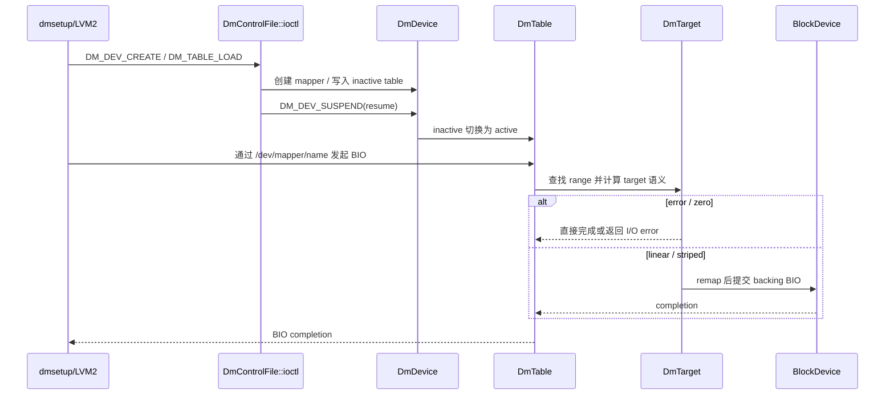
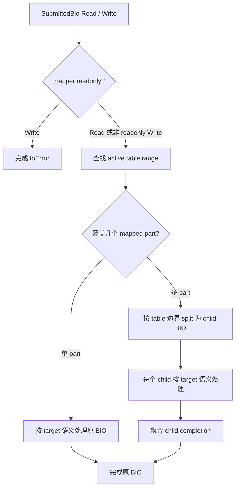

# Asterinas Device Mapper 技术与设计文档

## 文档信息

| 项目 | 内容 |
|---|---|
| 版本 | v2.1 |
| 状态 | 维护中，基于当前 `dm` 分支实现与 2026-09-01 验证结果整理 |
| 目标读者 | 内核开发人员、架构评审人员、测试与集成维护人员 |
| 更新时间 | 2026-09-01 |
| 相关进度 | [Device Mapper 项目进度](../log/device-mapper-progress.md) |

## 执行摘要

Asterinas Device Mapper 的设计目标不是一次性复刻完整 Linux Device Mapper 生态，而是在 Asterinas 当前块设备、VFS、devtmpfs、procfs 和 NixOS guest 测试框架内，实现一个能被真实 `dmsetup`、LVM2、ext2 和 reboot recovery 路径验证的 Linux DM 核心 ABI 兼容子集。

本文重新按“整体路线 + 功能路线”组织设计说明：先说明 DM 分支从兼容目标到系统验收的全路线，再分别展开控制面、数据面、target 能力、mixed table、striped 几何、flush、LVM2 场景和测试矩阵。这样可以避免只看局部流程图时误解当前实现范围，也能清楚看到每个能力从用户态入口到内核语义再到验收出口的闭环。

当前已支持的核心能力包括：

- `/dev/mapper/control` 控制设备和 Linux DM ioctl 核心命令；
- mapper device 创建、删除、重命名、状态查询、wait、table load/status/deps；
- active / inactive table 生命周期，以及 suspend / resume 激活语义；
- `error`、`zero`、`linear`、`striped`，以及同一 table 内 `linear + striped` mixed target；
- Read / Write 按 target remap 或直接完成，Flush 按 backing 去重 fan-out 或无 backing direct completion，跨 target split、striped chunk split 和 completion 聚合；
- `dmsetup` 控制面、raw DM 数据面边界、LVM2 linear 基础 / cross-segment、striped N-way 基础 / N-to-2N cross-segment、linear+striped mixed table 的系统验收路径。

设计结论：后续新增 target 或新增 BIO 语义时，不能只补局部代码；必须同时定义 Linux DM control ABI、table/status/deps 输出、数据面映射、flush 行为、错误传播和验收路径，保证能力从用户态到块层闭环。


## 阅读路径

本文附录包含完整命令矩阵，首次阅读时不必从头读到尾：

| 目的 | 建议阅读范围 |
|---|---|
| 看整体架构 | 第 2、6、7、8、9、10 章 |
| 看验证方法 | 第 11、14、15.2 节 |
| 看命令对齐状态 | 附录 15.4、15.5 |
| 看能力边界 | 第 3、13、15.1 节 |

## 目录

1. [背景与现状](#1-背景与现状)
2. [整体路线图](#2-整体路线图)
3. [目标与非目标](#3-目标与非目标)
4. [术语与定义](#4-术语与定义)
5. [需求分析](#5-需求分析)
6. [总体架构设计](#6-总体架构设计)
7. [控制面功能路线](#7-控制面功能路线)
8. [数据面功能路线](#8-数据面功能路线)
9. [Target 能力路线](#9-target-能力路线)
10. [系统集成路线](#10-系统集成路线)
11. [测试与验收路线](#11-测试与验收路线)
12. [技术选型与设计决策汇总](#12-技术选型与设计决策汇总)
13. [风险与待确认事项](#13-风险与待确认事项)
14. [验收标准](#14-验收标准)
15. [附录](#15-附录)

## 1. 背景与现状

Linux Device Mapper 是 LVM2、dmsetup 等用户态工具依赖的块设备映射基础设施。它将一个或多个底层块设备组合成新的逻辑块设备，并通过 table 描述逻辑 sector 到 backing device sector 的映射关系。

Asterinas 当前没有完整 Linux udev、sysfs DM 层级、uevent 自动联动和完整 block queue stacking 生态。因此本设计选择实现一个最小但真实可用的 DM 兼容子集：让 `dmsetup`、LVM2、ext2、真实块设备和 reboot recovery 测试路径能够闭环，而不是声明支持完整 Linux DM。

当前实现已经完成上游 `kernel/core` 目录迁移适配，DM core 位于 [kernel/core/comps/device-mapper](../kernel/core/comps/device-mapper)，控制面入口位于 [kernel/core/src/device/misc/device_mapper.rs](../kernel/core/src/device/misc/device_mapper.rs)。

## 2. 整体路线图

### 2.1 DM 分支端到端全路线

DM 分支的端到端路线是：用户态 `dmsetup` / LVM2 通过 `/dev/mapper/control` 进入 DM ioctl 控制面，控制面创建 mapper、装载 inactive table 并在 resume 后切换为 active table；文件系统和应用 I/O 通过 `/dev/mapper/<name>` 或 `/dev/dm-N` 进入 mapper 块设备，随后由 DM table 按 segment 和 target 规则 remap 到 backing block device。

这条路线依赖 Asterinas 通用内核框架提供设备节点、block registry、BIO submit/completion、VFS mount 和 backing 生命周期保护；Device Mapper 专属实现只负责 Linux DM ABI、mapper/table 生命周期、target 参数解析、status/deps 查询和 BIO 数据面映射。

### 2.2 能力边界与非目标关系

当前设计目标是让 `dmsetup`、LVM2、ext2、真实 backing block device 和 reboot recovery 测试路径闭环；不承诺完整 Linux DM 生态。完整 udev/uevent/systemd 自动联动、完整 DM sysfs 层级、复杂 target、完整 queue stacking 和 DM-on-DM backing 都属于非目标或后续独立阶段。discard/write zeroes 作为已有 block/BIO 框架的增量能力接入，不代表引入新的设备管理框架。

### 2.3 当前能力闭环图

下图描述当前已验证的能力闭环：控制面先确保 mapper/table 生命周期可被真实工具驱动，数据面再把文件系统或 raw I/O 请求映射到 target 语义，最后由 ktest 和系统脚本分别证明内核语义与用户态链路。

```mermaid
flowchart LR
    U[用户态 dmsetup / LVM2] --> C[/dev/mapper/control]
    C --> I[DM ioctl 适配层]
    I --> M[DmManager / DmDevice]
    M --> T[active / inactive table]
    T --> E[error / zero]
    T --> L[linear]
    T --> S[striped]
    L --> B[backing block device]
    S --> B
    FS[ext2 / raw dd I/O] --> N[/dev/mapper/name 或 /dev/dm-N]
    N --> D[DmTable enqueue]
    D --> T
    E --> Q[BIO 直接完成]
    B --> Q
    Q --> V[ktest + NixOS 系统脚本]
```

## 3. 目标与非目标

### 3.1 项目目标

1. 支持 Linux DM 核心控制面 ABI，使 `dmsetup` 和 LVM2 可以完成基础 mapper 生命周期操作。
2. 支持 `error`、`zero`、`linear` 与 `striped` target 的 table load、status、deps 和数据面语义。
3. 支持同一 DM table 内多个 target 的连续逻辑地址空间，包括无 backing target 和 `linear + striped` mixed table。
4. 保证 active / inactive table、suspend / resume、failed load、readonly、event wait 等状态机语义可预测。
5. 保证 Read / Write 的 remap 或 direct completion、Flush 的 fan-out 或 direct completion，以及 split 和 completion 聚合正确。
6. 通过 ktest 和 NixOS/LVM2 系统脚本验证关键内核语义与真实用户态路径。

### 3.2 非目标

当前不实现或不承诺：

- 完整 udev / uevent / systemd 自动联动；
- 完整 Linux DM sysfs 层级；
- target registry 泛化框架；
- `crypt`、`snapshot`、`thin`、`mirror`、`multipath` 等复杂 target；
- `DM_TARGET_MSG`、`DM_DEV_SET_GEOMETRY`、`DM_DEV_ARM_POLL`；
- Linux DM 完整 queue stacking 规则；
- DM-on-DM backing；
- NVMe discard / write zeroes 后端命令接入。

### 3.3 假设与边界

- 假设 sector 单位为 512 字节，与当前 block 层和 DM table 参数保持一致。
- 假设 LVM2 测试路径可通过 `activation { udev_rules=0 }` 避开 udev 依赖。
- 当前系统验收结论来自 `dm` 分支已有测试记录；本文不新增测试结果，也不虚构性能数据。
- 当前已实现的是 `/dev/dm-*` 与 `/dev/mapper/*` runtime node 的最小 devtmpfs 集成；udev rules、uevent 驱动的自动发现和 systemd/LVM 自动激活仍属后续独立阶段。
- 本文描述当前实现与设计边界，不代表完整 Linux Device Mapper 兼容承诺。

## 4. 术语与定义

| 术语 | 定义 |
|---|---|
| DM | Device Mapper，将逻辑块设备请求映射到底层块设备的内核框架。 |
| mapper device | DM 创建出的逻辑块设备，例如 `/dev/dm-0` 或 `/dev/mapper/<name>`。 |
| backing device | mapper table 中引用的底层块设备。 |
| table | 描述逻辑 sector range 到 target 的映射表。 |
| active table | 当前正在服务 I/O 的 table。 |
| inactive table | `DM_TABLE_LOAD` 写入、等待 resume 激活的 table。 |
| target | table 中的一段映射规则，例如 `error`、`zero`、`linear` 或 `striped`。 |
| BIO | 块 I/O 请求对象，包含操作类型、sector range、segments 和 completion。 |
| split | 将一个跨映射边界的 BIO 拆成多个 child BIO。 |
| deps | table 依赖的 backing device 集合。 |
| mixed table | 同一个 table 中同时包含不同 target 类型，例如前半段 linear、后半段 striped。 |

## 5. 需求分析

### 5.1 功能需求

| 编号 | 需求 | 当前状态 |
|---|---|---|
| FR-1 | 提供 `/dev/mapper/control` 控制设备 | 已支持 |
| FR-2 | 支持 Linux DM ioctl header 解析、版本校验和 header 写回 | 已支持 |
| FR-3 | 支持 mapper create/remove/remove_all/rename/status/list/wait | 已支持 |
| FR-4 | 支持 active/inactive table 生命周期 | 已支持 |
| FR-5 | 支持 `error` target | 已支持 |
| FR-6 | 支持 `zero` target | 已支持 |
| FR-7 | 支持 `linear` target | 已支持 |
| FR-8 | 支持 `striped` target | 已支持 |
| FR-9 | 支持 mixed linear + striped table | 已支持 |
| FR-10 | 支持 table status/deps 的 active/inactive 查询 | 已支持 |
| FR-11 | 支持 Read/Write remap 或 direct completion，以及 Flush fan-out 或 direct completion | 已支持 |
| FR-12 | 支持 BIO 跨 target 和跨 striped chunk 拆分 | 已支持 |
| FR-13 | 支持 dmsetup/LVM2 create/grow/shrink/reboot recovery 验收路径 | 已覆盖主要路径 |
| FR-14 | 支持通用 discard / write zeroes BIO、DM remap/direct completion 和 block ioctl 入口 | 已支持；NVMe 后端暂返回不支持 |

### 5.2 非功能需求

| 类型 | 要求 | 设计响应 |
|---|---|---|
| 正确性 | table 生命周期、sector 映射和 completion 必须可验证 | ktest 覆盖内核语义，系统脚本覆盖真实用户态路径 |
| 安全性 | kernel 侧保持 safe Rust，不绕过块设备生命周期 | 使用 `BlockDeviceLease` 持有 backing 生命周期 |
| 兼容性 | 对齐 Linux DM 核心 ABI，但不假支持未实现语义 | flags 分类处理；未实现命令显式拒绝 |
| 可维护性 | target 与 table 逻辑边界清晰 | `DmManager` / `DmDevice` / `DmTable` / `DmTarget` 分层 |
| 可测试性 | 每类关键行为有窄测试入口 | ktest + 分层系统验收脚本 |
| 可用性 | LVM2、dmsetup、ext2 能走真实路径 | NixOS guest 提供实际工具链和测试盘 locator |

### 5.3 优先级

| 优先级 | 内容 |
|---|---|
| P0 | DM core 语义正确性：ioctl、table 生命周期、Read/Write remap/direct completion、Flush fan-out/direct completion、BIO split/completion。 |
| P1 | 真实用户态路径：dmsetup、LVM2、ext2、reboot recovery。 |
| P2 | 测试矩阵稳定化和文档化。 |
| P3 | udev / systemd / LVM 自动扫描与自动激活、完整 sysfs DM 层级等框架集成。 |

## 6. 总体架构设计

总体架构采用四层路线：用户态工具通过控制设备进入 ioctl 适配层，ioctl 适配层操作 DM core，DM core 通过 block registry 和 BIO 接入底层块设备，devtmpfs/procfs/VFS 提供用户态可见性。

### 6.1 代码位置

| 层级 | 文件或目录 | 职责 |
|---|---|---|
| DM crate | [kernel/core/comps/device-mapper](../kernel/core/comps/device-mapper) | DM core crate。 |
| 控制面 | [kernel/core/src/device/misc/device_mapper.rs](../kernel/core/src/device/misc/device_mapper.rs) | `/dev/mapper/control`、Linux DM ioctl ABI、table load/status/deps。 |
| block 支撑 | [kernel/core/comps/block/src/lib.rs](../kernel/core/comps/block/src/lib.rs) | `BlockDevice`、registry、lease、lookup。 |
| BIO 支撑 | [kernel/core/comps/block/src/bio.rs](../kernel/core/comps/block/src/bio.rs) | BIO remap、split、segment slice、completion。 |
| runtime node | [kernel/core/src/device/mod.rs](../kernel/core/src/device/mod.rs) | `/dev/dm-N` 和 `/dev/mapper/<name>` node 管理。 |
| procfs | [kernel/core/src/fs/fs_impls/procfs/devices.rs](../kernel/core/src/fs/fs_impls/procfs/devices.rs) | `/proc/devices` 输出 block major。 |
| VFS mount | [kernel/core/src/fs/vfs/fs_apis/registry.rs](../kernel/core/src/fs/vfs/fs_apis/registry.rs) | mount source 到 `BlockDeviceLease` 的解析。 |
| 系统测试入口 | [myshell/run_dm_system_tests.sh](../myshell/run_dm_system_tests.sh) | DM 系统验收组合入口。 |

### 6.2 内核模块协作路线

控制面协作路线：`device_mapper.rs` 解析 Linux DM ioctl 和用户 buffer，调用 DM core 创建 `DmDevice`、装载 `DmTable`、切换 active/inactive table，并通过 devtmpfs 暴露 `/dev/mapper/<name>` 和 `/dev/dm-N`。

数据面协作路线：VFS 和文件系统把 mapper 设备上的请求转换为 BIO；DM core 根据 active table 查找 segment，`error` / `zero` 直接完成，`linear` / `striped` 计算 backing sector 后提交到底层 `BlockDevice` 并聚合 completion。

生命周期协作路线：table load 时通过 block registry 查找 backing device 并持有 `BlockDeviceLease`；table 被替换、清理或 mapper 删除后释放对应 lease，避免 backing 生命周期被 DM 绕过。

### 6.3 控制面与数据面协作图



### 6.4 架构边界

- [kernel/core/src/device/misc/device_mapper.rs](../kernel/core/src/device/misc/device_mapper.rs) 不承载 target 数据面算法；它只做 ABI、buffer、flags 和 ioctl 分发。
- [kernel/core/comps/device-mapper](../kernel/core/comps/device-mapper) 不直接依赖用户态测试脚本；它只表达 DM 内核语义。
- `DmTable` 负责 table 连续性、capacity、deps、metadata、BIO split 和 flush fan-out。
- `DmTarget` 负责 target 内部映射规则；多 backing target 不能被伪装成 single backing target。
- block registry 负责 block device 生命周期和 open count，不应被 DM 绕过。

## 7. 控制面功能路线

### 7.1 DM ioctl 生命周期路线

DM ioctl 层只处理 mapper 生命周期和 table 状态机，不承载 target 数据面算法。核心边界是：`DM_TABLE_LOAD` 写 inactive table，resume 才让 inactive 替换 active。

设计要点：

- `DM_DEV_CREATE` 创建 mapper 对象和 runtime node。
- `DM_TABLE_LOAD` 解析 target params，查找并持有 backing lease。
- `DM_TABLE_LOAD` 成功后只更新 inactive table。
- `DM_DEV_SUSPEND` 带 `DM_SUSPEND_FLAG` 时挂起并等待在途 I/O；不带该 flag 时表示 resume。
- failed table load 不得污染 active/inactive table、`event_nr` 或 readonly 状态。
- `DM_DEV_WAIT` 等待时不能持有全局 control lock。

### 7.2 Linux DM ioctl 兼容子集地图

| 编号 | ioctl | 当前状态 | 说明 |
|---:|---|---|---|
| 0 | `DM_VERSION` | 支持 | 返回兼容版本 `4.48.0`。 |
| 1 | `DM_REMOVE_ALL` | 支持 | best-effort 删除非 busy mapper。 |
| 2 | `DM_LIST_DEVICES` | 支持 | 输出 name、dev、event、uuid flag。 |
| 3 | `DM_DEV_CREATE` | 支持 | 支持 name、uuid、persistent minor、readonly。 |
| 4 | `DM_DEV_REMOVE` | 支持 | busy mapper 返回 `EBUSY`。 |
| 5 | `DM_DEV_RENAME` | 支持 | 支持 name rename 和 `DM_UUID_FLAG` 下 UUID rename。 |
| 6 | `DM_DEV_SUSPEND` | 支持 | `DM_SUSPEND_FLAG` 表示 suspend，否则 resume。 |
| 7 | `DM_DEV_STATUS` | 支持 | 输出 exists、suspended、readonly、active/inactive present、open count、event。 |
| 8 | `DM_DEV_WAIT` | 支持最小语义 | 等待 `event_nr` 变化；等待期间不持有全局 control lock。 |
| 9 | `DM_TABLE_LOAD` | 支持 | 支持 `error`、`zero`、`linear` 和 `striped`。 |
| 10 | `DM_TABLE_CLEAR` | 支持 | 清理 inactive table。 |
| 11 | `DM_TABLE_DEPS` | 支持 | 支持 active/inactive table selector，backing 去重。 |
| 12 | `DM_TABLE_STATUS` | 支持 | 支持 info/table 两种输出格式。 |
| 13 | `DM_LIST_VERSIONS` | 支持 | 当前返回 `error 1.6.0`、`zero 1.1.0`、`linear 1.4.0`、`striped 1.6.0`。 |
| 14 | `DM_TARGET_MSG` | 不支持 | 当前命令解码拒绝。 |
| 15 | `DM_DEV_SET_GEOMETRY` | 不支持 | 当前命令解码拒绝；现有 LVM2 路径不依赖它。 |
| 16 | `DM_DEV_ARM_POLL` | 不支持 | 当前命令解码拒绝。 |
| 17 | `DM_GET_TARGET_VERSION` | 支持 | 支持按 target name 查询 version。 |

### 7.3 flags 策略

| 类型 | 处理方式 | 代表 flag |
|---|---|---|
| 已实现或参与语义 | 正常处理 | `DM_READONLY_FLAG`、`DM_SUSPEND_FLAG`、`DM_STATUS_TABLE_FLAG`、`DM_QUERY_INACTIVE_TABLE_FLAG`、`DM_UUID_FLAG` |
| 兼容忽略 | 显式允许但不改变核心语义 | `DM_SKIP_BDGET_FLAG`、`DM_SKIP_LOCKFS_FLAG`、`DM_NOFLUSH_FLAG`、`DM_SECURE_DATA_FLAG` |
| 显式拒绝 | 返回错误，避免假支持 | `DM_DEFERRED_REMOVE`、`DM_IMA_MEASUREMENT_FLAG`、未知 flag |

设计结论：unknown flags 不能静默吞掉；output-only flags 由内核写回，用户输入中的旧输出位不决定最终状态。

## 8. 数据面功能路线

数据面章节只描述 BIO 在 table 层如何被分类、拆分、提交和完成；具体 target 参数合法性放在第 9 章。这里的核心边界是：Read / Write 有 sector range，需要按 target 语义 remap 或直接完成；Flush 没有数据 range，不做 sector remap，只按 backing 依赖 fan-out，或在无 backing table 上直接完成。

### 8.1 Read / Write 通用路径

Read 和 Write 共享同一套 active table 查询、range 选择、target 映射、split 和 completion 聚合路径。差异只在 readonly mapper 上：Read 允许继续，Write 需要直接拒绝。



设计要点：

- active table 缺失、BIO range 超出容量或 Write 命中 readonly mapper 时，直接以 I/O error 完成。
- 单 part 不需要复制数据结构；可在原 BIO 上 remap 或 direct completion。
- 多 part 先按 table 边界拆 child BIO，再让每个 child 进入对应 target 逻辑。
- 原 BIO 只能完成一次；多 child 场景由 completion 聚合决定最终状态。

### 8.2 error / zero 无 backing direct completion

`error` 和 `zero` 不持有 backing device，也不会产生 backing BIO。它们的数据面语义在 DM table 层直接完成：

| Target | Read | Write | Flush | deps |
|---|---|---|---|---|
| `error` | 完成 I/O error | 完成 I/O error | 无 backing，直接 Complete | 空 |
| `zero` | 填充全 0 后 Complete | 丢弃并 Complete | 无 backing，直接 Complete | 空 |

这样处理可以避免把无 backing target 伪装成普通 remap target，也避免为 `zero` read 引入特殊 completion status。`zero` read 的用户可见结果来自实际填充 BIO segment，而不是把 `BioStatus::Zeros` 当作最终完成状态。

### 8.3 table-level split、target-level split 与 completion 聚合

数据面 split 分两层：

| 层级 | 触发条件 | 处理方式 |
|---|---|---|
| table-level split | BIO 跨越相邻 target range | 按 target 边界拆 child BIO，每个 child 只落到一个 target。 |
| target-level split | 单个 child 在 striped target 内跨 stripe chunk | striped target 继续按 chunk 和 stripe 分布拆分或 remap。 |
| completion 聚合 | 一个原 BIO 派生多个 child | 所有 child 完成后再完成原 BIO；任一关键 child 失败时原 BIO 返回错误。 |

`linear` 的主要复杂度是 logical sector 到 backing sector 的平移；`striped` 的主要复杂度是 chunk 内偏移、stripe 轮转和跨 chunk 拆分；mixed table 则验证 table-level split 与 striped target-level split 可以组合。

### 8.4 Flush fan-out、错误聚合与非目标边界

Flush 不读取或写入用户数据，也不携带需要 remap 的 logical sector range。当前策略是：

- active table 无 backing target 时，Flush 直接 Complete。
- active table 包含 backing target 时，先收集所有 backing device。
- shared backing 只 flush 一次，避免 mixed table 或重复引用导致重复下发。
- backing flush enqueue 或 completion 失败时，原 Flush 返回 I/O error。
- readonly mapper 允许 Flush，因为它不修改 mapper 数据。

discard / write zeroes 是通用 block range BIO：不携带数据 segment，但携带 logical sector range。`linear` / `striped` 按现有 table-level 和 target-level split/remap 下发到 backing；`error` 直接返回 I/O error；`zero` 直接 Complete。只读 mapper 将 Write / Discard / WriteZeroes 都视为 write-like 并拒绝。当前 virtio block 已按协商能力下发 `VIRTIO_BLK_T_DISCARD` / `VIRTIO_BLK_T_WRITE_ZEROES`，NVMe 后端仍明确返回 NotSupported。

## 9. Target 能力路线

### 9.1 Target 能力演进路线

Target 能力按风险和映射复杂度递进：先用 `error` / `zero` 这类无 backing target 锁定控制面、deps 和直接完成语义；再用 single linear 验证基础 sector remap，用 multi-segment linear 验证 table-level split；随后用 striped 验证多 backing、chunk split 和 deps；最后用 mixed table 验证同一 table 内 linear segment 与 striped segment 的组合。

系统验收也按这个顺序分层：`--dmsetup-cli` 覆盖控制面和 error/zero 基础 I/O，`--dataplane-edge` 覆盖 raw DM 边界和 zero 读写语义，raw linear / raw striped 覆盖窄数据面，linear / striped 基础 LVM2 覆盖单 segment grow/shrink，linear / striped cross-segment 覆盖追加 segment 和 shrink 回单段，mixed 覆盖 linear + striped table 组合。

### 9.2 Error target 错误语义路线

文件：[kernel/core/comps/device-mapper/src/target/error.rs](../kernel/core/comps/device-mapper/src/target/error.rs)

参数格式：

```text
<logical_start> <length> error
```

核心语义：

- 不接受 backing 参数。
- `length` 不能为 0，logical range 不能溢出。
- Read / Write BIO 稳定以 I/O error 完成。
- Flush 对无 backing table 成功完成。
- `deps` 为空，table/status 输出 target type 为 `error` 且参数为空。

选择理由：error target 是最小的无 backing 错误注入 target，能给 dmsetup 控制面和 guest I/O error 场景提供稳定样本。

边界：它不等于真实 backing device fault injection；后者仍属于单独的数据面故障注入阶段。

### 9.3 Zero target 零读写语义路线

文件：[kernel/core/comps/device-mapper/src/target/zero.rs](../kernel/core/comps/device-mapper/src/target/zero.rs)

参数格式：

```text
<logical_start> <length> zero
```

核心语义：

- 不接受 backing 参数。
- `length` 不能为 0，logical range 不能溢出。
- Read BIO 填充全 0 后以 Complete 完成。
- Write BIO 丢弃并以 Complete 完成。
- Flush 对无 backing table 成功完成。
- `deps` 为空，table/status 输出 target type 为 `zero` 且参数为空。

选择理由：zero target 能验证无 backing target 的成功完成路径，也补齐 `dmsetup targets`、`target-version`、table/status/deps 和 raw 数据面边界覆盖。

边界：zero target 的普通 Write 丢弃是 target 自身语义；通用 Discard / WriteZeroes BIO 在 zero target 上也可 direct-complete，因为该 target 的用户可见内容恒为零且没有 backing device。

### 9.4 Linear target 映射路线

文件：[kernel/core/comps/device-mapper/src/target/linear.rs](../kernel/core/comps/device-mapper/src/target/linear.rs)

参数格式：

```text
<logical_start> <length> linear <major>:<minor> <backing_start>
```

核心语义：

- 参数严格为 `<major>:<minor> <backing_start>` 两个字段。
- `length` 不能为 0。
- logical range 是 end-exclusive。
- logical range 和 backing range 都不能溢出。
- backing range 不能超过 backing device capacity。
- table status info 模式输出空 params。
- table status table 模式输出 `<major>:<minor> <backing_start>`。

选择理由：linear 是 Linux DM 和 LVM2 最基础 target，能够支撑 grow 后生成的多 segment/table、raw cross-target BIO 和 ext2 I/O 路径。

替代方案：可以先只支持单 target linear，但无法覆盖 LVM2 grow 后生成的多 segment/table 和跨 target BIO split，因此当前选择支持多 target linear table。

### 9.5 Striped target 几何与边界路线

文件：[kernel/core/comps/device-mapper/src/target/striped.rs](../kernel/core/comps/device-mapper/src/target/striped.rs)

参数格式：

```text
<logical_start> <length> striped <stripe_count> <chunk_size> <dev1> <offset1> <dev2> <offset2> ...
```

核心语义：

- `stripe_count` 不能为 0。
- `chunk_size` 不能为 0，单位为 512 字节 sector。
- backing 参数数量必须等于 `stripe_count`。
- 每个 backing id 必须能通过 block registry 找到 lease。
- 构造时校验 backing lease id 与 params 中的 `major:minor` 一致。
- 每个 stripe 的 required sectors 按真实 logical length 计算，允许最后一行不完整。
- backing range 不能溢出，也不能超过对应 backing capacity。
- table status info 模式输出空 params。
- table status table 模式输出 canonical striped params。

示例：2-way striped，chunk size 为 4 sectors，logical range `2..10` 会拆成：

```text
2..4  -> stripe0
4..8  -> stripe1
8..10 -> stripe0
```

选择理由：striped 是 LVM2 常见 target，可验证多 backing、chunk split、deps 去重和 reboot recovery 路径。

替代方案：只支持 raw striped 或只支持固定 2-way striped。当前没有采用，因为参数化 N-way 基础脚本和 N-to-2N cross-segment 能覆盖更多真实 LVM2 输出形态。

### 9.6 Mixed table 跨 target 拆分路线

mixed table 允许同一个 mapper 内相邻 target 使用不同类型，例如前半段 `linear`、后半段 `striped`。这里的“跨 target”只表示同一个 DM device / 同一个 LV 的逻辑地址跨过相邻 target 边界，不表示一个 BIO 跨两个不同 LV。

mixed table 示例：

```text
0 524288 linear 253:64 2048
524288 524288 striped 2 8 253:80 2048 253:96 2048
```

含义：第一段是 PV1 上的 linear segment，第二段是 PV2+PV3 上的 2-way stripe、4 KiB chunk。

选择理由：真实 LVM2 grow 场景可能在同一个 LV 中先有 linear segment，再追加 striped segment。支持 mixed table 能验证同一 mapper 内跨 target 类型的数据面一致性。

权衡：mixed table 增加了 table-level split 与 target-level split 的组合复杂度，需要 ktest 和系统验收共同覆盖。

## 10. 系统集成路线

### 10.1 block registry 与 runtime node

DM 与 Asterinas block registry 集成，用于：

- 注册 mapper block device；
- 维护 block open count；
- 创建和删除 `/dev/dm-N`；
- 创建、rename、删除 `/dev/mapper/<name>`；
- 在 `/proc/devices` 暴露 `device-mapper` major；
- 提供 legacy block ioctl 支撑 LVM2、mkfs、blkid。

设计结论：runtime node 和 manager 索引必须保持一致。runtime node rename 失败时，manager 状态必须回滚。

### 10.2 BlockDeviceLease 生命周期设计

DM table 持有 backing 时使用 `BlockDeviceLease`，不是裸 `Arc<dyn BlockDevice>`。

选择理由：

- backing 正在卸载或移除时，lease 负责生命周期约束；
- filesystem mount、DM backing、raw disk 使用同一套 block device 生命周期模型；
- 避免 DM table 持有已从 registry 生命周期中移除的 backing。

替代方案：直接保存 `Arc<dyn BlockDevice>`。该方案实现更简单，但会绕过 block registry 生命周期约束，因此不采用。

### 10.3 VFS mount 集成

VFS mount source 解析到 block device 时，通过 [kernel/core/src/fs/vfs/fs_apis/registry.rs](../kernel/core/src/fs/vfs/fs_apis/registry.rs) 获取 `BlockDeviceLease`。

- 普通 mount：通过 block registry `lookup_lease` 获取受生命周期保护的 lease。
- rootfs 预解析设备：通过 `BlockDeviceLease::new_untracked` 包装，不参与 registry lease count。

设计结论：mount 与 DM backing 共享同一套块设备生命周期模型，避免同一设备在 filesystem 或 DM 使用期间被注销。

### 10.4 LVM2 系统功能路线

NixOS guest 提供真实用户态工具链，包括 LVM2、dmsetup、e2fsprogs、util-linux、strace 和测试盘 locator。测试盘通过 VirtIO block serial 暴露给 guest，脚本使用 locator 稳定定位测试盘，不硬编码 `/dev/vd*`。

## 11. 测试与验收路线

验证按三层组织：ktest 锁内核语义，dmsetup/NixOS smoke 锁最小用户态路径，LVM2/reboot 系统验收锁真实用户态链路。`error` / `zero` 这类无 backing target 优先用定向 ktest 和 dmsetup CLI 验证，`linear` 和 `striped` 按 target 特性分层：基础脚本验证单 segment 内扩容/缩容，进阶脚本独立验证 cross-segment/table，mixed 脚本验证真实 LVM2 linear + striped 组合。

写测试和 review 结论时需要先区分改动归属：DM 专属修改指 Device Mapper 自己的 ioctl 适配、table 生命周期、target 参数解析、status/deps、error/zero 直接完成语义、linear/striped 映射、BIO split/flush 等能力；Asterinas 内核框架修改指 DM 为跑通真实用户态而依赖或补齐的通用内核能力，例如 block registry/lease、devtmpfs runtime node、procfs、VFS/mount 生命周期、设备号和测试基础设施。前者应优先用 DM ktest 和 DM 系统入口证明，后者还需要说明为什么不是只服务某个 target，以及是否会影响非 DM 路径。

### 11.1 ktest 的目的、分层和执行方法

ktest 是在 QEMU 内核环境里运行的 Rust 测试，用来验证不依赖真实 LVM2/NixOS 脚本也能判断的 DM 内核语义。它回答的是：table 参数是否合法、ioctl 是否按 Linux DM ABI 返回、error/zero 直接完成语义是否正确、linear/striped 映射是否正确、BIO split/flush/readonly/suspend/resume 是否符合预期，以及失败的 table-load 是否会污染已有 active/inactive table。

系统脚本证明真实用户态链路能跑通；ktest 证明内核语义本身是对的。做 review 时应先看改动属于哪一层，再选对应 ktest。

| ktest 类别 | 对应代码层 | 主要验证什么 | 什么时候跑 |
|---|---|---|---|
| DM core / target ktest | `kernel/core/comps/device-mapper` | table、error target、zero target、linear target、striped target、BIO split/remap、flush、deps 去重 | 修改 table、target、数据面时跑 |
| ioctl 层 ktest | `kernel/core` | `/dev/mapper/control` ioctl ABI、flags、active/inactive、status/deps、remove/rename/wait | 修改 ioctl、控制面、状态机时跑 |

当前 ktest 受根 [Cargo.toml](../Cargo.toml) 的 `default-members` 影响。为了只跑目标 crate 的内核测试，通常需要临时收窄 `default-members`；否则可能跑到无关 crate、耗时过长，或者测试过滤没有命中目标。

标准流程：

1. 临时修改 [Cargo.toml](../Cargo.toml) 的 `default-members`；
2. 运行对应 ktest；
3. 立刻还原 [Cargo.toml](../Cargo.toml)；
4. 执行 `git diff -- Cargo.toml`，预期无输出。

修改 table / target / BIO 数据面时，先临时把根 [Cargo.toml](../Cargo.toml) 收窄为：

```toml
default-members = [
    "kernel/core/comps/device-mapper",
]
```

示例命令：

```bash
docker exec myAsterinas bash -lc 'cd /root/asterinas && timeout -k 10s 180s make ktest CARGO_OSDK_TEST_ARGS="--kcmd-args=loglevel=error --kcmd-args=earlycon --kcmd-args=console=ttyS0 --boot-method=grub-rescue-iso --grub-boot-protocol=multiboot2 aster_device_mapper::<test_path>"'
```

适用改动：

- error / zero 参数解析和无 backing 完成语义；
- linear / striped 参数解析；
- table 连续性、容量和 deps 去重；
- linear sector remap；
- striped chunk split/remap；
- mixed table split；
- flush fan-out 和错误传播。

修改 ioctl / 控制面状态机时，先临时把根 [Cargo.toml](../Cargo.toml) 收窄为：

```toml
default-members = [
    "kernel/core",
]
```

示例命令：

```bash
docker exec myAsterinas bash -lc 'cd /root/asterinas && timeout -k 10s 180s make ktest CARGO_OSDK_TEST_ARGS="--kcmd-args=loglevel=error --kcmd-args=earlycon --kcmd-args=console=ttyS0 --boot-method=grub-rescue-iso --grub-boot-protocol=multiboot2 aster_core::device::misc::device_mapper::tests::<test_name>"'
```

适用改动：

- `DM_DEV_CREATE` / `DM_DEV_REMOVE` / `DM_DEV_RENAME`；
- `DM_TABLE_LOAD` / `DM_TABLE_CLEAR` / `DM_TABLE_STATUS` / `DM_TABLE_DEPS`；
- `DM_DEV_SUSPEND` / resume；
- active / inactive table；
- readonly flag、wait event、flags 校验、buffer layout。

每次临时修改 [Cargo.toml](../Cargo.toml) 后，收尾必须还原并确认：

```bash
git diff -- Cargo.toml
```

预期结果是无输出；如果有输出，说明临时收窄 `default-members` 没还原，不能提交。

### 11.2 按 target 特性分层的系统验收矩阵

ktest 不放进本矩阵。它是公共内核语义测试层，内部通过 case 覆盖 error、zero、linear、striped 和 mixed；本矩阵只描述需要启动 NixOS guest、调用 dmsetup/LVM2/ext2 的系统验收脚本。

| 验收层级 | linear | striped | mixed |
|---|---|---|---|
| dmsetup raw 数据面 | `--linear-data`：raw linear cross-target BIO split/remap | `--striped-data`：raw striped chunk split/remap 和 backing 分布 | 暂不单独设 raw mixed 主入口 |
| 基础 LVM2 单 segment | `--linear-lvm2`：单 PV、单 linear segment、同盘 grow/shrink、ext2 I/O、reboot recovery | `--striped-lvm2`：N PV / N-way、单 striped segment、同一组 PV grow/shrink、ext2 I/O、reboot recovery；默认 2-way，可用 `STRIPED_PV_COUNT=3` 等参数扩展 | 不单独设基础入口 |
| 进阶 LVM2 cross-segment | `--linear-lvm2-cross-segment`：独立 2PV，先建单段 linear，再扩到第二块 PV 形成两段 linear table，reboot 后验证再 shrink 回单段 | `--striped-lvm2-cross-segment`：独立 2N PV，前 N 盘建基础 striped 段，后 N 盘扩容形成第二个 striped 段；默认 2→4 盘，可用 `STRIPED_CS_PV_COUNT=3` 验证 3→6 盘 | mixed 暂不做扩容/缩容专项 |
| mixed 组合 | 参与 linear 段 | 参与 striped 段 | `--mixed-lvm2`：基础 linear 单盘段 + 基础 striped 双盘段，验证同一 LV 内 mixed table 读写和 reboot recovery |
| 阶段验收 | 显式运行 linear 相关入口 | 显式运行 striped 相关入口 | 显式运行 mixed 入口 |

矩阵原则：基础 LVM2 脚本负责“同一段/同一组盘内扩缩容”，进阶 cross-segment 脚本负责“独立从初始段扩出第二段”。PV 数量是 LVM2 生成目标 table 的触发条件；DM review 的核心是多 segment/table、跨 target 边界、status/deps、flush 和 reboot recovery 是否正确。

### 11.3 系统测试入口

组合入口：[myshell/run_dm_system_tests.sh](../myshell/run_dm_system_tests.sh)

| 规范入口 | 覆盖范围 |
|---|---|
| `--quick` | control ABI smoke + raw linear cross-target BIO + raw striped BIO distribution。 |
| `--dmsetup-cli` | dmsetup 静态查询、tableless、error/zero/linear/striped create/table/status/deps、load/reload/clear/resume、suspend/wait、rename/UUID、remove/remove_all。 |
| `--lvm2-cli` | LVM2 PV/VG/LV 控制面子集，包括 linear/striped/mixed 命令模板在隔离测试盘上的对齐。 |
| `--dataplane-edge` | raw DM 数据面边界：multi-segment linear、非零 backing start、striped chunk 边界、zero target 读零写丢弃。 |
| `--linear-data` | raw linear cross-target BIO split/remap。 |
| `--striped-data` | raw striped BIO split/remap 和 backing 分布。 |
| `--linear-lvm2` | 单 PV、单 linear segment、同盘 grow/shrink、ext2 I/O、reboot recovery。 |
| `--striped-lvm2` | N PV / N-way、单 striped segment、同组盘 grow/shrink、ext2 I/O、reboot recovery；默认 2-way，可通过 `STRIPED_PV_COUNT` 参数扩展。 |
| `--linear-lvm2-cross-segment` | 独立 linear cross-PV segment、reboot recovery、shrink 回单段。 |
| `--striped-lvm2-cross-segment` | 独立 striped N-to-2N cross-segment、reboot recovery、shrink 回单段；默认 2→4 盘，可通过 `STRIPED_CS_PV_COUNT` 参数扩展。 |
| `--mixed-lvm2` | LVM2 linear + striped mixed table create、跨 segment/table ext2 I/O、reboot recovery；暂不做 mixed 扩容/缩容专项。 |

### 11.4 按改动范围选择验证

| 改动范围 | 必跑验证 |
|---|---|
| Rust 格式或 DM core 小改 | `cargo fmt --check` + 对应定向 ktest |
| 新增基础 target | target/table 定向 ktest + ioctl 定向 ktest；若改到用户态输出或脚本，再跑对应系统入口 |
| ioctl/control/flags/event/wait | ioctl 层 ktest；改到 dmsetup 用户可见语义时跑 `--dmsetup-cli` |
| zero/error 用户态语义 | target/table 定向 ktest + ioctl 定向 ktest + `--dmsetup-cli`；raw 数据面边界变化再跑 `--dataplane-edge` |
| linear BIO split/remap | DM table/target ktest + `--linear-data` |
| striped BIO split/remap | DM table/target ktest + `--striped-data` |
| linear LVM2 基础单段扩缩容/恢复 | ktest + `--linear-lvm2` |
| striped LVM2 基础单段扩缩容/恢复 | ktest + `--striped-lvm2` |
| linear LVM2 cross-segment/recovery/shrink | ktest + `--linear-lvm2-cross-segment` |
| striped LVM2 N-to-2N cross-segment/recovery/shrink | ktest + `--striped-lvm2-cross-segment` |
| LVM2 linear + striped mixed table/recovery | ktest + `--mixed-lvm2` |
| 阶段验收或发版前 DM 系统回归 | 按改动范围显式运行对应入口；quick 包含 control、linear raw 和 striped raw；linear 常用 `--linear-lvm2`、`--linear-lvm2-cross-segment`，striped 常用 `--striped-lvm2`、`--striped-lvm2-cross-segment` |

新增功能默认以相关定向 ktest 锁定内核语义；系统测试属于慢速验收，只在改动影响用户态链路、脚本逻辑、设备节点或阶段验收时运行。QEMU、ktest、NixOS 系统测试需要串行运行，避免镜像和测试盘锁冲突。

## 12. 技术选型与设计决策汇总

| 决策 | 选择 | 替代方案 | 理由 | 权衡 |
|---|---|---|---|---|
| 兼容范围 | Linux DM 核心 ABI 子集 | 完整 Linux DM | 当前 Asterinas 不具备完整 udev/sysfs/queue stacking 生态 | 需要明确拒绝未实现语义 |
| target 表达 | `DmTarget` enum | target registry 泛化 | 当前支持的 target 数量仍少，enum 更直接 | 新增 target 时需要同步修改匹配逻辑 |
| table 激活 | load 写 inactive，resume 激活 | load 直接替换 active | 对齐 Linux DM table 生命周期 | 状态机更复杂，但语义正确 |
| backing 生命周期 | `BlockDeviceLease` | 裸 `Arc<dyn BlockDevice>` | 避免 backing 被注销时仍被 DM 使用 | rootfs 预解析设备需要 untracked lease |
| 数据面 split | table-level split + target-level split | 每个 target 自己处理完整 BIO | 能统一处理 mixed table 和 completion 聚合 | table 与 target 边界需要清晰 |
| Flush | backing 去重后异步 fan-out | 同步等待或逐 target 重复 flush | 避免阻塞 DM enqueue 路径，减少重复 flush | completion 聚合逻辑更复杂 |
| flags 策略 | 支持/兼容忽略/拒绝三分法 | 未知位静默忽略 | 避免用户态误以为已支持高级语义 | 需要持续维护 flag 分类 |
| 系统验收 | ktest + NixOS/LVM2 分层 | 只跑 ktest 或只跑系统脚本 | 覆盖内核语义与真实用户态路径 | 验收成本更高，需按需运行 |
| 系统验收入口 | 显式选择对应 suite | 默认运行历史全量套件 | linear/striped 执行方式对齐，避免默认入口隐藏覆盖范围 | 阶段验收需要手动列出要跑的入口 |

## 13. 风险与待确认事项

### 13.1 主要风险

| 风险 | 影响 | 应对措施 |
|---|---|---|
| 误声明完整 Linux DM 兼容 | 用户态依赖未实现语义导致错误预期 | 文档和 ioctl 行为都明确拒绝非目标能力 |
| table 生命周期状态污染 | failed load 或 reload 破坏 active/inactive 语义 | ktest 覆盖 failed load、active/inactive 查询和 resume 替换 |
| BIO split completion 错误 | original BIO 重复完成或漏完成 | split 聚合测试覆盖成功和失败路径 |
| striped range 边界错误 | 数据写入错误 backing 或错误 sector | 覆盖 chunk 边界、partial final row、target end 边界 |
| mixed table 语义被误解为跨 LV | 错误支持不可能的 BIO 范围 | 文档和测试都强调同一 mapper / 同一 LV 内跨 target |
| backing 生命周期绕过 | backing 被注销后仍被 table 使用 | table 持有 `BlockDeviceLease` |
| 系统测试互相干扰 | QEMU 镜像锁或测试盘残留导致假失败 | 系统测试串行运行，异常时检查进程和输出 |

### 13.2 待确认事项

- 是否需要在后续阶段补充更多 mixed table 组合，例如三段以上 target 或更复杂 grow/shrink 形态。
- 是否需要为 `patches/` 重新生成适配当前 `main` 基线的 patch 集。
- 是否有真实用户态路径要求 udev / systemd 自动联动、LVM 自动扫描与自动激活或完整 sysfs DM 层级；若有，应作为独立阶段评估。
- 是否需要进一步抽象 target registry，以支撑更多 target 类型。

## 14. 验收标准

### 14.1 功能验收

- `dmsetup` 可创建、加载、激活、查询、删除 mapper。
- LVM2 可在无 udev 规则依赖的配置下完成 linear、striped 和 mixed 相关路径。
- `DM_TABLE_STATUS` 能输出 canonical table params。
- `DM_TABLE_DEPS` 能按 backing 首次出现顺序去重输出依赖。
- readonly mapper 允许 Read/Flush，拒绝 Write。
- failed table load 不改变已有 active/inactive table 和 device 状态。

### 14.2 数据面验收

- error target 的 Read / Write 返回 I/O error，Flush 成功完成。
- zero target 的 Read 返回全 0，Write 丢弃并成功完成，Flush 成功完成。
- linear BIO remap 到正确 backing sector。
- striped BIO 按 chunk 映射到正确 stripe backing。
- 跨 target BIO 能拆分到相邻 target。
- mixed linear + striped BIO 能先按 target 拆分，再按 striped chunk 拆分。
- split child 全部完成后 original BIO 才完成。
- 任一 child 或 flush backing 失败时，原 BIO 返回错误。

### 14.3 系统验收

- 每个小阶段至少有对应定向 ktest 或系统入口证明，不用全量 ktest 作为新增功能默认验收项。
- 改动影响 dmsetup 用户可见语义时，`--dmsetup-cli` 需要通过并说明是否存在 GAP。
- 改动影响 raw DM 数据面边界时，`--dataplane-edge` 或对应 raw data suite 需要通过。
- 改动影响 LVM2 控制面或 reboot recovery 时，对应 LVM2 suite 需要通过。
- 系统测试需要显式选择入口；慢系统脚本只在相关链路变化或阶段验收时运行。

## 15. 附录

### 15.1 当前 target 支持矩阵

| Target | 控制面 | 数据面 | 系统验收 | 当前边界 |
|---|---|---|---|---|
| `error` | table load/status/deps 已支持；version 为 `1.6.0` | Read/Write 返回 I/O error；Flush 对无 backing table 成功完成 | 定向 ktest、`--dmsetup-cli` 已覆盖 | 只模拟稳定错误 target，不等于真实 backing fault injection。 |
| `zero` | table load/status/deps 已支持；version 为 `1.1.0` | Read 返回全 0；Write 丢弃并成功；Flush/Discard/WriteZeroes 对无 backing table 成功完成 | 定向 ktest、`--dmsetup-cli`、`--dataplane-edge` 已覆盖 | 普通 Write 丢弃仍是 zero target 自身语义；Discard/WriteZeroes 是通用 range BIO 在 zero 上的 direct-complete 特例。 |
| `linear` | table load/status/deps 已支持；version 为 `1.4.0` | Read/Write/Discard/WriteZeroes remap 到 backing；Flush 参与 backing 去重 fan-out；跨 target BIO split 已支持 | ktest、`--linear-data`、`--linear-lvm2`、`--linear-lvm2-cross-segment` 已覆盖 | backing 不支持 range BIO 时返回不支持；不声明 Linux DM queue stacking 支持。 |
| `striped` | table load/status/deps 已支持；version 为 `1.6.0` | Read/Write/Discard/WriteZeroes 按 stripe chunk remap 到 backing；Flush 参与 backing 去重 fan-out | ktest、`--striped-data`、`--striped-lvm2`、`--striped-lvm2-cross-segment` 已覆盖 | backing 不支持 range BIO 时返回不支持；不承诺 Linux striped 周边扩展语义。 |
| `linear + striped mixed` | table load/status/deps 已支持 | 跨 target split + striped chunk split 已支持 | ktest、`--mixed-lvm2` 已覆盖 | 只表示同一 mapper table 内跨 target，不表示跨 LV。 |

### 15.2 系统验收脚本地图

| 脚本 | 规范入口 | 作用 |
|---|---|---|
| [myshell/run_dmsetup_cli_semantics_test.sh](../myshell/run_dmsetup_cli_semantics_test.sh) | `--dmsetup-cli` | dmsetup 控制面和 error/zero 基础 I/O 语义审计。 |
| [myshell/run_lvm2_cli_semantics_test.sh](../myshell/run_lvm2_cli_semantics_test.sh) | `--lvm2-cli` | LVM2 控制面命令模板在测试盘隔离参数下的 guest 对齐审计。 |
| [myshell/run_dm_dataplane_edge_test.sh](../myshell/run_dm_dataplane_edge_test.sh) | `--dataplane-edge` | raw DM linear/striped/zero 数据面边界审计，包含 zero target 的 BLKDISCARD/BLKZEROOUT。 |
| [myshell/dm_linear/run_control_abi_test.sh](../myshell/dm_linear/run_control_abi_test.sh) | `--quick` | linear control ABI smoke。 |
| [myshell/dm_linear/run_cross_target_bio_regression.sh](../myshell/dm_linear/run_cross_target_bio_regression.sh) | `--linear-data`、`--quick` | raw linear cross-target BIO regression。 |
| [myshell/dm_linear/run_lvm2_linear_reboot_test.sh](../myshell/dm_linear/run_lvm2_linear_reboot_test.sh) | `--linear-lvm2` | 单 PV、单 segment linear，同盘 grow/shrink、ext2 I/O、reboot recovery。 |
| [myshell/dm_linear/run_lvm2_linear_cross_segment_test.sh](../myshell/dm_linear/run_lvm2_linear_cross_segment_test.sh) | `--linear-lvm2-cross-segment` | 独立 2PV linear cross-segment、reboot recovery、shrink 回单段。 |
| [myshell/dm_striped/run_raw_striped_bio_test.sh](../myshell/dm_striped/run_raw_striped_bio_test.sh) | `--striped-data` | raw striped BIO distribution。 |
| [myshell/dm_striped/run_lvm2_striped_reboot_test.sh](../myshell/dm_striped/run_lvm2_striped_reboot_test.sh) | `--striped-lvm2` | N PV / N-way 单 segment striped，同组盘 grow/shrink、ext2 I/O、reboot recovery；默认 2-way，可用 `STRIPED_PV_COUNT` 参数扩展。 |
| [myshell/dm_striped/run_lvm2_striped_cross_segment_test.sh](../myshell/dm_striped/run_lvm2_striped_cross_segment_test.sh) | `--striped-lvm2-cross-segment` | 独立 striped N-to-2N cross-segment、reboot recovery、shrink 回单段；默认 2→4 盘，可用 `STRIPED_CS_PV_COUNT` 参数扩展。 |
| [myshell/dm_mixed/run_lvm2_linear_striped_mixed_reboot_test.sh](../myshell/dm_mixed/run_lvm2_linear_striped_mixed_reboot_test.sh) | `--mixed-lvm2` | LVM2 linear + striped mixed table reboot。 |

### 15.3 质量检查清单

提交或评审 DM 相关改动前，应确认：

- 是否影响 Linux DM ioctl ABI 或 flags 分类；
- 是否影响 active/inactive table 生命周期；
- 是否影响 backing lease 或 block registry 生命周期；
- 是否影响 target status/deps 输出；
- 是否影响 BIO remap/split/completion；
- 是否影响 Flush fan-out；
- 是否需要新增或调整 ktest；
- 是否需要运行对应系统验收入口；
- 是否显式选择了对应系统验收入口，避免默认套件隐藏覆盖范围；
- 是否需要同步当天日志、项目进度文档和 `patches/` 补丁目录记录；
- 是否仍在当前边界内，未把 udev/systemd 自动联动或完整 sysfs DM 层级混入本阶段；
- 是否需要更新 [Device Mapper 项目进度](../log/device-mapper-progress.md) 或阶段日志。

### 15.4 dmsetup 控制面命令对齐矩阵

本附录从 [study.md](study.md) 迁入，用于集中维护标准 Linux/OpenEuler 与 Asterinas 的 `dmsetup` 用户可见语义对比。正文只保留架构、设计与验收路线；逐命令判定统一放在附录，避免学习记录和技术文档重复维护。

本节用于批量对齐标准 Linux/OpenEuler 与 Asterinas 的 `dmsetup` 用户可见语义。基准入口是 [run_dmsetup_linux_cli_baseline.sh](../myshell/run_dmsetup_linux_cli_baseline.sh)，Asterinas guest 验证入口是 [run_dmsetup_cli_semantics_test.sh](../myshell/run_dmsetup_cli_semantics_test.sh)，统一通过 [run_dm_system_tests.sh](../myshell/run_dm_system_tests.sh) 的 `--dmsetup-cli` suite 运行。

本轮 Linux/OpenEuler 基准主体已在 2026-08-28 运行，基准结果已固化在下表；当时使用的 `/tmp/dmsetup-linux-baseline.log` 是临时日志，当前不作为现存依据。本机存在非测试 DM 设备 `openeuler-root`、`openeuler-swap`、`wdf`，因此 `EMPTY_LS`、`REMOVE_ALL_TEST_ONLY`、`REMOVE_ALL_EMPTY` 被标记为 `SKIPPED_HOST_UNSAFE`，没有在宿主机执行全局 `remove_all` 语义。Asterinas guest 已在 2026-09-01 重建 NixOS 后通过 `GUEST_QEMU_TIMEOUT=180 myshell/run_dm_system_tests.sh --dmsetup-cli` 完成复测：guest ready 18s，guest 内命令审计 11s，`SUMMARY_GAP_DMSETUP_CLI_SEMANTICS: 0`。zero target 相关 host baseline 脚本已补充，宿主侧完整基准待需要时重新运行。

动态值归一化规则：`/dev/loopX` 记为 `<LOOP1>/<LOOP2>`，backing 设备号记为 `<DEV1>/<DEV2>`，`/dev/dm-N` 记为 `/dev/dm-<N>`，版本号记为 `<VERSION>`，event number 只记录关键变化。对齐状态按用户可见语义判断，不要求 stdout 字节级完全相同；例如本机支持更多 target，而 Asterinas 只列出当前已实现的 `error`、`linear`、`striped`、`zero`，仍属于符合当前阶段目标。

#### 静态查询

| 命令 / 前置条件 | 标准 Linux 用户可见行为 | 当前 Asterinas 情况 | 依据 | 当前结论 |
| --- | --- | --- | --- | --- |
| `dmsetup version`<br>无 mapper 依赖 | status 0<br>输出 Library / Driver version | status 0<br>输出 `1.02.205` / `4.48.0` | 本机基准<br>guest `STATIC_VERSION` | 已对齐 |
| `dmsetup targets`<br>查询可用 target | status 0<br>列出内核支持的 targets | status 0<br>列出已实现的 `error`、`linear`、`striped`、`zero` | 本机 target 更多是支持范围差异<br>guest `STATIC_TARGETS` | 已对齐 |
| `dmsetup target-version error`<br>target 存在 | status 0<br>`error v<VERSION>` | status 0<br>`error v1.6.0` | 本机基准<br>guest `TARGET_VERSION_ERROR` | 已对齐 |
| `dmsetup target-version linear`<br>target 存在 | status 0<br>`linear v<VERSION>` | status 0<br>`linear v1.4.0` | 本机基准<br>guest `TARGET_VERSION_LINEAR` | 已对齐 |
| `dmsetup target-version striped`<br>target 存在 | status 0<br>`striped v<VERSION>` | status 0<br>`striped v1.6.0` | 本机基准<br>guest `TARGET_VERSION_STRIPED` | 已对齐 |
| `dmsetup target-version zero`<br>target 存在 | status 0<br>`zero v<VERSION>` | status 0<br>`zero v1.1.0` | host baseline 脚本已补，待宿主复测<br>guest `TARGET_VERSION_ZERO` | Asterinas 已对齐，host 基准待复测 |
| `dmsetup target-version aster_unknown`<br>target 不存在 | status 1<br>`Invalid argument` | status 1<br>`Invalid argument` | 本机基准<br>guest `TARGET_VERSION_UNKNOWN` | 已对齐 |

#### list 与 tableless device

| 命令 / 前置条件 | 标准 Linux 用户可见行为 | 当前 Asterinas 情况 | 依据 | 当前结论 |
| --- | --- | --- | --- | --- |
| `dmsetup ls`<br>无 mapper | status 0<br>`No devices found` | guest status 0<br>`No devices found` | 宿主非空，不能安全测空列表<br>guest `EMPTY_LS` | 限定场景已对齐 |
| `dmsetup ls`<br>存在 tableless mapper | status 0<br>输出包含 tableless mapper 的名称和设备号 | status 0<br>输出包含 tableless mapper 的名称和设备号 | 本机基准<br>guest `TABLELESS_LS` 使用 stdin EOF 和 `--notable` 两种 tableless 创建方式 | 已对齐 |
| `timeout 5 dmsetup create NAME < /dev/null`<br>stdin EOF，无 table | status 0<br>`info` 可查<br>不创建 mapper block node | status 0<br>`info` 可查<br>不创建 mapper block node | 本机基准<br>guest `CREATE_STDIN_EOF` | 已对齐 |
| `dmsetup create NAME --notable`<br>显式 tableless | status 0<br>`info` 可查<br>不创建 mapper block node | status 0<br>`info` 可查<br>不创建 mapper block node | 本机基准<br>guest `CREATE_NOTABLE` | 已对齐 |
| `dmsetup info NAME`<br>device 存在但无 table | ACTIVE<br>Tables None<br>targets 0 | ACTIVE<br>Tables None<br>targets 0 | 本机基准<br>guest `TABLELESS_INFO_*` | 已对齐 |
| `dmsetup remove NAME`<br>tableless device 存在 | status 0<br>device 删除 | status 0<br>device 删除 | 本机基准<br>guest `TABLELESS_REMOVE_*` | 已对齐 |

#### linear target

| 命令 / 前置条件 | 标准 Linux 用户可见行为 | 当前 Asterinas 情况 | 依据 | 当前结论 |
| --- | --- | --- | --- | --- |
| `dmsetup create NAME`<br>stdin table：`0 8 linear DEV 0` | status 0<br>创建 mapper node | status 0<br>创建 mapper node | 本机基准<br>guest `LINEAR_CREATE_MAJOR` | 已对齐 |
| `dmsetup create NAME --table ...`<br>table 使用 backing path | status 0<br>后续 table 输出 backing 设备号 | status 0<br>`/dev/vde` 转为 `253:64` | 本机基准<br>guest `LINEAR_CREATE_PATH` | 已对齐 |
| `dmsetup info NAME`<br>active linear mapper 存在 | status 0<br>mapper 可查 | status 0<br>mapper 可查 | 本机基准<br>guest `LINEAR_INFO` | 已对齐 |
| `dmsetup table NAME`<br>active linear table 存在 | 输出 active table<br>`0 8 linear DEV 0` | 输出 active table<br>`0 8 linear 253:64 0` | 本机基准<br>guest `LINEAR_TABLE` | 已对齐 |
| `dmsetup status NAME`<br>active linear table 存在 | status 0<br>`0 8 linear ` | status 0<br>`0 8 linear ` | 本机基准<br>guest `LINEAR_STATUS` | 已对齐 |
| `dmsetup deps NAME`<br>active linear table 存在 | status 0<br>1 dependency | status 0<br>1 dependency | 本机基准<br>guest `LINEAR_DEPS` | 已对齐 |
| `dmsetup remove NAME`<br>active linear mapper 存在 | status 0<br>node 删除 | status 0<br>node 删除 | 本机基准<br>guest `LINEAR_REMOVE` | 已对齐 |

#### striped target

| 命令 / 前置条件 | 标准 Linux 用户可见行为 | 当前 Asterinas 情况 | 依据 | 当前结论 |
| --- | --- | --- | --- | --- |
| `dmsetup create NAME`<br>stdin table：`striped 2 4 DEV1 0 DEV2 0` | status 0<br>创建 mapper node | status 0<br>创建 mapper node | 本机基准<br>guest `STRIPED_CREATE_MAJOR` | 已对齐 |
| `dmsetup create NAME --table ...`<br>table 使用两个 backing path | status 0<br>后续 table 输出 backing 设备号 | status 0<br>`/dev/vde/vdf` 转为 `253:64/253:80` | 本机基准<br>guest `STRIPED_CREATE_PATH` | 已对齐 |
| `dmsetup info NAME`<br>active striped mapper 存在 | status 0<br>mapper 可查 | status 0<br>mapper 可查 | 本机基准<br>guest `STRIPED_INFO` | 已对齐 |
| `dmsetup table NAME`<br>active striped table 存在 | 输出 table 参数<br>含 chunk size 和 backing start | 输出 table 参数<br>格式匹配 | 本机基准<br>guest `STRIPED_TABLE` | 已对齐 |
| `dmsetup status NAME`<br>active striped table 存在 | 输出 striped status 参数<br>`2 DEV1 DEV2 1 AA` | 输出 striped status 参数<br>`2 DEV1 DEV2 1 AA` | 本机基准<br>guest `STRIPED_STATUS` | 已对齐 |
| `dmsetup deps NAME`<br>active striped table 存在 | status 0<br>2 dependencies | status 0<br>2 dependencies | 本机基准<br>guest `STRIPED_DEPS` | 已对齐 |
| `dmsetup remove NAME`<br>active striped mapper 存在 | status 0<br>可删除 | status 0<br>可删除 | 本机基准<br>guest `STRIPED_REMOVE` | 已对齐 |

#### error target

| 命令 / 前置条件 | 标准 Linux 用户可见行为 | 当前 Asterinas 情况 | 依据 | 当前结论 |
| --- | --- | --- | --- | --- |
| `dmsetup create NAME --table "0 8 error"`<br>无 backing 参数 | status 0<br>创建 mapper node | status 0<br>创建 mapper node | 本机基准<br>guest `ERROR_CREATE` | 已对齐 |
| `dmsetup table NAME`<br>active error mapper 存在 | 输出 `0 8 error` | 输出 `0 8 error` | 本机基准<br>guest `ERROR_TABLE` | 已对齐 |
| `dmsetup status NAME`<br>active error mapper 存在 | status 0<br>target type 为 `error`，参数为空 | status 0<br>target type 为 `error`，参数为空 | 本机基准<br>guest `ERROR_STATUS` | 已对齐 |
| `dmsetup deps NAME`<br>active error mapper 存在 | status 0<br>`0 dependencies` | status 0<br>`0 dependencies` | 本机基准<br>guest `ERROR_DEPS` | 已对齐 |
| 对 `/dev/mapper/NAME` 读写<br>active error mapper 存在 | 读写返回 I/O error | 读写返回 I/O error | 本机基准<br>guest `ERROR_READ` / `ERROR_WRITE` | 已对齐 |
| `dmsetup remove NAME`<br>active error mapper 存在 | status 0<br>可删除 | status 0<br>可删除 | 本机基准<br>guest `ERROR_REMOVE` | 已对齐 |

#### zero target

| 命令 / 前置条件 | 标准 Linux 用户可见行为 | 当前 Asterinas 情况 | 依据 | 当前结论 |
| --- | --- | --- | --- | --- |
| `dmsetup create NAME --table "0 8 zero"`<br>无 backing 参数 | status 0<br>创建 mapper node | status 0<br>创建 mapper node | host baseline 脚本已补，待宿主复测<br>guest `ZERO_CREATE` | Asterinas 已对齐，host 基准待复测 |
| `dmsetup table NAME`<br>active zero mapper 存在 | 输出 `0 8 zero` | 输出 `0 8 zero` | guest `ZERO_TABLE` | Asterinas 已对齐 |
| `dmsetup status NAME`<br>active zero mapper 存在 | status 0<br>target type 为 `zero`，参数为空 | status 0<br>target type 为 `zero`，参数为空 | guest `ZERO_STATUS` | Asterinas 已对齐 |
| `dmsetup deps NAME`<br>active zero mapper 存在 | status 0<br>`0 dependencies` | status 0<br>`0 dependencies` | guest `ZERO_DEPS` | Asterinas 已对齐 |
| 读取 `/dev/mapper/NAME`<br>active zero mapper 存在 | status 0<br>读取内容全为 0 | status 0<br>读取内容全为 0 | guest `ZERO_READ_ALL_ZERO` | Asterinas 已对齐 |
| 写入 `/dev/mapper/NAME`<br>active zero mapper 存在 | status 0<br>写入被丢弃 | status 0<br>写入被丢弃，后续读取仍为全 0 | guest `ZERO_WRITE` / `ZERO_READ_AFTER_WRITE_ALL_ZERO` | Asterinas 已对齐 |
| `dmsetup remove NAME`<br>active zero mapper 存在 | status 0<br>可删除 | status 0<br>可删除 | guest `ZERO_REMOVE` | Asterinas 已对齐 |

#### table 生命周期

| 命令 / 前置条件 | 标准 Linux 用户可见行为 | 当前 Asterinas 情况 | 依据 | 当前结论 |
| --- | --- | --- | --- | --- |
| `dmsetup load NAME --table ...`<br>device 有 active table | status 0<br>只装载 inactive table | status 0<br>只装载 inactive table | 本机基准<br>guest `LOAD_INACTIVE` | 已对齐 |
| `dmsetup table NAME`<br>load 后未 resume | 仍返回旧 active table | 仍返回旧 active table | 本机基准<br>guest `TABLE_ACTIVE_AFTER_LOAD` | 已对齐 |
| `dmsetup table --inactive NAME`<br>存在 inactive table | 返回 inactive table | 返回 inactive table | 本机基准<br>guest `TABLE_INACTIVE_AFTER_LOAD` | 已对齐 |
| `dmsetup status --inactive NAME`<br>存在 inactive table | status 0<br>返回 inactive status | status 0<br>返回 inactive status | 本机基准<br>guest `STATUS_INACTIVE_AFTER_LOAD` | 已对齐 |
| `dmsetup info NAME`<br>同时有 active/inactive table | `Tables present: LIVE & INACTIVE` | `Tables present: LIVE & INACTIVE` | event 数值不作为单独语义差异<br>guest `INFO_AFTER_LOAD` | 已对齐 |
| `dmsetup clear NAME`<br>存在 inactive table | status 0<br>清除 inactive<br>active 保留 | status 0<br>清除 inactive<br>active 保留 | 本机基准<br>guest `CLEAR_INACTIVE` | 已对齐 |
| `dmsetup table --inactive NAME`<br>clear 后无 inactive table | status 0<br>stdout 空 | status 0<br>stdout 空 | 本机基准<br>guest `TABLE_INACTIVE_AFTER_CLEAR` | 已对齐 |
| `dmsetup reload NAME --table ...`<br>active mapper 存在 | status 0<br>装载 inactive table | status 0<br>装载 inactive table | 本机基准<br>guest `RELOAD_INACTIVE` | 已对齐 |
| `dmsetup resume NAME`<br>存在 inactive table | status 0<br>inactive 切为 active | status 0<br>inactive 切为 active | 本机基准<br>guest `RESUME_AFTER_RELOAD` | 已对齐 |

#### suspend / resume / wait

| 命令 / 前置条件 | 标准 Linux 用户可见行为 | 当前 Asterinas 情况 | 依据 | 当前结论 |
| --- | --- | --- | --- | --- |
| `dmsetup suspend NAME`<br>active mapper 存在 | status 0<br>State 变 SUSPENDED | status 0<br>State 变 SUSPENDED | 本机基准<br>guest `SUSPEND` | 已对齐 |
| `dmsetup resume NAME`<br>suspended mapper 存在 | status 0<br>State 变 ACTIVE | status 0<br>State 变 ACTIVE | 本机基准<br>guest `RESUME` | 已对齐 |
| `dmsetup suspend --noflush NAME`<br>active mapper 存在 | status 0<br>可被 resume | status 0<br>可被 resume | 本机基准<br>guest `SUSPEND_NOFLUSH` | 已对齐 |
| `dmsetup resume --noflush NAME`<br>suspended mapper 存在 | status 0<br>回到 ACTIVE | status 0<br>回到 ACTIVE | 本机基准<br>guest `RESUME_NOFLUSH` | 已对齐 |
| `timeout 3 dmsetup wait --noflush NAME 0`<br>当前 event 为 0 | Linux 等待到 timeout<br>status 124 | 等待到 timeout<br>status 124 | 本机基准<br>guest `WAIT_ZERO` | 已对齐 |
| `dmsetup wait --noflush NAME EVENT`<br>后台 wait 当前 event，再触发 suspend | Linux wait 未被 suspend 唤醒<br>status 124 | wait 未被 suspend 唤醒<br>status 124 | 本机基准<br>guest `WAIT_OLD_EVENT` | 已对齐 |

#### rename / UUID

| 命令 / 前置条件 | 标准 Linux 用户可见行为 | 当前 Asterinas 情况 | 依据 | 当前结论 |
| --- | --- | --- | --- | --- |
| `dmsetup rename OLD NEW`<br>OLD 存在，NEW 不存在 | status 0<br>旧名失效，新名可查 | status 0<br>旧名失效，新名可查 | 本机基准<br>guest `RENAME_NAME` | 已对齐 |
| `dmsetup rename NAME NAME`<br>源名和目标名相同 | status 1<br>`Device or resource busy` | status 1<br>`Device or resource busy` | 本机基准<br>guest `RENAME_SAME_NAME` | 已对齐 |
| `dmsetup rename NAME EXISTING`<br>目标名已存在 | status 1<br>状态不破坏 | status 1<br>状态不破坏 | stderr 文本不同不影响本阶段语义<br>guest `RENAME_DUPLICATE` | 已对齐 |
| `dmsetup rename NAME --setuuid UUID`<br>device 存在 | status 0<br>name 不变，uuid 改变 | status 0<br>name 不变，uuid 改变 | 本机基准<br>guest `SET_UUID` | 已对齐 |
| `dmsetup info -u UUID`<br>UUID 存在 | status 0<br>按 UUID 查到 device | status 0<br>按 UUID 查到 device | 本机基准<br>guest `INFO_BY_UUID` | 已对齐 |

#### remove / remove_all

| 命令 / 前置条件 | 标准 Linux 用户可见行为 | 当前 Asterinas 情况 | 依据 | 当前结论 |
| --- | --- | --- | --- | --- |
| `dmsetup remove NAME`<br>active mapper 存在 | status 0<br>device 删除 | status 0<br>device 删除 | 本机基准<br>guest `REMOVE_ACTIVE` | 已对齐 |
| `dmsetup info NAME`<br>刚 remove 后再查 | status 1<br>`Device does not exist` | status 1<br>`Device does not exist` | 本机基准<br>guest `INFO_AFTER_REMOVE_ACTIVE` | 已对齐 |
| `dmsetup remove NAME`<br>tableless device 存在 | status 0<br>device 删除 | status 0<br>device 删除 | 本机基准<br>guest `REMOVE_TABLELESS` | 已对齐 |
| `dmsetup remove NAME`<br>device 不存在 | status 1<br>`No such device or address` | status 1<br>同样错误 | 本机基准<br>guest `REMOVE_NONEXISTENT` | 已对齐 |
| `dmsetup remove_all`<br>存在脚本创建的 mapper | 宿主非空<br>未执行全局 remove_all | guest status 0<br>测试 mapper 均删除 | 宿主安全跳过<br>guest `REMOVE_ALL_TEST_ONLY` | 限定场景已对齐 |
| `dmsetup remove_all`<br>空 DM 环境 | 宿主非空<br>未测 | guest status 0<br>stdout/stderr 空 | 宿主安全跳过<br>guest `REMOVE_ALL_EMPTY` | 待测 |

当前阶段明确不纳入：`dmsetup message`、`geometry`、`stats`、`udev`、`mknodes`、`tree`、`columns`、`wipe_table`、deferred remove、IMA，以及 `snapshot`、`thin`、`cache`、`crypt`、`mirror` 等 target 族。后续如果要支持，需要另起小阶段先做本机基准。

### 15.5 LVM2 控制面命令对齐矩阵

本附录从 [study.md](study.md) 迁入，用于集中维护标准 Linux/OpenEuler 与 Asterinas 当前 LVM2 控制面子集的逐命令对齐状态。本节整体适用边界是测试盘隔离参数和无 udev 规则依赖；表格每行的当前结论只判断该命令模板在该前置条件下的用户可见语义是否对齐。

本节用于对齐标准 Linux/OpenEuler 与 Asterinas 当前 Device Mapper 能支撑的 LVM2 控制面子集。主机基准入口是 [run_lvm2_linux_cli_baseline.sh](../myshell/run_lvm2_linux_cli_baseline.sh)，已在 2026-08-31 用临时 loop 设备完成实测：`SUMMARY_GAP_LVM2_LINUX_BASELINE: 0`，且 postflight 未发现非测试 LVM/DM 快照变化。Asterinas guest 同构入口是 [run_lvm2_cli_semantics_test.sh](../myshell/run_lvm2_cli_semantics_test.sh)，已通过 `GUEST_QEMU_TIMEOUT=180 myshell/run_dm_system_tests.sh --lvm2-cli` 完成复测：`SUMMARY_GAP_LVM2_CLI_SEMANTICS: 0`。该结论只表示当前脚本覆盖的 linear/striped/mixed LVM2 控制面子集在限定场景下对齐，不代表完整 LVM2 兼容。

主机安全口径：所有 destructive 命令只允许作用于本次 manifest 中的测试 VG/LV/PV 和临时 loop device；不删除、不 deactivate、不清理用户已有 PV/VG/LV。

LVM2 common 参数口径：表格里的 `pvcreate`、`vgcreate`、`lvcreate`、`lvextend` 等是命令模板。host/guest 实际执行时都会追加 `COMMON_LVM_ARGS`：`--config 'devices { use_devicesfile=0 filter/global_filter=[测试盘, reject all] } activation { udev_rules=0 udev_sync=0 }'`，并在支持时追加 `--devices <测试盘列表>`。裸 LVM2 命令、默认 devices file、默认 udev/systemd 联动仍未判定，不应从单行“已对齐”外推。

#### 静态查询与空测试环境

| 命令 / 前置条件 | 标准 Linux 用户可见行为 | 当前 Asterinas 情况 | 依据 | 当前结论 |
| --- | --- | --- | --- | --- |
| `pvs -o pv_name,vg_name,pv_size`<br>测试 filter 下无测试 PV | status 0<br>stdout 空 | status 0<br>stdout 空 | host `STATIC_PVS`<br>guest `STATIC_PVS` | 已对齐 |
| `vgs -o vg_name,pv_count,lv_count,`<br>`vg_size,vg_free`<br>测试 filter 下无测试 VG | status 0<br>stdout 空 | status 0<br>stdout 空 | host `STATIC_VGS`<br>guest `STATIC_VGS` | 已对齐 |
| `lvs -a -o vg_name,lv_name,lv_size,`<br>`seg_count,devices`<br>测试 filter 下无测试 LV | status 0<br>stdout 空 | status 0<br>stdout 空 | host `STATIC_LVS`<br>guest `STATIC_LVS` | 已对齐 |

#### PV / VG 生命周期

| 命令 / 前置条件 | 标准 Linux 用户可见行为 | 当前 Asterinas 情况 | 依据 | 当前结论 |
| --- | --- | --- | --- | --- |
| `pvcreate -ff -y`<br>`<DISK1> <DISK2> <DISK3> <DISK4>` | status 0<br>创建测试 PV | status 0<br>创建测试 PV | host `PV_CREATE`<br>guest `PV_CREATE` | 已对齐 |
| `pvs -o pv_name,pv_size,vg_name`<br>PV 已创建 | status 0<br>列出测试 PV | status 0<br>列出测试 PV | host `PVS_AFTER_PVCREATE`<br>guest `PVS_AFTER_PVCREATE` | 已对齐 |
| `pvscan`<br>PV 已创建 | status 0<br>可扫描测试 PV | status 0<br>可扫描测试 PV | host `PVSCAN_AFTER_PVCREATE`<br>guest `PVSCAN_AFTER_PVCREATE` | 已对齐 |
| `vgcreate <VG>`<br>`<DISK1> <DISK2>`<br>测试 PV 存在 | status 0<br>创建测试 VG | status 0<br>创建测试 VG | host `VG_CREATE`<br>guest `VG_CREATE` | 已对齐 |
| `vgextend <VG>`<br>`<DISK3> <DISK4>`<br>VG 已存在 | status 0<br>PV count 增加 | status 0<br>PV count 增加 | host `VG_EXTEND`<br>guest `VG_EXTEND` | 已对齐 |
| `vgs -o vg_name,vg_size,vg_free,`<br>`pv_count,lv_count`<br>VG 已创建或扩展 | status 0<br>显示 PV/LV count | status 0<br>显示 PV/LV count | host `VGS_AFTER_*`<br>guest `VGS_AFTER_*` | 已对齐 |

#### linear LV

| 命令 / 前置条件 | 标准 Linux 用户可见行为 | 当前 Asterinas 情况 | 依据 | 当前结论 |
| --- | --- | --- | --- | --- |
| `lvcreate --type linear -L 32M`<br>`-n <LINEAR_LV> <VG> <DISK1>` | status 0<br>创建 linear LV 和 mapper | status 0<br>创建 linear LV 和 mapper | host `LV_CREATE_LINEAR`<br>guest `LV_CREATE_LINEAR` | 已对齐 |
| `lvs -a -o vg_name,lv_name,lv_size,`<br>`seg_count,devices <VG>`<br>`lvs --segments -o lv_name,seg_start,`<br>`seg_size,segtype,devices <VG>/<LINEAR_LV>` | status 0<br>segtype 为 linear | status 0<br>segtype 为 linear | host `LVS_LINEAR_INITIAL`<br>guest `LVS_LINEAR_INITIAL` | 已对齐 |
| `dmsetup table <LINEAR_MAPPER>`<br>`dmsetup status <LINEAR_MAPPER>`<br>`dmsetup deps <LINEAR_MAPPER>`<br>linear LV active | status 0<br>table 为 linear<br>deps 匹配 PV | status 0<br>table 为 linear<br>deps 匹配 PV | host `LINEAR_INITIAL_DM_*`<br>guest `LINEAR_INITIAL_DM_*` | 已对齐 |
| `lvextend -L 64M`<br>`<VG>/<LINEAR_LV> <DISK1>`<br>linear LV 存在 | status 0<br>容量增长 | status 0<br>容量增长 | host `LV_EXTEND_LINEAR_SAME_PV`<br>guest `LV_EXTEND_LINEAR_SAME_PV` | 已对齐 |
| `lvextend -L 96M`<br>`<VG>/<LINEAR_LV> <DISK2>`<br>linear LV 存在 | status 0<br>形成跨 PV linear segments | status 0<br>形成跨 PV linear segments | host `LV_EXTEND_LINEAR_CROSS_PV`<br>guest `LV_EXTEND_LINEAR_CROSS_PV` | 已对齐 |
| `lvreduce -y -L 32M`<br>`<VG>/<LINEAR_LV>`<br>linear LV 已扩容 | status 0<br>容量收缩<br>LV 保留 | status 0<br>容量收缩<br>LV 保留 | host `LV_REDUCE_LINEAR`<br>guest `LV_REDUCE_LINEAR` | 已对齐 |

#### striped LV

| 命令 / 前置条件 | 标准 Linux 用户可见行为 | 当前 Asterinas 情况 | 依据 | 当前结论 |
| --- | --- | --- | --- | --- |
| `lvcreate --type striped -i 2 -I 64K -L 32M`<br>`-n <STRIPED_LV> <VG> <DISK1> <DISK2>` | status 0<br>创建 striped LV | status 0<br>创建 striped LV | host `LV_CREATE_STRIPED`<br>guest `LV_CREATE_STRIPED` | 已对齐 |
| `lvs --segments -o lv_name,seg_start,`<br>`seg_size,segtype,stripes,stripesize,devices`<br>`<VG>/<STRIPED_LV>` | status 0<br>segtype striped<br>stripes=2 | status 0<br>segtype striped<br>stripes=2 | host `LVS_SEGMENTS_STRIPED_INITIAL`<br>guest `LVS_SEGMENTS_STRIPED_INITIAL` | 已对齐 |
| `dmsetup table <STRIPED_MAPPER>`<br>`dmsetup status <STRIPED_MAPPER>`<br>`dmsetup deps <STRIPED_MAPPER>`<br>striped LV active | status 0<br>table/status 为 striped<br>deps=2 | status 0<br>table/status 为 striped<br>deps=2 | host `STRIPED_INITIAL_DM_*`<br>guest `STRIPED_INITIAL_DM_*` | 已对齐 |
| `lvextend -i 2 -I 64K -L 64M`<br>`<VG>/<STRIPED_LV> <DISK1> <DISK2>`<br>striped LV 存在 | status 0<br>容量增长<br>仍为 striped | status 0<br>容量增长<br>仍为 striped | host `LV_EXTEND_STRIPED_SAME_SET`<br>guest `LV_EXTEND_STRIPED_SAME_SET` | 已对齐 |
| `lvextend -i 2 -I 64K -L 96M`<br>`<VG>/<STRIPED_LV> <DISK3> <DISK4>`<br>striped LV 存在 | status 0<br>形成跨 segment striped LV | status 0<br>形成跨 segment striped LV | host `LV_EXTEND_STRIPED_CROSS_SET`<br>guest `LV_EXTEND_STRIPED_CROSS_SET` | 已对齐 |
| `lvreduce -y -L 32M`<br>`<VG>/<STRIPED_LV>`<br>striped LV 已扩容 | status 0<br>容量收缩<br>LV 保留 | status 0<br>容量收缩<br>LV 保留 | host `LV_REDUCE_STRIPED`<br>guest `LV_REDUCE_STRIPED` | 已对齐 |

#### mixed / scan / activation / remove

| 命令 / 前置条件 | 标准 Linux 用户可见行为 | 当前 Asterinas 情况 | 依据 | 当前结论 |
| --- | --- | --- | --- | --- |
| `lvcreate --type linear -L 32M`<br>`-n <MIXED_LV> <VG> <DISK4>`<br>`lvextend --type striped -i 2 -I 64K -L 64M`<br>`<VG>/<MIXED_LV> <DISK1> <DISK2>` | status 0<br>LV 同时含 linear/striped segments | status 0<br>LV 同时含 linear/striped segments | host `LV_CREATE_MIXED_LINEAR` / `LV_EXTEND_MIXED_STRIPED`<br>guest `LV_CREATE_MIXED_LINEAR` / `LV_EXTEND_MIXED_STRIPED` | 已对齐 |
| `vgchange -an <VG>`<br>测试 VG active | status 0<br>deactivate 测试 VG | status 0<br>deactivate 测试 VG | host `VGCHANGE_INACTIVE`<br>guest `VGCHANGE_INACTIVE` | 已对齐 |
| `vgscan --mknodes`<br>测试 VG inactive 后扫描 | status 0<br>扫描并准备恢复节点 | status 0<br>扫描并准备恢复节点 | host `VGSCAN_MKNODES`<br>guest `VGSCAN_MKNODES` | 已对齐 |
| `vgchange -ay <VG>`<br>测试 VG 可扫描 | status 0<br>reactivate 测试 VG | status 0<br>reactivate 测试 VG | host `VGCHANGE_ACTIVE`<br>guest `VGCHANGE_ACTIVE` | 已对齐 |
| `lvremove -y <VG>/<MIXED_LV>`<br>`lvremove -y <VG>/<STRIPED_LV>`<br>`lvremove -y <VG>/<LINEAR_LV>` | status 0<br>测试 LV 消失 | status 0<br>测试 LV 消失 | host `LVREMOVE_*`<br>guest `LVREMOVE_*` | 已对齐 |
| `vgremove -y <VG>`<br>VG 为本次测试对象且无 LV | status 0<br>测试 VG 消失 | status 0<br>测试 VG 消失 | host `VGREMOVE_TEST`<br>guest `VGREMOVE_TEST` | 已对齐 |
| `pvremove -ff -y`<br>`<DISK1> <DISK2> <DISK3> <DISK4>` | status 0<br>测试 PV label 清除 | status 0<br>测试 PV label 清除 | host `PVREMOVE_TEST`<br>guest `PVREMOVE_TEST` | 已对齐 |

当前阶段明确不纳入：thin、snapshot、cache、mirror、raid、crypt 等 target 族相关 LVM2 命令，`lvconvert`、`lvrename`、`vgrename`、`pvmove`，以及完整 udev/systemd 自动激活语义。
