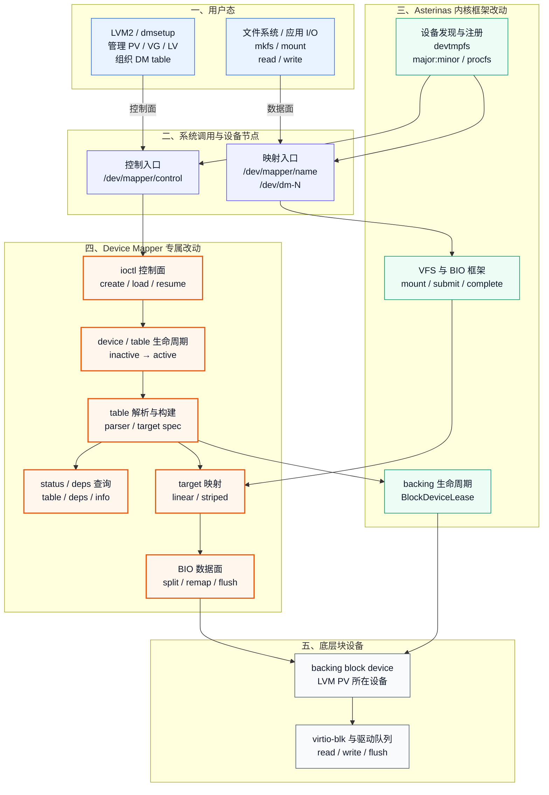
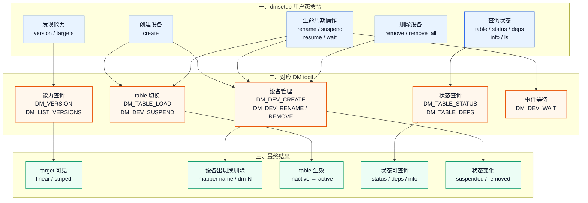
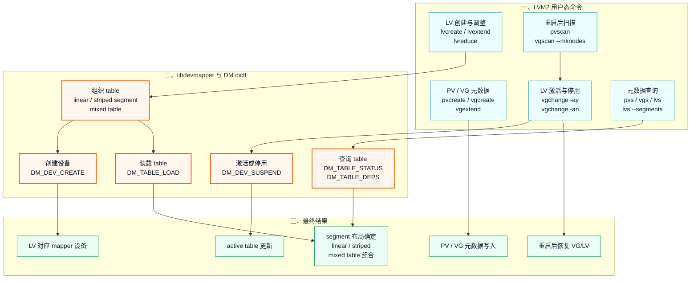
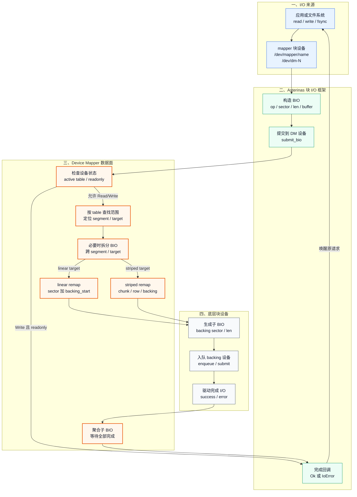
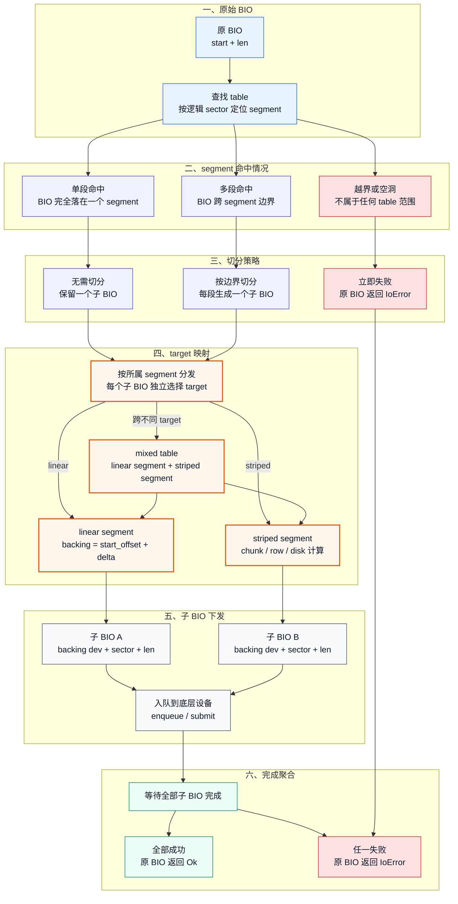
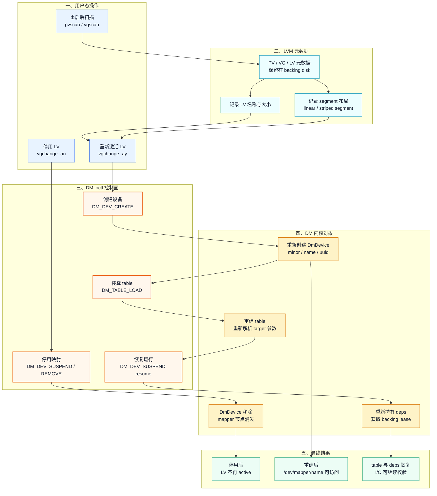
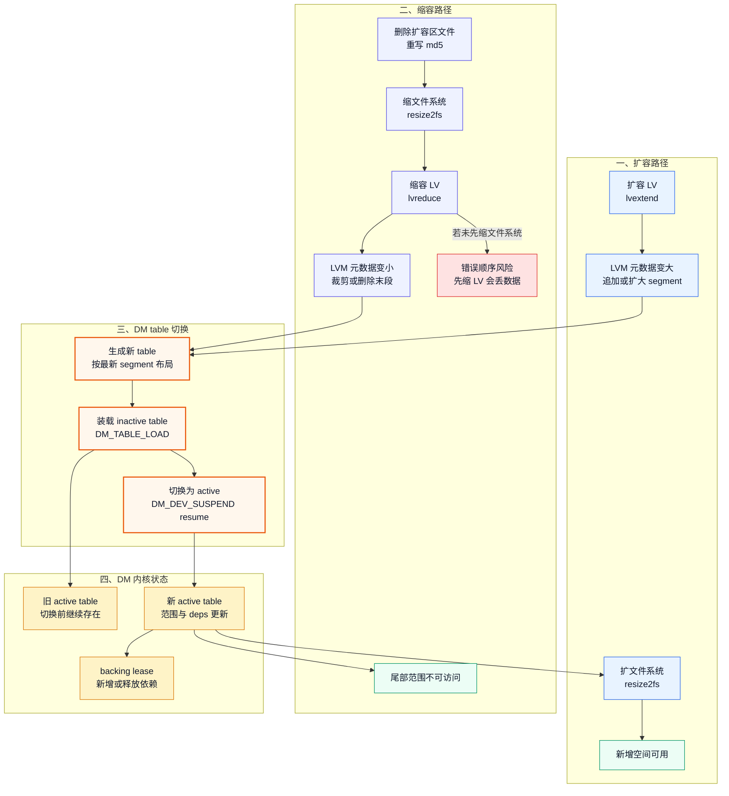
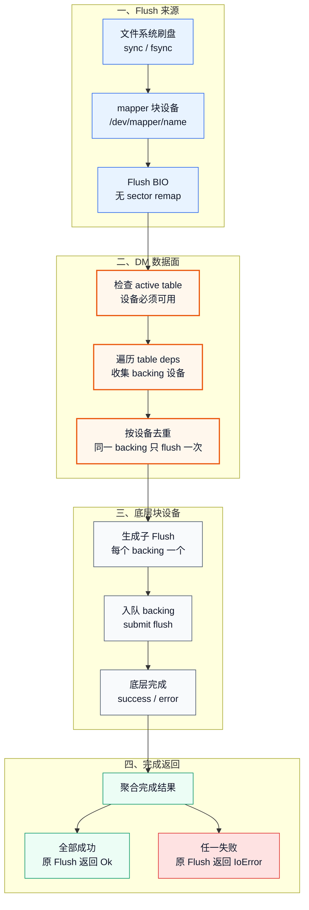
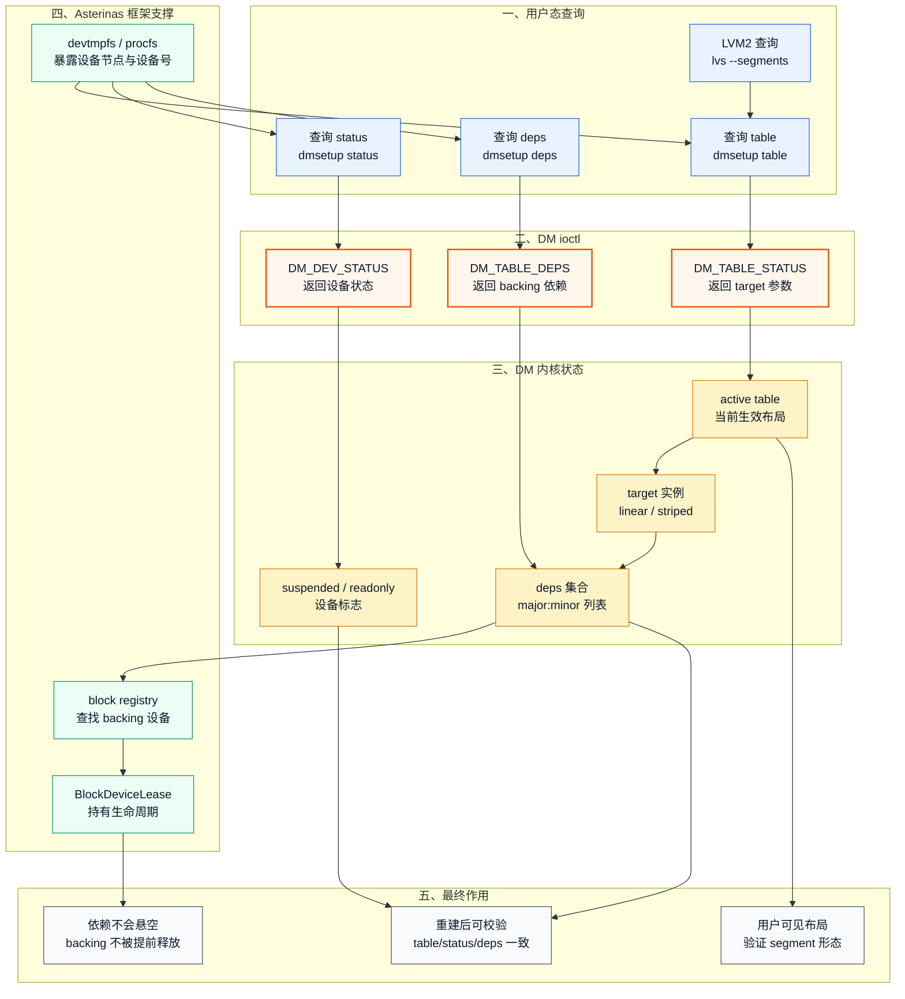

# Device Mapper 整体架构图草稿

本文只作为技术文档配图草稿，正式位置和正文说明待确认后再合入 [device-mapper-technical-maintenance.md](device-mapper-technical-maintenance.md)。

## 整体取舍建议

- 建议正式文档保留图 1：它是唯一从用户态到 backing block device 的总览图，也是区分 Device Mapper 专属改动与 Asterinas 内核框架改动的入口图。
- 建议图 2 和图 3 二选一或合并引用：如果正文讲控制面细节，就保留两张；如果正文篇幅有限，可合并成一节，只保留 LVM2 图，dmsetup 命令用表格补充。
- 建议图 4 和图 5 同时保留：图 4 讲 Read/Write 主路径，图 5 讲跨 segment 的 BIO 切分细节，层级不同，不算重复。
- 建议图 6 和图 7 作为 LV 生命周期小节的两张图：图 6 讲停用、删除映射和重建恢复，图 7 讲扩容、缩容和 table 切换；如果后续需要压缩，可把图 6 放正文，图 7 放测试说明或附录。
- Flush 数据面，以及 status/deps 与 backing lease 的关系已经补成图 8 和图 9；正式合入时应删除本节取舍建议，只保留正文引用、图和图注。

## 颜色约定

- 蓝色 / 青色：用户态入口、LVM2 元数据或用户态操作。
- 紫色：系统调用边界、BIO 切分或缩容路径。
- 橙色 / 黄色：Device Mapper ioctl、DM table、target 和内核对象。
- 绿色：Asterinas 框架支撑或成功结果。
- 灰色：底层块设备或最终作用。
- 红色：错误路径、风险或失败结果。

## 图 1：从用户态到块设备的完整路线图

## 图 2：dmsetup 控制面命令、ioctl 与结果

## 图 3：LVM2 控制面命令、ioctl 与结果

图 2 和图 3 说明：

- `dmsetup` 是更直接的 DM 控制面：脚本里用到 `dmsetup version`、`targets`、`create`、`table`、`status`、`deps`、`info`、`ls`、`rename`、`suspend`、`resume`、`wait`、`remove`、`remove_all`。
- `LVM2` 是更高层的存储管理控制面：脚本里用到 `pvcreate`、`vgcreate`、`vgextend`、`lvcreate`、`lvextend`、`lvreduce`、`vgchange -ay/-an`、`pvscan`、`vgscan --mknodes`、`pvs`、`vgs`、`lvs`、`lvs --segments`。
- `pvcreate`、`vgcreate`、`vgextend`、`pvs`、`vgs`、`lvs` 主要处理或查询 LVM 元数据；真正创建、加载、激活、停用 DM 映射设备时，LVM2 通过 libdevmapper 进入 `/dev/mapper/control` 并触发 DM ioctl。
- 最终结果包括 target 能力可见、mapper 设备出现、table 从 inactive 切到 active、linear / striped segment 布局确定、mixed table 由 linear segment 和 striped segment 组合而成、status/deps/info 可返回，以及重启后 VG/LV 可扫描恢复。

## 图 4：Read / Write BIO 数据面转发路径

图 4 说明：

- Read 和 Write 的主路径相同：都从 mapper 块设备进入 DM active table，再按逻辑 sector 找到目标 segment。
- 如果一个 BIO 覆盖多个 segment 或 target，DM 数据面会拆成多个子 BIO；每个子 BIO 只落到一个 backing 设备的连续范围。
- `linear` target 的核心是把逻辑 sector 加上 backing 起始偏移；`striped` target 的核心是根据 chunk size 和 stripe row 选择 backing 设备与 backing sector。
- 子 BIO 下发到底层 backing 设备队列后，由 completion 聚合结果：全部成功则原 BIO 成功；任一子 BIO 入队失败或完成为 `IoError`，原 BIO 返回 `IoError`。
- readonly mapper 下 Read 允许，Write 在进入 remap 前被拒绝；Flush 不走本图的 sector remap 路径，后续单独画。

## 图 5：BIO 切分、映射与完成聚合细节

图 5 说明：

- 单段 segment 场景下，BIO 不需要按 table 边界拆分，只生成一个子 BIO，然后按该 segment 的 target 类型进入 `linear` 或 `striped` 映射逻辑。
- 多段 segments 场景下，BIO 会先按 table segment 边界切分；切分后的每个子 BIO 只覆盖一个 target 的连续逻辑范围，可能是 linear+linear、striped+striped，也可能是 mixed table 中的 linear+striped。
- mixed table 不是一种 target，也不是单个 segment 类型；它表示同一张 table 同时包含 linear segment 和 striped segment，这也是 mixed 测试要覆盖跨 target 读写的原因。
- `linear` 映射只需要计算 backing 起始偏移；`striped` 映射需要根据 chunk size、stripe row 和 stripe index 选择 backing 设备与 backing sector。
- 完成聚合以原 BIO 为单位：所有子 BIO 成功，原 BIO 才成功；任何子 BIO 入队失败或完成失败，原 BIO 返回 `IoError`。

## 图 6：LV 停用、删除映射与重建恢复

图 6 说明：

- 当前系统脚本主要验证的是 `vgchange -an` 停用 LV、guest 重启后 `pvscan` / `vgscan --mknodes` 重新发现元数据、再通过 `vgchange -ay` 重建 mapper 设备和 active table。
- 这里的“重建”不是重新创建文件系统数据，也不是重新 `pvcreate/vgcreate/lvcreate`；它依赖 backing disk 上已有的 LVM 元数据恢复 VG/LV 和 segment 布局。
- `vgchange -an` 会让 DM 映射设备停用或消失；重新激活时，LVM2 通过 libdevmapper 按顺序触发 `DM_DEV_CREATE`、`DM_TABLE_LOAD` 和 resume，最终重新得到 `/dev/mapper/name`、active table、status/deps 与 backing lease。
- `dmsetup remove` 也可以直接删除 DM 映射设备，但它不是当前 reboot recovery 脚本的主路径，因此不放在主图中。
- 真正的 `lvremove` 会删除 LVM 元数据里的 LV 定义，属于破坏性删除；当前 reboot recovery 脚本不依赖这种语义，图中重点是“停用映射后基于元数据重建”。

## 图 7：LV 扩容、缩容与 DM table 切换

图 7 说明：

- 扩容路径是 `lvextend` 先修改 LVM 元数据，生成更大的 DM table，再通过 `DM_TABLE_LOAD` 装载 inactive table，resume 后成为新的 active table；之后 `resize2fs` 才能让文件系统使用新增空间。
- 缩容路径必须反过来：先删除扩容区测试文件并重写 md5，确保尾部有效数据已经移除，再用 `resize2fs` 缩小文件系统，最后执行 `lvreduce` 缩小 LV；否则 LV 尾部被裁掉后，文件系统仍引用旧范围，会产生数据丢失风险。
- DM 内核侧不直接原地修改旧 active table，而是装载新 table 后切换；切换完成后，table 范围、deps 和 backing lease 与新的 segment 布局一致。
- 对 linear / striped segment 组成的 table 来说，扩容可能扩大末段或追加 segment；缩容通常裁剪尾部范围，必要时删除末尾 segment；mixed table 表示同一张 table 同时包含 linear segment 和 striped segment。

## 图 8：Flush BIO 扇出、去重与完成聚合

图 8 说明：

- Flush BIO 不像 Read/Write 那样按逻辑 sector 查找单个 segment，也不做 linear 或 striped sector remap；它表达的是“把此前写入持久化到底层设备”。
- DM 需要根据 active table 收集当前 table 依赖的 backing 设备，并对相同 backing 去重，避免 mixed table 或多 segment 场景下对同一底层设备重复 flush。
- 每个 backing 设备收到一个子 Flush；所有子 Flush 成功后，原 Flush 才返回成功；任一 backing flush 失败，原 Flush 返回 `IoError`。
- 这张图应与图 4 分开使用：图 4 解释 Read/Write 的 sector remap，图 8 解释 Flush 的 backing 扇出。

## 图 9：status / deps 查询与 backing 生命周期保护

图 9 说明：

- `dmsetup table` / `status` / `deps` 分别对应 table 参数、设备状态和 backing 依赖，是脚本判断 DM table 是否正确生效的重要观测面。
- `DM_TABLE_DEPS` 返回的是当前 active table 依赖的 backing 设备集合；这些依赖来自 linear / striped target 解析出的底层块设备。
- `BlockDeviceLease` 属于 Asterinas 内核框架支撑：DM table 持有 backing 设备期间，lease 防止 backing 设备生命周期提前结束。
- 重启恢复、扩容缩容、mixed table 校验都可以通过 `table/status/deps` 交叉验证：用户态看到的 segment 形态、DM active table、backing 依赖应保持一致。