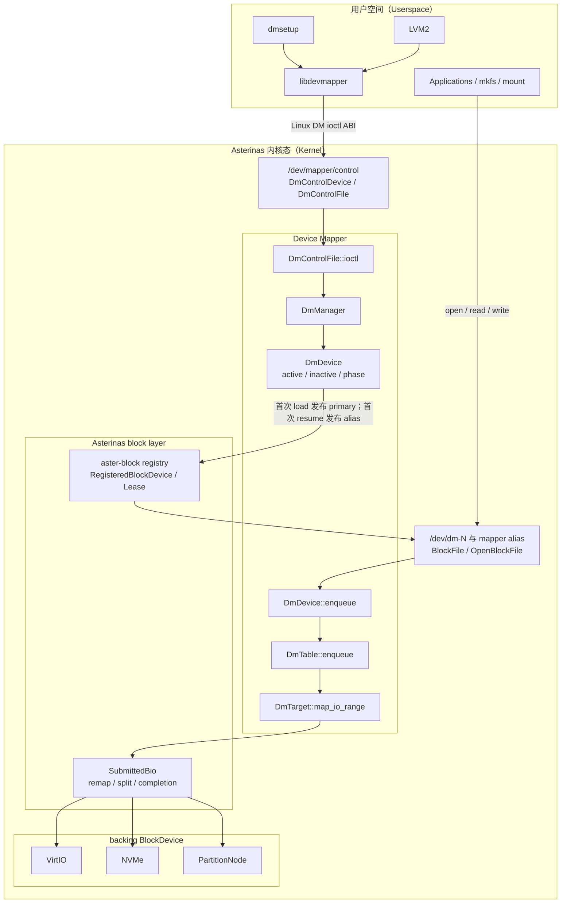

# Device Mapper 学习记录

## 一、核心对象和接口

本部分只说明对象本身：对象的来源、结构、字段、接口和持有关系。所有启动、注册、查找、`open`、`create`、`load`、`resume` 和 BIO 执行过程统一放在第二部分。

### 1. 来源分类

```text
[Asterinas 原有]
  DM 项目开始前，Asterinas 框架中已经存在的对象或接口。

[DM 专属]
  只服务 Device Mapper 身份、table、target 或 control ABI 的对象。

[DM 推动的通用框架扩展]
  为接入 DM 而新增或改造，但最终可由所有块设备、文件系统或运行期设备复用的能力。
```

对象位于哪个 crate，并不能直接说明它属于哪一类。例如，`DmControlDevice` 位于 `aster-core`，但它是 DM 专属对象；`RegistrationStatus` 位于 `aster-block`，但它并非 Asterinas 原有能力，而是 DM 推动加入的通用框架扩展。

### 2. Asterinas 原有基础接口

#### 2.1 `Device` / `DeviceType` `[Asterinas 原有]`

源码：[kernel/core/src/device/mod.rs](../kernel/core/src/device/mod.rs)

```rust
pub(crate) trait Device: Send + Sync + 'static {
    fn type_(&self) -> DeviceType;
    fn id(&self) -> DeviceId;
    fn devtmpfs_meta(&self) -> Option<DevtmpfsInodeMeta<'_>>;
    fn open(&self) -> Result<Box<dyn PerOpenFileOps>>;
}

pub(crate) enum DeviceType {
    Char,
    Block,
}
```

`Device` 面向 VFS，描述一个能够通过设备 inode 打开的对象：

| 接口 | 语义 |
|---|---|
| `type_()` | 返回字符设备或块设备。 |
| `id()` | 返回设备号 `DeviceId`。 |
| `devtmpfs_meta()` | 声明设备节点在 devtmpfs 中的名称和元数据。 |
| `open()` | 创建一次打开对应的 `PerOpenFileOps`。 |

`Device` 不负责 sector、BIO 或 DM 映射。DM 直接复用该接口实现 `DmControlDevice`；原有 `BlockFile` 也继续通过该接口接入 VFS。

#### 2.2 `BlockDevice` `[Asterinas 原有，接口有通用框架扩展]`

源码：[kernel/core/comps/block/src/lib.rs](../kernel/core/comps/block/src/lib.rs)

```rust
pub trait BlockDevice: Send + Sync + Any + Debug {
    fn enqueue(&self, bio: SubmittedBio) -> Result<(), BioEnqueueError>;
    fn metadata(&self) -> BlockDeviceMeta;
    fn name(&self) -> String;
    fn id(&self) -> DeviceId;
}
```

`BlockDevice` 面向 block layer：

| 接口 | 语义 |
|---|---|
| `enqueue()` | 接收已经构造好的 `SubmittedBio`。 |
| `metadata()` | 返回容量、BIO segment 上限等块设备元数据。 |
| `name()` | 返回块设备名称。 |
| `id()` | 返回块设备的 `DeviceId`。 |

`VirtioBlockDevice`、`NvmeBlockDevice` 和 `PartitionNode` 原本就是 `BlockDevice`。DM 新增的 `DmDevice` 也实现该接口。

DM 接入对原接口做过一项通用修改：`name()` 的返回值由静态借用形式改为 `String`，以支持运行期可变的 mapper 名称。

`Device` 与 `BlockDevice` 不是父子 trait：

```text
Device
  面向 VFS、设备节点和 open。

BlockDevice
  面向 sector、BIO 和块 I/O。
```

### 3. DM control 对象

#### 3.1 `DmControlDevice` / `DmControlFile` `[DM 专属，复用原有 Device]`

源码：[kernel/core/src/device/misc/device_mapper.rs](../kernel/core/src/device/misc/device_mapper.rs)

```rust
#[derive(Debug)]
struct DmControlDevice {
    id: DeviceId,
}

impl Device for DmControlDevice {
    fn type_(&self) -> DeviceType {
        DeviceType::Char
    }

    fn id(&self) -> DeviceId {
        self.id
    }

    fn devtmpfs_meta(&self) -> Option<DevtmpfsInodeMeta<'_>> {
        Some(DevtmpfsInodeMeta::new("mapper/control"))
    }

    fn open(&self) -> Result<Box<dyn PerOpenFileOps>> {
        Ok(Box::new(DmControlFile))
    }
}

struct DmControlFile;
```

| 对象 | 职责 |
|---|---|
| `DmControlDevice` | 表示 `/dev/mapper/control` 对应的字符设备，实现原有 `Device`。 |
| `DmControlFile` | 表示一次 control 节点打开后的文件对象，负责 DM ioctl，不支持普通 read/write。 |

control 设备复用了 Asterinas 原有的固定 misc major 10、`Device` trait 和 char registry；DM 新增的是 minor 236 对应的对象及 ioctl 语义。

#### 3.2 `dm_ioctl` ABI 信封 `[Linux DM UAPI，不是长期运行期对象]`

源码：[kernel/core/src/device/misc/device_mapper.rs](../kernel/core/src/device/misc/device_mapper.rs)

`dm_ioctl` 是 libdevmapper 在一次 ioctl 中传入、内核在返回前写回的 ABI buffer。当前实现按 Linux C layout 的固定 offset 读取和写入该 buffer，而不将它建模为长期存活的 Rust 结构体。`DmControlFile::ioctl()` 还会独立取得 raw ioctl number，并经 `decode_command()` 确定命令类别；该 number 不存放在 `dm_ioctl` buffer 中。

| `dm_ioctl` 字段 | 语义 |
|---|---|
| `version` | 用户态声明其支持的 ABI 版本；内核校验主版本，并将自身版本写回。 |
| `data_size` / `data_start` | 声明完整 buffer 大小和可变数据区的起点；内核在信任 data area 前校验边界与对齐。 |
| `name` / `uuid` / `dev` | create 时提供身份字段，其他 mapper 命令可据此定位已有 `DmDevice`。 |
| `flags` | 传递 readonly、persistent minor、查询 inactive table 等命令控制语义。 |
| `target_count` + data area | load 时描述 target 数量，以及连续的 `dm_target_spec` 和 target 参数；其他命令也可通过 data area 返回变长结果。 |

它的生命周期只覆盖一次 `DmControlFile::ioctl()`：该函数先从 `RawIoctl` 独立解码命令类别，再从用户地址复制 `dm_ioctl` buffer，完成布局、版本和 flags 校验后以二者调用 `handle_command()`，最后将 buffer 结果写回用户地址。它不被 `DmManager`、`DmDevice`、`DmTable` 或任一 registry 持有。

#### 3.3 char device registry `[Asterinas 原有，DM 新增一项]`

源码：[kernel/core/src/device/registry/char.rs](../kernel/core/src/device/registry/char.rs)

```rust
static DEVICE_REGISTRY: Mutex<BTreeMap<u32, Arc<dyn Device>>> =
    Mutex::new(BTreeMap::new());
```

该全局表的键和值为：

```text
key
  DeviceId.to_raw()

value
  Arc<dyn Device>
```

DM 没有改变该表的结构和核心语义，只增加了一个实际指向 `DmControlDevice` 的注册项：

```text
10:236 -> Arc<DmControlDevice> as Arc<dyn Device>
```

#### 3.4 `DmManager` / `ManagerInner` / `DmDeviceIdOwner` `[DM 专属]`

源码：[kernel/core/comps/device-mapper/src/manager.rs](../kernel/core/comps/device-mapper/src/manager.rs)

```rust
struct ManagerInner {
    by_name: BTreeMap<String, Arc<DmDevice>>,
    name_by_uuid: BTreeMap<String, String>,
}

pub(crate) struct DmDeviceIdOwner {
    id: DeviceId,
    _major: Arc<MajorIdOwner>,
    minors: Arc<Mutex<IdAlloc>>,
}

pub struct DmManager {
    major: Arc<MajorIdOwner>,
    minors: Arc<Mutex<IdAlloc>>,
    inner: Mutex<ManagerInner>,
}
```

| 字段或对象 | 语义 |
|---|---|
| `major` | `DmManager` 长期持有的 device-mapper block major 所有权。 |
| `minors` | mapper minor 分配器；支持顺序分配和请求固定 minor。 |
| `by_name` | mapper name 到 `Arc<DmDevice>` 的控制面索引。 |
| `name_by_uuid` | mapper UUID 到 name 的索引。 |
| `DmDeviceIdOwner.id` | 当前 mapper 的完整 `DeviceId`。 |
| `DmDeviceIdOwner._major` | 保证 mapper 存活期间动态 major 不被释放。 |
| `DmDeviceIdOwner.minors` | 在 owner 销毁时将 minor 归还给 manager 的分配器。 |

`lookup_id()` 当前不是另一张 `DeviceId` map，而是在 `by_name.values()` 中匹配 `device.id()`。

动态 block major 分配和 `MajorIdOwner` 是 Asterinas 原有能力。DM 项目为 `/proc/devices` 的驱动名显示新增了 `allocate_major_with_name()`，并将原 major 所有权集合扩展为带 driver name 的通用映射。

核心生命周期接口：

| 函数 | 输入与前置条件 | 对象、索引和失败边界 |
|---|---|---|
| `DmManager::create_with_readonly()` | name、可选 UUID、可选指定 minor；name/UUID 不能冲突，指定 minor 必须在范围内且空闲。 | 从 `minors` 分配 minor，与既有 `major` 合成 `DeviceId`，创建 `DmDeviceIdOwner` 与 `Arc<DmDevice>`；最后写入 `by_name` 和可选 `name_by_uuid`。它只建立身份和 manager 索引，不插入任一 block/VFS registry。冲突或 minor 分配失败时不会创建 mapper。 |
| `DmManager::lookup_name()` / `lookup_uuid()` / `lookup_id()` | 分别由 name、UUID 或 `DeviceId` 定位。 | 从 `inner` 返回独立的 `Arc<DmDevice>`；`lookup_id()` 先检查 major，再遍历 `by_name` 的值匹配 id，并没有独立的 `DeviceId` 索引表。 |
| `DmManager::remove()` | 调用方必须已停止新 open、移除设备节点并注销 block registry 项。 | 删除 `by_name` 与对应 UUID 索引并返回该 `Arc<DmDevice>`；不自行注销 VFS/block 资源。只有最后一个 `DmDevice` 引用释放，`DmDeviceIdOwner` 才归还 minor。 |

#### 3.5 `DM_MANAGER` `[DM 专属全局对象]`

源码：[kernel/core/src/device/misc/device_mapper.rs](../kernel/core/src/device/misc/device_mapper.rs)

```rust
static DM_MANAGER: Once<DmManager> = Once::new();
```

`DM_MANAGER` 保证全局只有一个 `DmManager` 实例。mapper name、UUID 和设备对象索引实际保存在该实例的 `inner: Mutex<ManagerInner>` 中。

### 4. DM mapper 核心对象

#### 4.1 `DmDevice` / `DmDeviceState` / `DmIoState` `[DM 专属]`

源码：[kernel/core/comps/device-mapper/src/device.rs](../kernel/core/comps/device-mapper/src/device.rs)

```rust
#[derive(Clone, Copy, Debug, Eq, PartialEq)]
enum DmDevicePhase {
    Running,
    Suspending,
    Suspended,
}

struct DmIoState {
    in_flight: AtomicUsize,
    drained: WaitQueue,
}

struct DmDeviceState {
    active: Option<Arc<DmTable>>,
    inactive: Option<Arc<DmTable>>,
    phase: DmDevicePhase,
    event_nr: u32,
}

pub struct DmDevice {
    id_owner: DmDeviceIdOwner,
    name: Mutex<String>,
    uuid: Mutex<Option<String>>,
    readonly: AtomicBool,
    state: Mutex<DmDeviceState>,
    io: Arc<DmIoState>,
    events: WaitQueue,
}
```

| 字段 | 语义 |
|---|---|
| `id_owner` | 持有 device-mapper major、mapper minor 和完整 `DeviceId`。 |
| `name` / `uuid` | mapper 的控制面身份。 |
| `readonly` | mapper 级只读状态。 |
| `state.active` | 当前服务数据面 BIO 的 table。 |
| `state.inactive` | 已加载、等待下一次激活的候选 table。 |
| `state.phase` | `Running`、`Suspending` 或 `Suspended`。 |
| `state.event_nr` | DM 事件序号。 |
| `io.in_flight` | 已接受但尚未完成的 BIO 数量。 |
| `io.drained` | 等待在飞 BIO 排空的等待队列。 |
| `events` | 支撑 control 面 wait 和事件通知。 |

`DmDevice` 实现 Asterinas 原有的 `BlockDevice`，但不实现 `aster-core` 的 VFS `Device`。这样 `aster-device-mapper` 只依赖较低层的 `aster-block`，不会反向依赖 `aster-core` 和 VFS。

核心状态转换接口：

| 函数 | 前置条件和状态变化 | 边界 |
|---|---|---|
| `load_table(table)` | 调用方已构造并完整校验 `Arc<DmTable>`；在 state lock 内执行 `inactive = Some(table)`。 | 不修改 `active`，也不注册设备节点或 block registry。 |
| `clear_inactive_table()` | 在 state lock 内执行 `inactive.take()`。 | inactive 为空时仍成功；不影响 active 或 event number。 |
| `suspend()` | `Running -> Suspending`，等待 `io.in_flight == 0` 后转为 `Suspended`。 | 已 `Suspended` 时幂等成功；正在 `Suspending` 时拒绝，避免交错的 suspend/resume 越过 I/O 栅栏。 |
| `resume()` | 对已经发布的 mapper：若存在 inactive，执行 `inactive.take()` 并写入 active；若当前为 `Suspended`，转为 `Running`。 | 当 active 和 inactive 均为空或 phase 为 `Suspending` 时拒绝。它只切换 table/phase，不负责注册 registry 或创建设备节点。 |
| `begin_initial_resume()` / `InitialResumeGuard` | 仅用于 primary node 已发布、alias 尚未发布的首次 resume，要求 `active == None` 且存在 inactive；guard 持有 state lock，但在 alias 发布成功前不改变 table 或 phase。 | control 层在 guard 存活期间创建 mapper alias；只有 `commit()` 才把 inactive 原子移至 active、切到 `Running` 并准备 postponed BIO replay。未 commit 的 drop 仅释放 state lock，inactive/phase 保持原样；primary 已可 open，但 alias 尚不可用。 |
| `BlockDevice::enqueue(bio)` | 仅在 `phase == Running`、写请求未违反 readonly、且 active table 存在时接受 BIO；随后增加 `io.in_flight` 并交给 active table。 | 不满足条件时返回 `BioEnqueueError::Refused`；完成回调负责减少 in-flight 计数，即使 table 已被替换也由 `Arc` 保持其与 backing lease 存活。 |

#### 4.2 `DmTable` `[DM 专属]`

源码：[kernel/core/comps/device-mapper/src/table.rs](../kernel/core/comps/device-mapper/src/table.rs)

```rust
pub struct DmTable {
    /// Ordered targets whose logical ranges must start at zero and be contiguous.
    targets: Vec<DmTargetBox>,
    /// Total table capacity in 512-byte sectors, equal to the last target end.
    length: u64,
}
```

| 字段 | 语义 |
|---|---|
| `targets` | 按 logical sector 排序的具体 target 对象；必须从 sector 0 开始、连续、无重叠和空洞。 |
| `length` | 整张 table 的容量，单位为 512-byte sector。 |

Asterinas 原有 block layer 不认识 active/inactive table、target 或 mapper logical range；这些都是 DM 领域语义。

| 函数 | 输入与产物 | 校验与失败边界 |
|---|---|---|
| `DmTable::new_targets(targets)` | 接收已构造的 `Vec<DmTargetBox>`，保存为 `targets` 并计算 `length`。 | 第一条必须从 logical sector 0 开始，后续 range 必须连续，拒绝重叠、空洞和算术溢出；失败时不产生 `DmTable`，也不改 `DmDevice` 的 active/inactive。 |
| `table_load_for_device(buffer, device)` | 从已校验的 `dm_ioctl` data area 逐条解析 `dm_target_spec`，调用 `parse_target_with()` 构造 targets，再调用 `DmTable::new_targets()`；若该 mapper 尚无 primary runtime，则先注册 `/dev/dm-X`，随后按 readonly flag 更新设备并调用 `load_table()`。 | `target_count`、每条 `next`、字符串边界、target 参数与全表 geometry 任一校验失败时，不会发布 primary、安装半张 table 或覆盖既有 inactive/active。首次成功 load 返回后只有 inactive table，primary 容量仍为 0。 |

### 5. DM target 对象和接口

#### 5.1 `DmTarget` / `DmTargetBox` / `TargetIoAction` `[DM 专属]`

源码：[kernel/core/comps/device-mapper/src/target/mod.rs](../kernel/core/comps/device-mapper/src/target/mod.rs)

```rust
pub enum TargetIoAction<'a> {
    Remap {
        logical_range: Range<Sid>,
        backing_start: Sid,
        backing: &'a dyn BlockDevice,
    },
    Error {
        logical_range: Range<Sid>,
    },
    Zero {
        logical_range: Range<Sid>,
    },
}

pub trait DmTarget: Debug + Send + Sync {
    fn metadata(&self) -> DmTargetMetadata;
    fn name(&self) -> &'static str;
    fn logical_range(&self) -> &Range<Sid>;
    fn length(&self) -> u64;
    fn for_each_backing_id(&self, f: &mut dyn FnMut(DeviceId));
    fn for_each_backing<'a>(&'a self, f: &mut dyn FnMut(&'a dyn BlockDevice));
    fn status_params(&self, mode: TargetStatusMode) -> Result<String, TableError>;
    fn map_io_range(&self, logical: Range<Sid>) -> Option<Vec<TargetIoAction<'_>>>;
}

pub type DmTargetBox = Box<dyn DmTarget>;
```

| 接口 | 语义 |
|---|---|
| `metadata()` / `name()` | target 的 Linux 可见类型和版本身份。 |
| `logical_range()` / `length()` | target 在 mapper table 中覆盖的 logical sector 区间。 |
| `for_each_backing_id()` | 按 Linux table 顺序访问 backing `DeviceId`。 |
| `for_each_backing()` | 访问已经解析完成的 backing `BlockDevice`。 |
| `status_params()` | 生成 table/status 命令需要的 target 参数。 |
| `map_io_range()` | 将 target 内部 logical range 转换为一个或多个 `TargetIoAction`。 |

`DmTargetBox` 统一保存 trait object，但内部真实对象仍是 `LinearTarget`、`StripedTarget`、`ZeroTarget` 或 `ErrorTarget`。

| 函数 | 输入、对象连接与产物 | 失败边界 |
|---|---|---|
| `parse_target_with()` | 接收一条 Linux table record 的 target type、logical start、length 和参数；按 type 分派到具体 target 的 `parse`/`parse_with`。linear/striped 通过调用方提供的回调将 backing token 解析为 `DeviceId`，再以 `lookup_lease()` 取得 `BlockDeviceLease`；最后返回 `DmTargetBox`。 | 不支持的 type、参数/geometry/backing 容量非法或 backing 不为 Live 都失败。失败时尚未装入 `DmTable`，临时 target 和已取得的 lease 随析构释放，不修改 `DmDevice` table 状态。 |

`TargetIoAction` 的三种结果为：

| action | 语义 |
|---|---|
| `Remap` | 指定 logical 子区间、backing 起始 sector 和 backing `BlockDevice`。 |
| `Zero` | 不需要 backing，对该 logical 子区间执行 zero target 语义。 |
| `Error` | 不需要 backing，对该 logical 子区间返回稳定 I/O error。 |

#### 5.2 `TargetRange` `[DM 专属]`

```rust
pub struct TargetRange {
    logical_range: Range<Sid>,
}
```

`TargetRange` 是具体 target 共用的 logical sector 范围对象，负责：

- 拒绝零长度；
- 检查 logical end 溢出；
- 返回 range 和长度；
- 计算 sector 相对 target 起点的 offset；
- 判断一个非空子区间是否完全属于 target。

#### 5.3 `LinearTarget` `[DM 专属]`

源码：[kernel/core/comps/device-mapper/src/target/linear.rs](../kernel/core/comps/device-mapper/src/target/linear.rs)

```rust
pub struct LinearTarget {
    range: TargetRange,
    backing_start: Sid,
    backing_id: DeviceId,
    backing: BlockDeviceLease,
}
```

| 字段 | 语义 |
|---|---|
| `range` | 该 target 覆盖的 mapper logical range。 |
| `backing_start` | `logical_range.start` 对应的第一个 backing sector。 |
| `backing_id` | 供 deps、table 和 status 输出使用的稳定 backing 身份。 |
| `backing` | 长期持有 backing `BlockDevice` 的 lease。 |

映射公式属于该对象的核心语义：

```text
logical offset = logical sector - target logical start
backing sector = backing_start + logical offset
```

`LinearTarget` 需要检查 logical range、sector 算术和 backing 容量，并为有效子区间生成一个 `Remap` action。

#### 5.4 `StripedTarget` `[DM 专属]`

源码：[kernel/core/comps/device-mapper/src/target/striped.rs](../kernel/core/comps/device-mapper/src/target/striped.rs)

```rust
pub struct StripedTarget {
    range: TargetRange,
    chunk_size: u64,
    stripe_width: u64,
    stripes: Vec<StripedTargetStripe>,
}

struct StripedTargetStripe {
    backing_start: Sid,
    backing_id: DeviceId,
    backing: BlockDeviceLease,
}
```

| 字段 | 语义 |
|---|---|
| `range` | 该 striped target 覆盖的 mapper logical range。 |
| `chunk_size` | 在一条 stripe 上连续放置的 sector 数量。 |
| `stripe_width` | 一整行全部 stripes 的 sector 总数。 |
| `stripes` | 按 Linux table 参数顺序保存的 backing stripe。 |
| `StripedTargetStripe.backing_start` | 当前 stripe 的 backing 起点。 |
| `StripedTargetStripe.backing_id` | 当前 stripe 的稳定设备身份。 |
| `StripedTargetStripe.backing` | 保持当前 backing 存活的 lease。 |

`StripedTarget` 负责 stripe row、chunk、stripe index 的计算，以及在自身范围内按 chunk 边界产生一个或多个 `Remap` action。

#### 5.5 `ZeroTarget` `[DM 专属]`

源码：[kernel/core/comps/device-mapper/src/target/zero.rs](../kernel/core/comps/device-mapper/src/target/zero.rs)

```rust
pub struct ZeroTarget {
    range: TargetRange,
}
```

`ZeroTarget` 没有 `DeviceId`、backing 或 `BlockDeviceLease`。它只持有 logical range，参数必须为空，映射结果为 `TargetIoAction::Zero`。

#### 5.6 `ErrorTarget` `[DM 专属]`

源码：[kernel/core/comps/device-mapper/src/target/error.rs](../kernel/core/comps/device-mapper/src/target/error.rs)

```rust
pub struct ErrorTarget {
    range: TargetRange,
}
```

`ErrorTarget` 同样没有 `DeviceId`、backing 或 `BlockDeviceLease`。它只持有 logical range，参数必须为空，映射结果为 `TargetIoAction::Error`。

### 6. DM 推动的通用 block 生命周期对象

#### 6.1 `RegisteredBlockDevice` / `RegistrationStatus` `[DM 推动的通用框架扩展]`

源码：[kernel/core/comps/block/src/lib.rs](../kernel/core/comps/block/src/lib.rs)

```rust
struct RegisteredBlockDevice {
    id: DeviceId,
    device: Arc<dyn BlockDevice>,
    state: Mutex<RegisteredBlockDeviceState>,
}

struct RegisteredBlockDeviceState {
    status: RegistrationStatus,
    lease_count: usize,
}

enum RegistrationStatus {
    Pending,
    Live,
    Removing,
}
```

| 字段或状态 | 语义 |
|---|---|
| `id` | registry 使用的块设备身份。 |
| `device` | 实际的 `Arc<dyn BlockDevice>`。 |
| `status` | 当前注册生命周期状态。 |
| `lease_count` | 正在长期使用该设备的受跟踪 lease 数量。 |
| `Pending` | 以 create 阶段已存在的 `DeviceId` 预留本 registry 的表项；不分配或拥有该设备号，普通 lookup/lease 尚不可见。 |
| `Live` | 已正式发布，普通 lookup/lease 可见。 |
| `Removing` | 正在注销，停止产生新的普通 lookup/lease。 |

Asterinas 原本已有 `aster-block` registry，但原值类型直接是 `Arc<dyn BlockDevice>`。`RegisteredBlockDevice`、三态生命周期和 `lease_count` 都是 DM 项目推动新增的通用能力。

#### 6.2 `BlockDeviceLease` `[DM 推动的通用框架扩展]`

```rust
pub struct BlockDeviceLease {
    device: Arc<dyn BlockDevice>,
    registered: Option<Arc<RegisteredBlockDevice>>,
}
```

| 字段 | 语义 |
|---|---|
| `device` | 被长期使用的实际块设备。 |
| `registered` | 可选的 registry 注册项，用于跟踪 `lease_count`。 |

受跟踪 lease 在创建和 clone 时增加 `lease_count`，在 drop 时减少；只要 `lease_count != 0`，设备就不能完成注销。`new_untracked()` 可为已经解析、但不参与 registry 生命周期跟踪的设备构造 lease。

#### 6.3 注册和注销事务令牌 `[DM 推动的通用框架扩展]`

```rust
pub struct PendingBlockDeviceRegistration {
    registered: Arc<RegisteredBlockDevice>,
}

pub struct PendingBlockDeviceUnregistration {
    registered: Arc<RegisteredBlockDevice>,
    restore_on_drop: bool,
}
```

| 对象 | 语义 |
|---|---|
| `PendingBlockDeviceRegistration` | 表示已经占用 registry 项、但尚未正式发布的注册事务。 |
| `PendingBlockDeviceUnregistration` | 表示已经停止新 lookup/lease、但外部资源尚未清理完成的注销事务；默认 drop 会恢复 Live，补偿失败路径可通过 `retain_removing()` 禁止该恢复并保持隔离。 |

核心事务接口：

| 函数 | 输入与状态变化 | 失败或回滚边界 |
|---|---|---|
| `register_pending(device)` | 读取既有 `device.id()`；创建 `RegisteredBlockDevice { device, status: Pending, lease_count: 0 }` 并插入 `aster_block::DEVICE_REGISTRY[id]`，返回注册 token。 | 该 id 已在此 registry 中时失败；它不分配 `DeviceId`，对于 mapper 该 id 早在 create 阶段由 `DmDeviceIdOwner` 持有。 |
| `commit_registration(token)` | 验证 token 仍对应同一 registry 表项且状态为 Pending，然后将其转为 Live。 | token 失效、表项被替换或状态已改变时失败；失败不会发布其他表项。 |
| `abort_registration(token)` | 验证仍是同一 Pending 表项且没有 lease，移除该 registry 项并返回内部 `Arc<dyn BlockDevice>`。 | 仅能撤销未发布的 Pending 项；因此 VFS wrapper、主节点或 alias 的后续创建失败可以回退到未注册状态。 |
| `begin_unregister(id)` | 要求表项为 Live 且 `lease_count == 0`，将状态改为 Removing 并返回注销 token。 | 不存在、仍有 lease 或不在 Live 时失败；Removing 阻止新的普通 lookup/lease。 |
| `commit_unregister(token)` / `abort_unregister(token)` | 前者移除 Removing 表项并返回 device；后者将其恢复为 Live。若 runtime node 补偿失败，调用方对 token 使用 `retain_removing()` 并保存它，保持 Removing 隔离而非在 drop 时恢复 Live；后续同名 remove 可取回 token 重试 commit。 | 正常可恢复失败才调用 `abort_unregister`；隔离期间 lookup/lease 不可见、wrapper 拒绝 open，避免缺失 node 的设备重新可用。 |
| `lookup(id)` / `lookup_lease(id)` | 只返回 Live 表项；后者创建 `BlockDeviceLease` 并增加 `lease_count`。 | Pending 和 Removing 对普通查找不可见，因此未完全发布或正在注销的设备不会成为新的 backing 依赖。 |

#### 6.4 `aster_block::DEVICE_REGISTRY` `[原有全局表，值类型和生命周期被扩展]`

```rust
static DEVICE_REGISTRY: Mutex<BTreeMap<u32, Arc<RegisteredBlockDevice>>> =
    Mutex::new(BTreeMap::new());
```

当前表项为：

```text
key
  DeviceId.to_raw()

value
  Arc<RegisteredBlockDevice>
```

历史差异：

```text
DM 引入前：
  BTreeMap<u32, Arc<dyn BlockDevice>>

当前：
  BTreeMap<u32, Arc<RegisteredBlockDevice>>
```

该表可以保存 `DmDevice`、VirtIO、NVMe 和分区等任何 `BlockDevice`。普通 `lookup()` 和 `lookup_lease()` 只暴露状态为 `Live` 的项。

### 7. VFS 块设备适配对象

#### 7.1 `BlockFile` / `OpenBlockFile` `[原有对象，DM 推动生命周期扩展]`

源码：[kernel/core/src/device/registry/block.rs](../kernel/core/src/device/registry/block.rs)

```rust
struct BlockFile {
    id: DeviceId,
    path: String,
    state: Arc<Mutex<BlockFileState>>,
    lifecycle: Mutex<()>,
    node: Mutex<Option<Path>>,
    mapper_alias: Mutex<Option<(String, Path)>>,
}

struct BlockFileState {
    device: Arc<dyn BlockDevice>,
    accepting_opens: bool,
    open_count: usize,
}

struct OpenBlockFile {
    device: Arc<dyn BlockDevice>,
    state: Arc<Mutex<BlockFileState>>,
}
```

```rust
impl Device for BlockFile {
    // Implements type_(), id(), devtmpfs_meta(), and open().
}
```

| 字段 | 语义 |
|---|---|
| `BlockFile.id` | VFS device registry 和设备 inode 使用的 `DeviceId`。 |
| `BlockFile.path` | 主设备节点的 devtmpfs 相对路径。 |
| `BlockFile.state.device` | 注册该 wrapper 时已经确定的具体 `Arc<dyn BlockDevice>`。 |
| `accepting_opens` | 是否允许产生新的 `OpenBlockFile`。 |
| `open_count` | 当前仍然存活的打开实例数量。 |
| `lifecycle` | 串行化注册、改名和注销等生命周期操作。 |
| `node` | 当前 wrapper 拥有的主设备节点。 |
| `mapper_alias` | mapper 名称和对应 alias 节点，仅服务 DM。 |
| `OpenBlockFile.device` | 从 `BlockFileState.device` clone 得到的同一个具体块设备。 |
| `OpenBlockFile.state` | 用于在 drop 时归还 `open_count`。 |

来源区分：

```text
Asterinas 原有：
  BlockFile 持有 BlockDevice，并实现 Device。
  OpenBlockFile 负责块设备文件的 read/write/ioctl。

DM 推动的通用框架扩展：
  id、path、node、lifecycle 和显式 wrapper 生命周期。
  accepting_opens、open_count 和 OpenBlockFile drop 计数。
  VFS block wrapper 的显式注册和撤销。

DM 专属：
  mapper_alias。
  dm-X 和 mapper/<name> 的注册、改名和删除规则。
```

`BlockFile` 保存的是注册时传入的具体 trait object，不会在 `open()` 时重新选择设备类型：

```text
mapper wrapper 的 state.device
  Arc<DmDevice> as Arc<dyn BlockDevice>

VirtIO wrapper 的 state.device
  Arc<VirtIoBlockDevice> as Arc<dyn BlockDevice>

NVMe wrapper 的 state.device
  Arc<NvmeBlockDevice> as Arc<dyn BlockDevice>

分区 wrapper 的 state.device
  Arc<PartitionNode> as Arc<dyn BlockDevice>
```

核心 wrapper 生命周期接口：

| 函数 | 输入、对象与状态变化 | 失败或回滚边界 |
|---|---|---|
| `register_pending_wrapper(device, path)` | 用已存在的 `Arc<dyn BlockDevice>` 创建 `BlockFile`；将其写入 VFS block `DEVICE_REGISTRY[id]`，初始 `accepting_opens = false`。对 mapper，该 trait object 的真实对象是同一个 `Arc<DmDevice>`。 | 仅建立 VFS wrapper，不发布 block registry、也不允许 open；后续失败可直接移除该 wrapper。 |
| `BlockFile::start_accepting_opens()` | 将 `accepting_opens` 置为 true。 | 只打开 VFS open gate，不改变 `DmDevice` 的 active/inactive table。 |
| `register_mapper_primary(device)` | 以既有 id 生成 `dm-X` 路径，执行 mapper primary 注册：Pending block registry 项 → Pending `BlockFile`（拒绝 open）→ 创建主节点 → block registry Live → 记录 node 并允许 open。 | 首次 `DM_TABLE_LOAD` 在 table 完整校验后调用它；`DmDevice.active` 仍为空，因此 `/dev/dm-X` 可 open 但容量为 0、read 为 EOF，不会把 BIO 映射到 inactive table。主节点创建失败时只清理 pending wrapper 并 abort pending registry，不会留下 Live/open 状态。 |
| `publish_mapper_alias(id, mapper_name)` | 校验已登记 primary node 仍由同一 `BlockFile` 持有，随后创建 `mapper/<name> -> ../dm-X` 并记录 alias 所有权。 | 首次 resume 的 `InitialResumeGuard` 持 state lock 时先调用它；只有 alias 成功后 `commit()` 才激活 table。失败时不撤 primary，inactive/phase 原样保留，后续 resume 可以重试。 |
| `unregister_mapper(id, mapper_name)` | 先停止新 open；如果有 alias 则先删 alias，再删 primary，提交 block registry 注销并移除 VFS wrapper。 | primary-only 状态没有 alias 时也能注销；可完整补偿的节点/注销失败会恢复资源与 open gate。若补偿也失败，则保存 `Removing` token，继续隐藏 registry/lease、拒绝 open 并返回 `EIO`；后续同名 remove 可重试完成注销。 |

#### 7.2 VFS block `DEVICE_REGISTRY` `[原有全局表，注册方式被扩展]`

```rust
static DEVICE_REGISTRY: Mutex<BTreeMap<u32, Arc<BlockFile>>> =
    Mutex::new(BTreeMap::new());
```

当前表项为：

```text
key
  DeviceId.to_raw()

value
  Arc<BlockFile>
```

历史差异：

```text
DM 引入前：
  BTreeMap<u32, Arc<dyn Device>>
  lookup 路径按需构造 BlockFile。

当前：
  BTreeMap<u32, Arc<BlockFile>>
  显式注册和撤销长期存在的同一个 BlockFile。
```

显式保存 `Arc<BlockFile>` 后，运行期发布、open gate、open count、节点所有权和注销回滚可以围绕同一个 wrapper 对象进行。

### 8. 对象和接口来源总览

| 对象或接口 | 来源分类 | 说明 |
|---|---|---|
| `Device`、`DeviceType` | Asterinas 原有 | VFS 设备抽象。 |
| `BlockDevice` | Asterinas 原有，接口有扩展 | 原有块 I/O 抽象；`name()` 为动态名称做过通用修改。 |
| `DmControlDevice`、`DmControlFile` | DM 专属 | Linux DM control 字符设备及每次打开对象。 |
| `dm_ioctl` ABI 信封 | Linux DM UAPI | 一次控制 ioctl 的用户态 buffer；与 raw ioctl number 并列输入，不是长期运行期对象。 |
| char `DEVICE_REGISTRY` | Asterinas 原有 | DM 只新增 `10:236` 对应项。 |
| `DM_MANAGER`、`DmManager`、`ManagerInner` | DM 专属 | mapper 控制面身份和索引。 |
| `DmDeviceIdOwner`、`DmDevice` | DM 专属 | mapper 设备身份、table 状态和块 I/O 入口。 |
| `DmTable` | DM 专属 | 一版完整 mapper 映射配置。 |
| `DmTarget`、`TargetRange`、`TargetIoAction` | DM 专属 | target 插件接口及映射决策。 |
| `LinearTarget`、`StripedTarget`、`ZeroTarget`、`ErrorTarget` | DM 专属 | 当前具体 target 对象。 |
| `aster_block::DEVICE_REGISTRY` 的基本存在 | Asterinas 原有 | 原本已支持 `DeviceId` 到 `BlockDevice` 的注册和查找。 |
| `RegisteredBlockDevice`、三态状态机 | DM 推动的通用框架扩展 | 为多资源原子发布和安全注销增加。 |
| `BlockDeviceLease`、`lease_count` | DM 推动的通用框架扩展 | 保护长期使用的 block device。 |
| 注册/注销事务令牌 | DM 推动的通用框架扩展 | 支持 prepare、commit 和 abort。 |
| `BlockFile`、`OpenBlockFile` 基本适配器 | Asterinas 原有 | 将 `BlockDevice` 接入 VFS。 |
| `BlockFile` open gate、open count、lifecycle | DM 推动的通用框架扩展 | 支持运行期设备安全发布和移除。 |
| `mapper_alias` | DM 专属 | 保存 `/dev/mapper/<name>` alias 所有权。 |
| VFS block `DEVICE_REGISTRY` 的基本存在 | Asterinas 原有 | 原本已按 `DeviceId` 保存 VFS block device。 |
| VFS block wrapper 显式注册/撤销 | DM 推动的通用框架扩展 | 当前值类型为 `Arc<BlockFile>`。 |
| 动态 block major 分配 | Asterinas 原有 | DM 直接复用。 |
| 带 driver name 的 major 注册 | DM 推动的通用框架扩展 | 支撑 `/proc/devices` 中显示 `device-mapper`。 |
| `dm-X`、`mapper/<name>` | DM 专属 | mapper 主节点和用户可见 alias 规则。 |

## 二、核心链路

本部分只说明运行过程：入口是什么、对象之间通过什么字段或 registry 连接、状态如何变化，以及最终得到什么结果。来源分类不再重复。

### 1. 项目控制面与数据面总览



三条主线：

```text
控制面：
  dmsetup / LVM2 -> libdevmapper -> DmControlFile::ioctl
  -> DmManager -> DmDevice -> active/inactive DmTable

用户态数据面：
  /dev/dm-X -> BlockFile -> OpenBlockFile -> DmDevice
  -> active DmTable -> DmTarget -> backing BlockDevice

内核依赖生命周期：
  DeviceId -> aster-block registry -> BlockDeviceLease
  -> DmDevice 或 backing BlockDevice
```

### 2. `/dev/mapper/control` 启动注册链路

#### 2.1 first kthread 阶段

```text
misc::init_in_first_kthread()
  -> acquire_major(MajorId::new(10))
     准备 misc 字符设备 major 10

  -> device_mapper::init_in_first_kthread()
     -> 初始化 DM_MANAGER
        保证 control 暴露给用户态前，后端 manager 已就绪

     -> DmControlDevice::new()
        创建 control 字符设备对象
        DeviceId = misc major 10 + DM_CONTROL_MINOR 236

     -> char::register(DmControlDevice)
        char::DEVICE_REGISTRY[10:236] = DmControlDevice
```

这里仅完成对象和 `DeviceId` 的注册，还没有创建用户态路径。

#### 2.2 first process 阶段

```text
char::init_in_first_process(path_resolver)
  -> collect_all()
  -> 找到 DmControlDevice
  -> DmControlDevice::devtmpfs_meta()
     返回 "mapper/control"

  -> add_node(DeviceType::Char, encoded DeviceId, meta, path_resolver)
  -> 创建 /dev/mapper/control
```

最终结果：

```text
/dev/mapper/control inode
  保存 DeviceType::Char + encoded DeviceId 10:236

char::DEVICE_REGISTRY
  保存 10:236 -> DmControlDevice
```

### 3. DM ioctl 公共 ABI 链路

一次 Linux DM ioctl 有两路平行输入。

#### 3.1 raw ioctl number

```text
raw_ioctl.cmd()
  -> decode_command()
  -> DM_VERSION_CMD / DM_DEV_CREATE_CMD / DM_TABLE_LOAD_CMD / ...
```

raw command 决定执行哪一种 DM 命令。它不会被写入 `dm_ioctl buffer`，也不会与 buffer 合并为一个字段。

#### 3.2 `dm_ioctl buffer`

`raw_ioctl.arg()` 是用户态 buffer 地址。libdevmapper 将命令参数编码到共享的 `dm_ioctl` 信封中：

```text
version[3]
  用户态支持的 DM ioctl 版本；内核也将自己的版本写回。

data_size / data_start
  整个 buffer 大小和可变数据区起点。

flags
  readonly、persistent minor、query inactive table 等控制位。

dev
  mapper 设备号，可用于定位已有设备。

name
  mapper 名称；create、load、status、remove 等命令可以使用。

uuid
  mapper UUID；LVM2 可用它维护稳定身份。

target_count
  table 中的 target 数量。

data area
  可变长度输入输出区；table load、table/status、deps、list 等命令使用。
```

#### 3.3 两路在 `DmControlFile::ioctl()` 汇合

```text
raw ioctl number --------------------------+
  -> decode_command()                      |
  -> command                               |
                                           +-> command + buffer
用户态 dm_ioctl buffer pointer ------------|     -> validate_client_version(buffer)
  -> 读取 header                           |     -> write_version(buffer)
  -> 校验 data_size / data_start           |     -> validate_input_flags(command, buffer)
  -> 复制完整 buffer                        |     -> handle_command(command, buffer)
                                           |     -> 写回 buffer
                                           +
```

`validate_client_version()` 和 `write_version()` 是所有 DM ioctl 的公共步骤，不是 `version` 命令专属逻辑。

### 4. `dmsetup version` 链路

```text
dmsetup version
  -> libdevmapper
     准备 raw ioctl number = DM_VERSION
     准备 dm_ioctl buffer，其中 version[] 带用户态版本

  -> open("/dev/mapper/control")
     -> 路径解析得到字符设备 inode
     -> inode 取出 DeviceType::Char + DeviceId 10:236
     -> device::lookup(Char, 10:236)
     -> char::DEVICE_REGISTRY[10:236]
     -> DmControlDevice
     -> DmControlDevice::open()
     -> DmControlFile

  -> ioctl(fd, DM_VERSION, dm_ioctl buffer pointer)
     -> sys_ioctl 根据 fd 找到 DmControlFile
     -> DmControlFile::ioctl()

        raw command -> decode_command() = DM_VERSION_CMD
        buffer      -> 读取并校验 dm_ioctl
        buffer      -> validate_client_version()
        buffer      -> write_version()
        command + buffer -> handle_command(DM_VERSION_CMD, buffer)
        buffer      -> 写回用户态

  -> libdevmapper 读取返回版本
  -> dmsetup 打印 Driver version
```

`DM_VERSION_CMD` 的具体 handler 基本不需要额外修改业务字段；真正有意义的版本处理已由公共 ioctl 框架完成。

### 5. `dmsetup create --notable demo` 链路

用户态将 `name=demo`、可选 UUID、flags 和可选 persistent minor 写入 `dm_ioctl buffer`。公共 ioctl 框架校验完成后进入 create handler：

```text
DM_MANAGER
  -> DmManager
  -> 检查 name 和 UUID 是否冲突
  -> 从 DmManager.minors 分配 minor
     默认顺序分配，也可请求固定 minor
  -> 使用 DmManager.major + minor 合成 DeviceId
  -> 创建 DmDeviceIdOwner
  -> 创建 DmDevice
  -> ManagerInner.by_name["demo"] = Arc<DmDevice>
  -> 若有 UUID：name_by_uuid[uuid] = "demo"
```

create 完成后的对象状态：

```text
DmDevice 已存在：
  name = "demo"
  id = device-mapper major:minor
  active = None
  inactive = None

尚未进入：
  aster-block registry
  VFS block DEVICE_REGISTRY

尚不存在：
  BlockFile
  /dev/dm-X
  /dev/mapper/demo
```

因此 `create --notable` 创建的是控制面 mapper 身份，不是已经可打开和读写的用户态块设备。

### 6. `dmsetup load demo` 链路

#### 6.1 定位已有 `DmDevice`

```text
dm_ioctl buffer 中的 name / uuid / dev
  -> lookup_device()
  -> DM_MANAGER
  -> 找到 create 阶段创建的 Arc<DmDevice>
```

load 不创建新的 `DmDevice`。

#### 6.2 解析 Linux table ABI

```text
target_count
  -> 遍历 data area 中的 dm_target_spec

每个 dm_target_spec
  -> logical_start
  -> length
  -> target_type
  -> next
  -> params
```

需要校验：

- `target_count` 与实际记录数量一致；
- `next` 和 data area 边界合法；
- target type 和参数字符串合法终止；
- sector 加法和长度计算不溢出。

#### 6.3 创建具体 target

```rust
match target_type {
    "error" => Box::new(ErrorTarget::parse(...)?),
    "linear" => Box::new(LinearTarget::parse_with(...)?),
    "striped" => Box::new(StripedTarget::parse_with(...)?),
    "zero" => Box::new(ZeroTarget::parse(...)?),
    _ => return Err(DmTargetParseError::UnsupportedTarget),
}
```

对需要 backing 的 `linear` 和 `striped`：

```text
backing token
  -> 若为绝对设备路径：解析设备 inode 的 DeviceId
  -> 若为 major:minor：直接解析 DeviceId

backing DeviceId
  -> aster_block::lookup_lease(backing_id)
  -> 只接受 Live 注册项
  -> lease_count += 1
  -> 得到 BlockDeviceLease
  -> target 保存 backing_id、backing_start 和 lease
```

随后检查 target 参数数量、格式、logical geometry、backing sector 算术和 backing 容量。

`zero` 和 `error` 不查找 backing，也不保存 lease；它们要求参数为空。

#### 6.4 构造完整 `DmTable`

```text
Vec<DmTargetBox>
  -> DmTable::new_targets()
  -> 第一条 target 必须从 logical sector 0 开始
  -> 后续 target 必须与前一条连续
  -> 不允许重叠
  -> 不允许空洞
  -> table.length = 最后一条 target 的 logical end
  -> Arc<DmTable>
```

#### 6.5 原子安装 inactive table

```text
所有解析和校验全部成功
  -> DmDevice::load_table(table)
  -> DmDeviceState.inactive = Some(table)
```

任一步失败时：

```text
不会安装半张 table
临时 target 和 BlockDeviceLease 随临时对象释放
原 active table 不变
原 inactive table也不会被半成品覆盖
```

load 完成后，首次 mapper 已有 `BlockFile` 和 `/dev/dm-X`，但仍没有 `/dev/mapper/demo`。由于 active table 为空，primary 的容量为 0，read 返回 EOF；inactive table 不会接收 BIO。

### 7. Asterinas 首次 `dmsetup load` / `resume demo` 链路

本节描述**当前 Asterinas** 的首次生命周期：Created、Loaded-inactive、Active。primary node 在首次 `load` 发布；Asterinas 的首次 `resume` 激活 table 并发布 alias；已发布 alias 的 mapper resume 继续调用普通 `DmDevice::resume()`，不重复注册节点或 registry。

上游 Linux DM core 对 table 的直接保证是：首次 load 只安装待激活 table，resume 才 bind/swap 为 active table。首个 table load 注册 block disk，可经通用 device/devtmpfs 路径暴露 `/dev/dm-X`；`/dev/mapper/<name>` 则由 LVM2 udev 规则响应 uevent 管理，并非 Linux DM 内核独占的 resume 阶段行为。因此，本机 `wdf` 实验中“alias 在 resume 前出现”只是一项环境可观察结果，不能写成 Linux 通用标准。

```text
create --notable
  -> DM_MANAGER -> Arc<DmDevice>
  -> active = None, inactive = None
  -> 无 BlockFile、/dev/dm-X、/dev/mapper/demo

load
  -> 完整解析与校验 DmTable
  -> 首次时注册 primary runtime
  -> DmDevice::load_table(table)
  -> inactive = Some(table), active = None

resume
  -> DmDevice::begin_initial_resume()
  -> InitialResumeGuard
  -> publish_mapper_alias()
  -> guard.commit()
```

#### 7.1 首次 load 发布 primary，但不激活 table

```text
register_mapper_primary(DmDevice)
  -> aster_block::register_pending(DmDevice)
  -> RegisteredBlockDevice { status = Pending, lease_count = 0 }
  -> register_pending_wrapper(DmDevice, "dm-X")，拒绝 open
  -> add_runtime_node(DeviceType::Block, DmDevice.id(), "dm-X")
  -> block registry Pending -> Live，记录 node
  -> BlockFile::start_accepting_opens()
```

primary 注册只在 table 的 ABI、target、backing lease 和全表 geometry 已全部校验成功后发生；因此无效 `DM_TABLE_LOAD` 不会泄露节点、改变 readonly 或覆盖既有 table。注册成功后才把 table 写入 inactive slot。

Loaded-inactive 时：

```text
/dev/dm-X                 已存在，可 open
/dev/mapper/demo          不存在
DmDevice.active           None
DmDevice.inactive         Some(table)
DmDevice::metadata()      0 sectors
primary read              0 字节 EOF
```

`OpenBlockFile::read_at()` 先依据 `metadata().nr_sectors` 截断范围；容量为 0 时直接返回 EOF，不会调用 `DmDevice::enqueue()`，更不会将 BIO 发送给 inactive table。

#### 7.2 首次 resume 激活 table 并发布 alias

```text
begin_initial_resume()
  -> 要求 active == None 且 inactive == Some(table)
  -> 持有 DmDeviceState lock，但不改变 inactive、active 或 phase

publish_mapper_alias(id, "demo")
  -> 确认 /dev/dm-X 仍由 BlockFile 持有
  -> 创建 /dev/mapper/demo -> ../dm-X
  -> BlockFile 保存 alias 所有权

InitialResumeGuard::commit()
  -> inactive.take() -> active = Some(table)
  -> phase = Running
  -> 准备 postponed BIO replay，随后释放 state lock
```

alias 出现后，primary 与 alias 都访问同一个 `BlockFile` / `DmDevice`，active table 的容量和实际 I/O 随之可用。alias 发布失败时不撤销已存在的 primary；guard 尚未改变 inactive 或 phase，只会在 drop 时释放 state lock，因此后续 resume 可以重试。

#### 7.3 primary-only 状态下的 rename / remove

```text
load 后 rename
  -> 仅更新 DmManager 与 DmDevice 名称
  -> 不存在旧 alias，也不创建新 alias
  -> 之后 resume 用新名称发布 mapper alias

load 后 remove
  -> 无 alias 时直接撤 primary node、BlockFile 和 Live registry
  -> 移除 DmManager 身份索引
```

已经有 alias 的 rename / remove 继续校验 alias 与 primary 的节点所有权，并沿用现有的 manager-index / alias 迁移回滚和 busy-open / lease 约束。

### 8. `/dev/mapper/demo` 的 `open/read/write` 链路

#### 8.1 从路径到 `BlockFile`

```text
open("/dev/mapper/demo")
  -> 跟随 symlink 到 /dev/dm-X
  -> 取得块设备 inode
  -> inode 取出 encoded DeviceId
  -> DeviceId::from_encoded_u64()
  -> 得到 mapper DeviceId

  -> device::lookup(DeviceType::Block, DeviceId)
  -> registry::lookup() 按 DeviceType 分派到 block::lookup()
  -> VFS block DEVICE_REGISTRY[DeviceId.to_raw()]
  -> Arc<BlockFile> as Arc<dyn Device>
```

设备 inode 不直接持有 `BlockFile`，只保存 `DeviceType + DeviceId`；VFS block registry 才保存 `DeviceId -> Arc<BlockFile>`。

#### 8.2 从 `BlockFile` 到 `OpenBlockFile`

```text
BlockFile::open()
  -> 检查 accepting_opens
  -> 若为 false：返回 ENODEV
  -> open_count += 1
  -> clone BlockFileState.device
  -> 创建 OpenBlockFile
     device = 同一个 Arc<dyn BlockDevice>
     state = 同一个 BlockFileState
```

mapper 对应的 `BlockFileState.device` 在注册时已经确定为：

```text
Arc<DmDevice> as Arc<dyn BlockDevice>
```

因此 `open()` 不会在 `DmDevice`、VirtIO、NVMe 和 `PartitionNode` 中重新查找或选择；它只 clone 已保存的 trait object。trait object 的数据指针仍指向原 `DmDevice`，vtable 对应 `DmDevice` 的 `BlockDevice` 实现。

`OpenBlockFile` drop 时将共享状态中的 `open_count` 减一。

#### 8.3 从文件读写到 `DmDevice::enqueue()`

```text
read/write(fd)
  -> OpenBlockFile::read_at()/write_at()
  -> 检查字节 offset 和设备容量
  -> self.device.read()/write()
  -> 通用 block helper 构造 SubmittedBio
  -> self.device.enqueue(bio)
  -> dyn BlockDevice 动态分发
  -> DmDevice::enqueue(bio)
```

#### 8.4 从 `DmDevice` 到 active table

```text
DmDevice::enqueue(bio)
  -> 检查 phase == Running
  -> 检查 active table 存在
  -> in_flight += 1
  -> clone state.active
  -> DmTable::enqueue(bio)
```

如果 phase 不是 `Running`，新 BIO 被拒绝；如果没有 active table，BIO 也不能进入映射。

BIO 完成时执行 `finish()`：

```text
in_flight -= 1
若 in_flight == 0：唤醒 drained waiters
```

#### 8.5 从 `DmTable` 到具体 target

```text
SubmittedBio.current_sid_range
  -> DmTable 在有序 targets 中定位覆盖 logical range 的 target
```

如果 BIO 只落在一条 target 内，table 直接请求该 target 映射；如果跨 target 边界，table 按边界拆成 child BIO，并聚合所有 child completion。

例如：

```text
Target 0：0..2048
Target 1：2048..4096
BIO：2040..2056

拆分：
  2040..2048 -> Target 0
  2048..2056 -> Target 1
```

#### 8.6 target 映射到 backing

```text
DmTarget::map_io_range(logical_range)
  -> Remap / Zero / Error
```

`LinearTarget`：

```text
backing sector
  = backing_start
  + logical sector
  - target logical start
```

`StripedTarget`：

```text
logical sector
  -> stripe row
  -> chunk index
  -> stripe index
  -> backing sector
```

若 logical range 跨 stripe chunk，`StripedTarget` 在自身内部产生多个 `Remap` action。

`Remap` action：

```text
DmTable
  -> 按 action.logical_range 切出 child BIO
  -> remap child current_sid_range 到 backing_start
  -> backing.enqueue(child BIO)
```

backing 引用直接来自 target 在 load 阶段已经保存的 `BlockDeviceLease`；数据面不会为每个 BIO 再调用 `lookup_lease()`。

`Zero` action 不下发 backing I/O；`Error` action直接以 I/O error 完成对应 logical 子区间。

完整用户态数据面为：

```text
/dev/mapper/demo
  -> /dev/dm-X inode
  -> DeviceId
  -> VFS block DEVICE_REGISTRY
  -> BlockFile
  -> OpenBlockFile
  -> Arc<DmDevice> as Arc<dyn BlockDevice>
  -> DmDevice::enqueue()
  -> DmDeviceState.active
  -> DmTable.targets
  -> 具体 DmTarget
  -> target 内保存的 BlockDeviceLease
  -> backing BlockDevice
```

### 9. mapper mount 与 backing lease 链路

文件系统 mount mapper 不通过 `BlockFile::open()`：

```text
mount source path
  -> 设备 inode metadata
  -> DeviceId
  -> aster_block::lookup_lease(DeviceId)
  -> aster-block DEVICE_REGISTRY[DeviceId]
  -> 检查 RegistrationStatus == Live
  -> lease_count += 1
  -> BlockDeviceLease
  -> lease.device 指向 DmDevice
```

因此两套入口必须区分：

```text
用户态 open/read/write：
  DeviceId -> VFS block registry -> BlockFile -> OpenBlockFile

内核 mount/长期 block 依赖：
  DeviceId -> aster-block registry -> BlockDeviceLease
```

DM target 获取 backing 的过程也使用第二套入口：

```text
backing DeviceId
  -> aster_block::lookup_lease()
  -> BlockDeviceLease
  -> 保存进 LinearTarget 或 StripedTargetStripe
```

### 10. Asterinas 首次 load/resume 与 Linux table 生命周期对照

上游 Linux 源码直接证明的 table 生命周期是：首次 `load` 完整构造候选 table 并将其暂存为待激活 table，`resume` 才将它 bind/swap 为 active table 并发布其容量。首表 load 同时注册 block disk，通用 `device_add()` / devtmpfs 路径可以创建 `/dev/dm-X`；而 `/dev/mapper/<name>` 属于 LVM2 udev 规则对 add/change uevent 的用户空间响应，Linux DM 内核不保证它仅在首次 resume 出现。

本机 `wdf` 的 `create --notable -> load -> resume` 实验曾观测到：load 后 primary 可见、容量为 0、read 为 EOF，resume 后 alias 可见。但它只证明该 OpenEuler 环境在该命令序列中的用户态结果，不能取代上述 Linux 源码边界，也不能把 alias 时机概括为 Linux 通用内核语义。

以下是当前 **Asterinas 自身** 的 runtime 行为：

```text
Created
  -> 无 /dev/dm-X、无 alias、无 runtime registry

load / Loaded-inactive
  -> Pending registry -> pending BlockFile（拒绝 open）
  -> 创建 /dev/dm-X
  -> registry -> Live，记录 node，accepting_opens = true
  -> inactive = Some(table)，active = None
  -> primary 可 open，容量为 0，read 为 EOF
  -> /dev/mapper/<name> 不存在

resume / Active
  -> InitialResumeGuard 持 state lock，inactive/phase 暂不改变
  -> 创建 /dev/mapper/<name> -> ../dm-X
  -> commit guard：inactive -> active
  -> primary 与 alias 都可实际 I/O
```

因此 Asterinas 的两个状态不变量是：

```text
Loaded-inactive：
  primary 可 open
  => RegistrationStatus = Live
  => BlockFile.accepting_opens = true
  => DmDevice.active = None
  => metadata = 0，I/O 不进入 inactive table

Active：
  mapper alias 可 follow / open
  => DmDevice.active = Some(table)
  => primary 和 alias 均可映射 BIO
```

primary node 创建发生在 table 写入 inactive 前，并在 pending registry/wrapper 阶段完成；失败时不会留下 Live registry、wrapper 或 open gate，原 active/inactive/readonly 保持不变。alias 发布失败则保留 primary，guard 尚未改变 inactive 或 phase，后续 resume 可以重试。若 remove 的节点补偿也失败，mapper 保持 `Removing` 隔离：registry/lease 隐藏、wrapper 拒绝 open、控制面返回 `EIO`，后续 remove 可重试完成注销。Asterinas 当前把 alias 生命周期绑定到首次 resume；这与 Linux 的 table 激活语义可比较，但不应宣称与 Linux udev alias 时序对齐。

本轮验证包括 `InitialResumeGuard` ktest、ioctl inactive-capacity ktest、control-plane suite 的 create/load/resume 三阶段节点/容量/EOF/alias/I/O 断言、load 后 rename/remove，以及 linear LVM2 integration 的 ext2、扩缩容和重启恢复。
