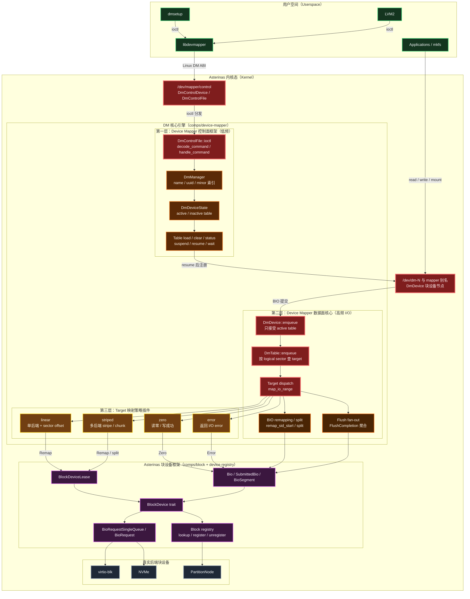

# Device Mapper 学习记录

## DM 项目分层总图

这张图先按层理解整个项目：每一层只放核心结构体或关键函数，红色节点是跨层入口。



读这张图时先抓三条线：

```text
控制面：dmsetup / LVM2 -> libdevmapper -> DmControlFile::ioctl -> DmManager -> DmDevice -> DmTable
数据面：ext2 / page cache -> DmDevice -> DmTable -> DmTarget -> TargetIoAction -> Bio -> backing BlockDevice
生命周期：DmTarget -> BlockDeviceLease -> BlockDevice -> block registry
```

## `/dev/mapper/control` 注册主线

这条主线解释 `/dev/mapper/control` 如何从内核启动期注册到用户态可见。重点不是 DM table、target 或 BIO 数据面，而是 DM control 字符设备如何挂到 Asterinas 的 misc/char/devtmpfs 链路下。

### 1. first kthread 阶段

入口在 `misc::init_in_first_kthread()`。

```text
misc::init_in_first_kthread()
  -> acquire_major(MajorId::new(10))
     准备 misc 字符设备 major 10

  -> device_mapper::init_in_first_kthread()
     -> 先初始化 DM_MANAGER
        不是为了注册 control 的硬依赖，
        而是保证 control 暴露给用户态前，后端 manager 已就绪

     -> DmControlDevice::new()
        创建 DM control 字符设备对象
        绑定 DeviceId = misc major 10 + DM_CONTROL_MINOR

     -> char::register(...)
        注册到 char DEVICE_REGISTRY
        建立 DeviceId -> DmControlDevice 的映射
```

### 2. first process 阶段

`char::register(...)` 只完成设备号到设备对象的注册；真正创建 `/dev/mapper/control` 路径节点发生在 first process 阶段。

```text
char::init_in_first_process(path_resolver)
  -> collect_all()
  -> 找到 DmControlDevice
  -> device.devtmpfs_meta()
     返回 "mapper/control"

  -> add_node(DeviceType::Char, dev_id, meta, path_resolver)
     在 /dev 下创建 mapper/control 节点
```

### 3. 阶段结论

最终效果是：

```text
/dev/mapper/control 出现在用户态
用户态 dmsetup 可以 open 它
后续 ioctl 会进入 DmControlFile::ioctl()
再分发到 DM 控制面逻辑
```

理解这条链路时要区分：

- `misc major 10`：给 `/dev/mapper/control` 这个 misc 字符设备使用。
- `DM_MANAGER`：control ioctl 后端依赖的全局管理器，后续管理 mapper block devices。
- `DmControlDevice`：暴露给用户态的 control 字符设备对象。
- `char::register(...)`：建立 `DeviceId -> DmControlDevice` 的内核注册表映射。
- `devtmpfs_meta()`：由 `DmControlDevice` 自己声明用户态路径 `mapper/control`。
- `add_node(...)`：根据 metadata 在 `/dev` 下创建真实路径节点。

## `dmsetup version` ioctl 主线

```text
dmsetup version
  -> libdevmapper
       准备 raw ioctl number = DM_VERSION
       准备 dm_ioctl buffer，其中 version 字段带用户态版本

  -> open("/dev/mapper/control")
  -> DmControlDevice::open()
  -> DmControlFile

  -> ioctl(fd, DM_VERSION, dm_ioctl buffer pointer)
  -> sys_ioctl 根据 fd 找到 DmControlFile
  -> DmControlFile::ioctl()

       raw ioctl number ---------> decode_command() = DM_VERSION_CMD
                                      |
                                      v
       dm_ioctl buffer pointer ---> 读取并校验 dm_ioctl buffer
                                      |
                                      v
                              validate_client_version(buffer)
                              write_version(buffer)
                              handle_command(DM_VERSION_CMD, buffer)
                                      |
                                      v
                              写回 dm_ioctl buffer

  -> dmsetup 打印 Driver version
```
