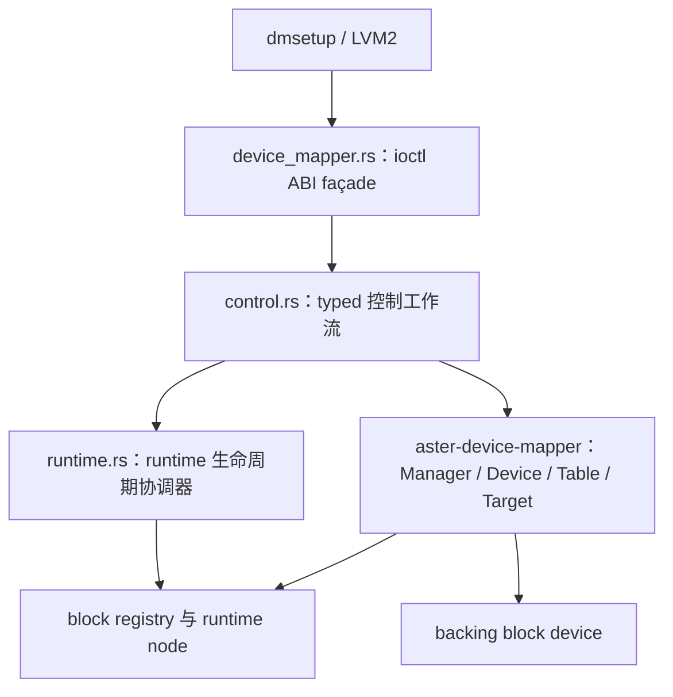

# Device Mapper 第三版优化文档

> 状态：进行中
>
> 最后核对：2026-09-17
>
> 本文记录第三版的架构收敛，不将未完成的系统验收、候选设计或后续 target 扩展写成已实现事实。第二版的 P1/P2/P3 优先级编号继续由 [device-mapper-optimization-v2.md](device-mapper-optimization-v2.md) 解释；本文使用 `V3.x` 标识第三版内的独立优化点，避免混淆。

## 1. 执行摘要

第三版的目标不是新增 Linux DM target 或扩大 ioctl ABI，而是逐步把当前已验证的生命周期事务、控制面编排和数据面 action 边界收敛为可维护的内部模块。核心约束如下：

- 保持 `dmsetup`、Linux `dm_ioctl` 布局、flags、errno、现有 target 集合与用户可见生命周期语义不变。
- 不重写已验证的 `RuntimeRenameReservation`、`InitialResumeGuard`、block registry pending token 或 runtime node 发布/注销事务。
- `aster-device-mapper` 不反向依赖 VFS、devtmpfs、raw ioctl buffer 或内核 errno；这些属于内核集成层。
- 每个优化点先通过最窄 ktest，再按影响范围串行运行一个 canonical system suite；系统验收受已知外部缺口阻断时，必须如实记录。

当前已实施 **V3.1 runtime 生命周期协调器**、**V3.1.1 低频控制面学习日志**、**V3.2.1 typed lifecycle requests**、**V3.2.2 typed table-load workflow**、**V3.2.3 typed removal workflow**、**V3.3 query snapshot**、**V3.3.1 demand-shaped query snapshot**、**V3.4 static target catalogue** 与 **V3.5 normal I/O plan/execute**。V3.1–V3.5 的定向 ktest、编译检查与各自风险范围的系统验收均已完成；V3.3.1 已修正静态 review 确认的 P2 表查询资源回退。独立的 `DM_DEV_WAIT` 修复现已完成生产 dispatch 分流、等待阶段的 lifecycle 隔离，以及仅该 ioctl 的 `EINTR → ERESTARTSYS` 映射；重建镜像后的完整 `--control-plane` 和完整 `--dataplane` 均通过。V3 当时新增的 C 级 `SA_RESTART` 回归虽通过严格编译，但完整 initramfs regression 因 TDX 依赖的外部 GitHub 下载返回 502 未能进入 guest，因此当时删除了该未完成实际验收的用例；后续 V4 focused DM 回归已重新实现并在 guest 中关闭这一缺口，见下文后续注记。

## 2. 当前架构边界

| 层次 | 职责 | 不应承担的职责 |
|---|---|---|
| `device_mapper.rs` | 用户内存 copy、`dm_ioctl` 布局/flags 校验、命令解码、target spec ABI 解析、header/record 编码和 errno 映射。 | 复制 runtime node、alias、manager reservation 或 block registry 的事务实现。 |
| `control.rs` | 接收已解码/已验证的 mutation request，编排 manager、runtime coordinator 与 `DmDevice` 提交；捕获 immutable query value snapshot，或保留内部 table generation 供 lazy record cursor 按需 materialize。 | 读取 raw ioctl buffer、编码 response header/record、解析 target spec 或持有 VFS 语义。 |
| `runtime.rs` | 编排 mapper domain state 与 runtime primary/alias/node 资源的提交顺序。 | 持有 manager/registry 状态、直接解析 raw ioctl buffer、替代 block registry 的回滚。 |
| `aster-device-mapper` | name/UUID/minor 索引、table 生命周期、BIO admission、target 语义和 mapping。 | VFS 路径解析、devtmpfs 节点操作、Linux ABI 字节格式。 |
| block registry/runtime node | pending-to-Live 发布、open gate、注销补偿与 `Removing` 隔离。 | DM table 或 ioctl 语义。 |

## 3. V3.1：runtime 生命周期协调器

### 3.1 改动清单

| 类型 | 文件 | 内容 |
|---|---|---|
| 新增 | `kernel/core/src/device/misc/device_mapper/runtime.rs` | 新增 `MapperRuntimeCoordinator`，集中 runtime primary、首次 alias 激活、runtime rename、runtime unregister 的跨层编排。 |
| 修改 | `kernel/core/src/device/misc/device_mapper.rs` | 引入协调器并替换 ioctl handler 中直接调用 runtime helper 的路径；保留 ABI façade、状态机调用与 Linux errno 映射。 |
| 删除 | 无 | 未删除任何生产文件。 |

### 3.2 改动前后

| 维度 | 改动前 | 改动后 |
|---|---|---|
| runtime 工作流归属 | primary 注册、首次 alias 发布、runtime rename、runtime unregister helper 与 ioctl handler 同处一个文件。 | 由 `MapperRuntimeCoordinator` 统一协调，ioctl handler 只选择命令工作流并处理 ABI buffer。 |
| rename 失败边界 | handler 直接编排 manager reservation 和 alias 移动。 | 协调器仍以“预留新名 → 移动 alias → commit index/name”为唯一顺序，失败时 reservation drop 释放新名。 |
| 首次 resume 边界 | handler 直接持有 `InitialResumeGuard` 并发布 alias。 | 协调器在 guard 持锁范围内发布 alias；只有成功后才 `commit` active table 和 postponed BIO replay。 |
| remove 边界 | handler 直接判断 primary 是否注册并调用 runtime unregister。 | 协调器只请求底层注销；block registry 继续独占补偿、`Removing` 隔离与重试语义。 |
| ABI 行为 | `dm_ioctl` decode/encode、header、flags、errno 和 target spec 解析在原文件。 | 保持不变，未移动至协调器。 |

### 3.3 必须保持的不变量

1. 首次 `DM_TABLE_LOAD` 成功后，`/dev/dm-N` 已发布，但 mapper alias 尚未发布，table 仍在 inactive slot。
2. 首次 resume 必须先成功发布 `/dev/mapper/<name>`，再将 inactive table 原子切换为 active；alias 失败时不得产生 backing I/O，后续 resume 可以重试。
3. runtime rename 失败时，旧 name、UUID index、`DmDevice.name` 和旧 alias 必须保持一致；新 name 必须再次可用。
4. runtime remove 无法恢复时，底层 registry 必须维持 `Removing` 隔离，不能重新暴露残缺的可打开 runtime device。
5. 不得在持有 manager 全局锁时执行 devtmpfs 或 block registry 工作；每 mapper lifecycle mutation 继续沿用 per-device lifecycle guard。

### 3.4 验证事实

| 验证类型 | 命令/范围 | 结果 | 证明范围 |
|---|---|---|---|
| 格式与差异 | `rustfmt --edition 2024 --check`、`git diff --check` | 通过 | 本次两个 Rust 文件格式正确，无 whitespace error。 |
| 编译 | 容器内离线 `aster-core` ktest 构建 | 通过 | 新模块的 trait import、可见性和测试注入接口可成功编译。 |
| ktest | `initial_alias_publication_failure_keeps_table_inactive` | 通过 | alias 发布失败仍保留 inactive table。 |
| ktest | `rename_runtime` 过滤的成功、同名拒绝、alias 失败回滚用例 | 通过 | reservation 和 manager/device name 回滚语义未改变。 |
| ktest | `primary_node_creation_failure_keeps_first_table_unpublished` | 通过 | primary node 发布失败不安装或暴露首 table。 |
| 系统验收 | `GUEST_READY_TIMEOUT=40 GUEST_QEMU_TIMEOUT=180 myshell/run_dm_system_tests.sh --control-plane` | 历史阻断，后续已解除 | 当时 guest 29 秒 ready、56 秒退出；步骤 1–8 通过，步骤 9 的 `dmsetup wait` 触发既有 `DM_DEV_WAIT` 分派 panic。这不是 V3.1 引入的问题；独立修复后，重建镜像的完整 `--control-plane` 已通过。 |

### 3.5 历史阻断与后续独立修复

V3.1 验证时，`decode_command()` 虽接受 `DM_DEV_WAIT_CMD`，通用 `handle_command()` 却会执行 `unreachable!()`，已有 `device_wait()` helper 未接入生产 dispatch。该问题早于 V3.1，后续作为独立修复处理，未混入 V3.1–V3.5 的架构收敛范围。

独立修复已完成：

- `DM_DEV_WAIT` 在 ioctl façade 中于通用 command dispatch 前分流，等待阶段不持有 mapper lifecycle guard。
- event 变化后获取 lifecycle guard，复核 manager current-`Arc` 与 `Removing` 状态，再回写当前 header。
- 仅将该可中断 wait 的 `EINTR` 映射为 `ERESTARTSYS`，保留其他 ioctl 与其他 errno 的原有语义。
- 新增的 Rust ioctl ktest `device_wait_maps_interrupt_to_restartsys` 通过；重建镜像后的完整 `--control-plane` 通过。

真实用户态 `SA_RESTART` 信号回归曾实现为 C 测试，但完整 initramfs regression 在打包 TDX 依赖时受外部 GitHub 下载 `qgs_msg_lib.cpp` 返回 502 阻断，无法进入 guest；该用例已删除，不将其执行结果记为已验证。

### 3.6 V3.1.1：低频控制面学习日志

#### 改动清单

| 类型 | 文件 | 内容 |
|---|---|---|
| 修改 | `kernel/core/src/device/misc/device_mapper.rs` | 将旧 normal-path `info!` 收敛为默认 `LOG_LEVEL=error` 可见的 `[dm-debug]` ioctl begin/header/done 和控制提交摘要；新增命令 ID 到稳定 Linux DM 名称的映射。 |
| 修改 | `kernel/core/comps/device-mapper/src/lib.rs` | 在子模块声明前定义 OSTD 日志 prefix，允许 core 组件使用日志宏。 |
| 修改 | `kernel/core/comps/device-mapper/src/device.rs` | 在 table/phase/event/postponed BIO 的真实状态提交后输出摘要，不进入 BIO 数据面。 |
| 修改 | `todo/gdb.md` | 记录 marker、前置 `DM_VERSION`、GDB 与日志的工具边界。 |
| 修改 | `log/weekly/2026-W38.md` | 将本周低频日志作为学习例外记录，并写入实测观察。 |
| 删除 | 无 | 未删除生产文件。 |

#### 改动前后

| 维度 | 改动前 | 改动后 |
|---|---|---|
| 默认控制台可见性 | 正常 DM `info!` 在 `LOG_LEVEL=error` 下不可见；学习单条控制路径通常需先进入 GDB。 | 仅 DM 控制 ioctl 在默认级别输出短 `[dm-debug]` begin/header/done，命令名直接显示为 `DM_VERSION`、`DM_TABLE_LOAD` 等。 |
| 生命周期证据 | ioctl handler 与 `DmDevice` 的状态提交没有同一控制台中的低频关联。 | 控制层记录命令/ABI 与资源提交；core 记录 inactive table、initial resume、suspend/resume、event 或 postponed BIO 的实际状态提交。 |
| 数据面影响 | 无专门学习日志，但没有明确机制防止日志误扩散。 | 未改 `enqueue`、target map、BIO split/completion 或 flush；zero mapper Read/Write 的 marker 区间实测没有 `[dm-debug]`。 |
| 预期 errno | 只能从用户态输出或 GDB 观察。 | 同一 ioctl 的 done 记录 errno；不输出 UUID、用户 buffer 指针、完整 target 参数或 block registry 列表。 |

#### 验证事实

| 验证类型 | 命令/范围 | 结果 | 证明范围 |
|---|---|---|---|
| 格式/差异 | 本次 Rust 文件 `rustfmt --config skip_children=true --check`、`git diff --check` | 通过 | 新日志文件格式正确；未覆盖 `table.rs` 的既有格式差异。 |
| ioctl ktest | `validates_ioctl_encoding_and_alignment` | 通过 | command ID 到学习日志名称的映射与既有 ioctl 编码约束并存。 |
| core ktest | load/resume、首次 activation、running replacement、noflush replay 定向用例 | 通过 | 跨 crate 日志 prefix 与新增状态提交日志不改变核心状态机。 |
| 调试镜像 | `make nixos RELEASE=0 LOG_LEVEL=error` | 通过 | 产物带 `.debug_info`、`.debug_line`、`.symtab`，且默认 error 日志可见。 |
| guest 命令观察 | `version`、`targets`、zero create/load/resume/suspend/clear/remove、未知 mapper 查询 | 通过 | 启动到首个 marker 前无新增 `[dm-debug]`；`targets` 实测为 `DM_VERSION → DM_LIST_VERSIONS`；zero 生命周期的控制和状态提交均可关联。 |
| 数据面静默断言 | zero mapper Read/Write 的 `DM_CMD_BEGIN/END zero-io` 区间 | 通过 | 区间内没有 `[dm-debug]`，没有逐 BIO 日志。 |

边界：本项验证当时 `DM_DEV_WAIT` 仍在既有 dispatch 异常处中断，故不以完整 `--control-plane` suite 作为本项完成条件。该独立问题现已修复，重建镜像后的完整 `--control-plane` 已通过；这不改变 V3.1.1 的日志验证边界。

## 4. V3.2.1：typed lifecycle requests

### 改动清单

| 类型 | 文件 | 内容 |
|---|---|---|
| 新增 | `kernel/core/src/device/misc/device_mapper/control.rs` | 新增 `ControlWorkflow`、`CreateRequest`、`RenameRequest`、`LifecycleRequest` 和 `LifecycleOutcome`；只接受已解析的控制面请求。 |
| 修改 | `kernel/core/src/device/misc/device_mapper.rs` | façade 继续解析 raw `dm_ioctl` buffer、保持 lifecycle guard 与 header 编码；create、rename、suspend/resume、clear 改为构造 request 并调用 workflow。 |
| 删除 | 无 | 未删除生产文件。 |

### 改动前后

| 维度 | 改动前 | 改动后 |
|---|---|---|
| handler 职责 | create、rename、suspend/resume、clear 各自在 ABI handler 内直接读取 flags/字符串后编排 `DmManager`、runtime publisher 和 `DmDevice`。 | façade 仅将 ABI 字段解码为 typed request；`ControlWorkflow` 集中执行对应 domain/runtime 工作流。 |
| lifecycle 锁与 ABI 回写 | handler 在 per-device lifecycle guard 内同时编排状态机并填充 response header。 | guard 与 header 回写仍保留在 façade，确保 current-`Arc` 复核和用户可见 response 时序不变；workflow 只执行已受 guard 保护的 mutation。 |
| runtime 事务 | rename/首次 resume 各处直接选择 `MapperRuntimeCoordinator` 逻辑。 | workflow 复用 V3.1 协调器；不重写 reservation、initial guard 或 block registry transaction。 |
| 本次边界 | table-load 的 target spec/backing 解析、remove/remove-all 的注销隔离与 raw query/record 编码同样混在本文件。 | 仍不迁移这些高风险路径；它们留待后续 V3.2 子项。 |

### 必须保持的不变量

1. `dm_ioctl` layout、flags、selector 优先级、errno 和 header 编码保持不变。
2. 在持 lifecycle guard 后继续复核 manager 是否拥有同一 `Arc`；workflow 不得绕过这条 stale-device 防线。
3. runtime rename 继续遵循 reservation → alias move → manager index/name commit；失败时旧 alias/index/name 保持一致。
4. 首次 resume 继续在 alias 发布成功后才提交 inactive → active；running replacement 与 noflush 的 `DmDevice` 状态机保持不变。
5. table-load、remove/remove-all、`DM_DEV_WAIT` 不因本项改变行为或归属。

### 验证事实

| 验证类型 | 命令/范围 | 结果 | 证明范围 |
|---|---|---|---|
| 格式/差异 | 新增 `control.rs` 与 façade `rustfmt --config skip_children=true --check`、`git diff --check` | 通过 | 模块格式正确，无 whitespace error。 |
| ioctl ktest | create readonly、rename/UUID、runtime rename rollback、resume active/inactive replacement、lifecycle guard drain filters | 通过 | request 构造、workflow 调用和原有 lifecycle 失败/并发边界共同编译并通过。 |
| 调试镜像 | `make nixos RELEASE=0 LOG_LEVEL=error` | 通过 | guest 包含 V3.2.1 workflow。 |
| guest 窄验收 | `dmsetup version`、`targets`、zero `create --notable → load → resume → info → suspend → clear → remove` | 通过 | guest 输出 `V32_GUEST_PASS`；`info` 显示 `LIVE`；create/load/resume/suspend/clear/remove 的 ioctl done 均为 status 0。 |

本项的窄验收当时仍受独立 `DM_DEV_WAIT` panic 阻断，不能替代完整 suite 对 wait/后续步骤的证明。该独立问题现已修复，重建镜像后的完整 `--control-plane` 已通过。

## 5. V3.2.2：typed table-load workflow

### 改动清单

| 类型 | 文件 | 内容 |
|---|---|---|
| 修改 | `kernel/core/src/device/misc/device_mapper/control.rs` | 新增 `TableLoadRequest`；`ControlWorkflow` 接收已验证的 `DmTable` 与 readonly 意图，在 primary 发布后提交 device state。 |
| 修改 | `kernel/core/src/device/misc/device_mapper.rs` | 将 raw target spec/backing 解析收敛为 `parse_table_load_request()`；façade 保留 lifecycle guard 和 header 回写，改为调用 workflow。 |
| 修改 | `log/device-mapper-optimization-v3.md` | 归档 V3.2.2 的职责边界、失败原子性与验证事实。 |
| 删除 | 无 | 未删除生产文件。 |

### 改动前后

| 维度 | 改动前 | 改动后 |
|---|---|---|
| `DM_TABLE_LOAD` 编排 | handler 从 raw buffer 解析 target、构造 `DmTable` 后，直接发布 primary、设置 readonly、安装 inactive table 并回写 header。 | façade 只解析并创建 `TableLoadRequest`；workflow 统一执行 primary 发布 → readonly → inactive table 安装；header 回写仍由 façade 完成。 |
| 失败原子性 | 顺序正确但提交逻辑与 ABI 解析同处一个函数，测试注入点也在 handler。 | 所有 parser/table 校验仍在 runtime effect 前完成；workflow 的 injectable primary publisher 验证失败时 readonly、table slot 与 block registration 均不改变。 |
| runtime 复用 | handler 直接选择 primary 注册 helper。 | workflow 通过 V3.1 `MapperRuntimeCoordinator::ensure_primary()` 复用 pending-to-Live 发布事务；已注册 primary 保持幂等。 |
| ABI 边界 | target parsing、state commit 与 response encoding 同处 façade。 | raw target spec、backing token/lease、Linux errno 和 response header 仍不离开 façade；`control.rs` 不接触 raw ioctl buffer。 |

### 必须保持的不变量

1. target spec 或 `DmTable` 校验失败时，不得发布 primary，也不得改变 readonly、active 或 inactive table。
2. primary 发布失败时，readonly 和 inactive table 必须保持加载前状态；后续同一 mapper 的 `DM_TABLE_LOAD` 可以重试。
3. primary 发布成功后才允许设置 readonly 或安装 inactive table；已有 primary 的后续 load 不重复注册 runtime node。
4. per-device lifecycle guard、current-`Arc` 复核、response header 编码和 target/backing ABI 解析继续留在 ioctl façade。
5. 不改变 target parser、backing resolver、remove/remove-all、event 语义或 `DM_DEV_WAIT` 分派。

### 验证事实

| 验证类型 | 命令/范围 | 结果 | 证明范围 |
|---|---|---|---|
| 格式/差异 | `rustfmt --edition 2024 --config skip_children=true`、`git diff --check` | 通过 | 本阶段 Rust 文件格式正确，无 whitespace error。 |
| ktest | `primary_node_creation_failure_keeps_first_table_unpublished` | 通过 | 注入 primary node 创建失败后，primary 未注册，readonly 与 active/inactive table 保持原状态。 |
| ktest | `table_load_with_readonly_flag_marks_device_readonly` | 通过 | 成功发布后 readonly flag、inactive table 和 ioctl response flags 保持原语义。 |
| ktest | `loads_single_zero_target_through_ioctl` | 通过 | raw `dm_target_spec` 仍能解析为 zero `DmTable` 并安装到 inactive slot。 |
| 调试镜像 | `make nixos RELEASE=0 LOG_LEVEL=error` | 通过 | guest 包含 V3.2.2 workflow。 |
| guest 窄验收 | `dmsetup version`、`targets`、zero `create --notable → load → resume → info → suspend → clear → remove` | 通过 | 输出 `V322_GUEST_PASS`；`DM_TABLE_LOAD` 显示 primary 已注册和 inactive table 已安装；`info` 显示 `LIVE`，关键 ioctl 均为 status 0。 |

本项的窄验收当时仍受独立 `DM_DEV_WAIT` panic 阻断，不能替代完整 suite 对 wait/后续步骤的证明。该独立问题现已修复，重建镜像后的完整 `--control-plane` 已通过。

## 6. V3.2.3：typed removal workflow

### 改动清单

| 类型 | 文件 | 内容 |
|---|---|---|
| 修改 | `kernel/core/src/device/misc/device_mapper/control.rs` | 新增 `RemoveAllRequest`、`RemoveAllOutcome` 和单设备/remove-all workflow；保持 runtime 注销在 event 与 manager detach 之前。 |
| 修改 | `kernel/core/src/device/misc/device_mapper.rs` | façade 保留 lookup 与 per-device lifecycle guard；single remove 改为调用 workflow，remove-all 改为传入 mapper snapshot 并接收聚合 outcome。 |
| 修改 | `myshell/run_dm_control_plane_test.sh` | 新增受校验的 `DM_CONTROL_PLANE_SKIP_WAIT` 测试模式；仅跳过 `dmsetup wait` 断言，保留状态转换、rename、UUID、busy 与 remove-all 测试。 |
| 新增 | `myshell/run_dm_control_plane_non_wait_test.sh` | 显式设置 non-wait 测试模式并转发调用参数。 |
| 修改 | `myshell/run_dm_system_tests.sh` | 注册 `--control-plane-non-wait` suite，避免将非 wait 回归表述为完整控制面验收。 |
| 修改 | `log/device-mapper-optimization-v3.md` | 归档 V3.2.3 的职责边界与验证事实。 |
| 删除 | 无 | 未删除生产文件。 |

### 改动前后

| 维度 | 改动前 | 改动后 |
|---|---|---|
| 单设备 remove | ioctl handler 直接执行 runtime unregister → postponed BIO fail → event publish → manager detach。 | `ControlWorkflow::remove()` 统一执行同一顺序；façade 仍持 lifecycle guard、记录日志并回写 header。 |
| 注销失败 | handler 中的 early return 隐含保证后续状态不变。 | `remove_with_unregistration()` 显式将 runtime 注销设为 event/detach 前唯一可失败步骤；失败时 mapper state、event 和 manager index 保持不变。 |
| remove-all | façade 手写 snapshot 遍历、best-effort 忽略和计数。 | `RemoveAllRequest` 表达已捕获 snapshot，workflow 返回 `RemoveAllOutcome`；façade 只提供每设备 guard/current-`Arc` 复核。 |
| 系统回归 | 历史上完整控制面脚本在 `DM_DEV_WAIT` panic 后无法覆盖后续 rename、busy、remove-all。 | 新 suite 仅跳过 wait assertions，仍在真实内核/guest 中执行剩余控制面路径，并明确标记为 non-wait；后续独立修复后完整 `--control-plane` 已通过。 |

### 必须保持的不变量

1. runtime 注销失败时，不得 fail postponed BIO、发布 event 或从 manager detach mapper；`Removing` 隔离与 retry 继续由底层 block registry 独占。
2. 单设备 remove 继续在 per-device lifecycle guard 和 current-`Arc` 复核后执行；不允许 stale lookup 修改已 detach 的 mapper。
3. `DM_REMOVE_ALL` 继续从 snapshot 逐设备 best-effort 执行：失败项保留，其他 mapper 继续尝试移除，ioctl 本身仍成功返回。
4. non-wait suite 不修改、不注释、不模拟生产 `DM_DEV_WAIT`；只跳过其用户态 wait 断言，因此不将该 suite 当作 wait 语义的证明。
5. default `--control-plane` 保持原样；wait 修复后仍必须运行它取得完整控制面回归证据。

### 验证事实

| 验证类型 | 命令/范围 | 结果 | 证明范围 |
|---|---|---|---|
| 格式/脚本 | `rustfmt --config skip_children=true --check`、`bash -n`、`git diff --check` | 通过 | Rust 格式、三份测试脚本语法和补丁 whitespace 正确。 |
| ktest | `remove_unregistration_failure_preserves_device_state` | 通过 | 注入 runtime 注销失败后，mapper index、event 与 device state 保持不变。 |
| ktest | `remove_detaches_current_device_after_runtime_unregistration` | 通过 | 成功注销后 mapper 从 manager detach，并仅发布一次 event。 |
| ktest | `remove_all_retains_failed_devices_and_continues_snapshot` | 通过 | 一个 mapper 失败时 retained，后续 snapshot mapper 仍被移除，outcome 统计正确。 |
| 调试镜像 | `make nixos RELEASE=0 LOG_LEVEL=error` | 通过 | 最终重试后完成包含 V3.2.3 的 NixOS 镜像构建。 |
| 系统回归 | 独立 `v323-*` 测试盘上的 `--control-plane-non-wait` | 通过 | guest 30 秒 ready、82 秒正常退出；`CHECK_PASS` 覆盖 suspend/resume、rename/UUID、readonly/busy、remove/remove-all，`SUMMARY_GAP_DM_CONTROL_PLANE: 0`，并输出 `HOST_PASS_DM_SYSTEM_TESTS --control-plane-non-wait`。 |

本项的 non-wait suite 是在独立 `DM_DEV_WAIT` panic 仍存在时取得的范围内证据，不替代完整 wait 验证；后续独立修复后，完整 `--control-plane` 已通过。

## 7. V3.3：query snapshot

### 改动清单

| 类型 | 文件 | 内容 |
|---|---|---|
| 修改 | `kernel/core/src/device/misc/device_mapper/control.rs` | 新增 `QueryWorkflow`、device/table/target/version snapshot 与 table query request；snapshot 只保存值，不暴露 `DmTable` 或 target trait object。 |
| 修改 | `kernel/core/src/device/misc/device_mapper.rs` | status、deps、table-status、list-devices、list-versions 和 get-target-version 改为 snapshot 后编码；header 编码接收 device snapshot。 |
| 修改 | `log/device-mapper-optimization-v3.md` | 归档 V3.3 的职责边界与验证事实。 |
| 删除 | 无 | 未删除生产文件。 |

### 改动前后

| 维度 | 改动前 | 改动后 |
|---|---|---|
| device/table 查询 | ioctl handler 在编码 header/records 的同时多次读取 `DmDevice`、`DmTable` 与 target trait object。 | `QueryWorkflow` 先分离 device/table 领域读取与 ABI 编码；V3.3.1 将 count、deps 和 records 收敛为按需 snapshot/cursor。 |
| target 参数 | 初始 `DM_TABLE_STATUS` snapshot 在 encoder 前预先生成所有 target 的 params。 | V3.3.1 改为 lazy cursor，在 façade 确认可写入前后每次只 materialize 当前 target；encoder 不直接访问 target trait object。 |
| list/version 查询 | façade 直接遍历 manager device 与静态 target catalogue，并在循环中读取 identity/status。 | runtime visibility filter 仍在 façade；可见 device 与 target-version 值先转为 snapshot，再编码 name-list/version records。 |
| header 编码 | `fill_device_header()` 直接读取 name、UUID 与 lifecycle status。 | `QueryWorkflow::device()` 捕获领域状态；façade 仅补充 runtime open count、flags、固定宽度字符串与 padding。 |

### 必须保持的不变量

1. `DeviceSnapshot`、count/deps snapshot 与已产出的 `TargetSnapshot` 不得保存 `DmTarget` trait object 或借用 target 参数；lazy record cursor 可在内部保留 selected table 的 `Arc`，但不得向 façade 暴露它，后续 table mutation 不得改变 cursor 已选 generation。
2. `DM_QUERY_INACTIVE_TABLE_FLAG`、`DM_STATUS_TABLE_FLAG` 的选择仍由 façade 解码，并原样传给 query request。
3. `next` offset、8-byte 对齐、short buffer 的 `DM_BUFFER_FULL_FLAG`、C-string 字节布局和 record 顺序继续由 façade 独占。
4. 仍由 façade 判断 runtime `Removing` 可见性、查询 errno、open count 和 raw ABI 边界；query workflow 不接触 VFS、devtmpfs 或 ioctl buffer。
5. 不改变 target catalogue 的名称/版本/顺序、lifecycle mutation、`DM_DEV_WAIT` 或数据面。

### 验证事实

| 验证类型 | 命令/范围 | 结果 | 证明范围 |
|---|---|---|---|
| 格式/差异 | `rustfmt --config skip_children=true --check`、`git diff --check` | 通过 | V3.3 Rust 文件格式正确，无 whitespace error。 |
| ktest | `table_query_snapshot_remains_stable_after_table_mutation` | 通过 | 清除 inactive table 后，已捕获的 table snapshot 仍含原始 header、target range/name/params。 |
| ktest | `reports_three_table_status_records_with_linux_next_offsets` | 通过 | snapshot 编码保持三条 table-status record 的字段与 `next` offset。 |
| ktest | `lists_devices_with_linux_next_offsets_and_uuid_flags` | 通过 | device snapshot 保持 name-list 顺序、UUID extension、event number 和 next offset。 |
| ktest | `lists_error_linear_striped_and_zero_target_versions` | 通过 | target-version snapshot 保持四种 target 的顺序、名称和版本。 |
| ktest | `marks_short_output_buffers_without_overwriting_records` | 通过 | snapshot encoder 保持 buffer-full 与不覆盖已有输出区的语义。 |
| 调试镜像 | `make nixos RELEASE=0 LOG_LEVEL=error` | 通过 | 最终镜像包含 V3.3 query workflow。 |
| 系统回归 | 独立 `v33-*` 测试盘上的 `--control-plane-non-wait` | 通过 | guest 35 秒 ready、85 秒正常退出；输出 `CHECK_SKIP_DMSETUP_WAIT`、全部后续 `CHECK_PASS`、`SUMMARY_GAP_DM_CONTROL_PLANE: 0` 和 `HOST_PASS_DM_SYSTEM_TESTS --control-plane-non-wait`。 |

本项的 non-wait suite 是在独立 `DM_DEV_WAIT` panic 仍存在时取得的范围内证据，不替代完整 wait 验证；后续独立修复后，完整 `--control-plane` 已通过。

## 8. V3.3.1：demand-shaped query snapshot

### 评审修复

静态 review 确认 V3.3 初版存在 P2 资源回退：`DM_DEV_STATUS` 为获得 count 无条件构造全部 target/deps snapshot，`DM_TABLE_STATUS` 即使短 buffer 也预格式化全部 target params。本项接受该结论并只修正 snapshot 粒度，不改变 ioctl ABI、target 语义或 query 可见结果。

### 改动清单

| 类型 | 文件 | 内容 |
|---|---|---|
| 修改 | `kernel/core/src/device/misc/device_mapper/control.rs` | 将统一 `TableSnapshot` 拆为 count-only `TableMetadataSnapshot`、deps-only `TableDepsSnapshot` 与 lazy `TableRecordCursor`。 |
| 修改 | `kernel/core/src/device/misc/device_mapper.rs` | status 只读取 `target_count()`；deps 只收集 backing IDs；table-status 逐条 materialize/编码 target record，满 buffer 后停止。 |
| 修改 | `log/device-mapper-optimization-v3.md` | 记录 P2 评审结论、修复边界与验证证据。 |
| 删除 | 无 | 未删除生产文件。 |

### 改动前后

| 维度 | 修复前 | 修复后 |
|---|---|---|
| `DM_DEV_STATUS` | 无条件遍历全部 target、分配 target snapshot、收集无用 deps。 | 仅获取 selected table 的 `target_count()`，不遍历 target、不分配 target snapshot。 |
| `DM_TABLE_DEPS` | 同时构造未使用的 target records。 | 仅收集去重后的 backing IDs。 |
| `DM_TABLE_STATUS` | 预先格式化所有 `status_params()`，随后才按 ABI buffer 容量停止编码。 | `TableRecordCursor` 每次只格式化当前 target；当前 record 放不下时立即置 `DM_BUFFER_FULL_FLAG` 并返回，不格式化后续 target。 |
| generation 保活 | 完整 snapshot 不需要保留 selected table。 | cursor 内部持 `Arc<DmTable>` 至查询结束，确保 lazy records 从同一 table generation 读取；façade 不获得该 `Arc`。 |

### 必须保持的不变量

1. `DM_DEV_STATUS` 的 selected active/inactive table、header flags、target count 与 errno 保持原 ABI。
2. `DM_TABLE_DEPS` 的 first-seen backing 顺序、去重、buffer-full 与 short output 语义保持原 ABI。
3. `DM_TABLE_STATUS` 的 target 顺序、range/name/params、`next`、对齐与 buffer-full 语义保持原 ABI；最多只多格式化当前无法写入的一条 record，绝不格式化其后 target。
4. cursor 只能从已 clone 的 selected `Arc<DmTable>` 按 index materialize record；它不跨 ioctl 保存，也不触及 VFS、runtime registry 或 lifecycle mutation。
5. 不改变 `DM_DEV_WAIT`、target catalogue、控制工作流、数据面或日志策略。

### 验证事实

| 验证类型 | 命令/范围 | 结果 | 证明范围 |
|---|---|---|---|
| 格式/差异 | `rustfmt --config skip_children=true --check`、`git diff --check` | 通过 | 两个 Rust 文件格式正确，无 whitespace error。 |
| ktest | `table_record_cursor_remains_stable_after_table_mutation` | 通过 | cursor 在 table mutation 后仍从已选 generation 返回 detached target record。 |
| ktest | `reports_status_target_count_for_selected_table` | 通过 | count-only status 保持 active/inactive selector 的用户可见 count。 |
| ktest | `reports_table_deps_from_mixed_linear_and_striped_targets` | 通过 | deps-only query 保持 mixed table backing IDs 与顺序。 |
| ktest | `reports_three_table_status_records_with_linux_next_offsets` | 通过 | lazy records 保持 target status record 字段与 `next` offset。 |
| ktest | `table_status_stops_materializing_records_at_full_output_buffer` | 通过 | 两条 target、无 record 输出空间时仅调用首条 `status_params()`，直接覆盖 review P2 短 buffer 回退。 |
| 调试镜像 | `make nixos RELEASE=0 LOG_LEVEL=error` | 通过 | 最终镜像包含 demand-shaped query snapshot。 |
| 系统回归 | 独立 `v331-*` 测试盘上的 `--control-plane-non-wait` | 通过 | guest 51 秒 ready、105 秒正常退出；输出 `CHECK_SKIP_DMSETUP_WAIT`、全部后续 `CHECK_PASS`、`SUMMARY_GAP_DM_CONTROL_PLANE: 0` 和 `HOST_PASS_DM_SYSTEM_TESTS --control-plane-non-wait`。 |

静态 review 的唯一 P2 已关闭。本项 non-wait suite 是在独立 `DM_DEV_WAIT` panic 仍存在时取得的范围内证据，不替代完整 wait 验证；后续独立修复后，完整 `--control-plane` 已通过。

## 9. V3.4：static target catalogue

### 改动清单

| 类型 | 文件 | 内容 |
|---|---|---|
| 修改 | `kernel/core/comps/device-mapper/src/target/mod.rs` | 新增 `TargetCatalogEntry` 与有序 `TARGET_CATALOG`；每项绑定 Linux metadata 和 parser kind，`parse_target_with()` 改为 catalogue lookup 后 dispatch。 |
| 修改 | `kernel/core/src/device/misc/device_mapper/control.rs` | target-version snapshot 从 `TARGET_CATALOG` 捕获发现顺序、名称与版本。 |
| 修改 | `log/device-mapper-optimization-v3.md` | 归档 V3.4 的 catalogue 边界与验证事实。 |
| 删除 | 无 | 未删除生产文件。 |

### 改动前后

| 维度 | 改动前 | 改动后 |
|---|---|---|
| target discovery | `SUPPORTED_TARGETS` 只存 metadata；table-load parser 另有按字符串 `match` 的 factory dispatch。 | `TARGET_CATALOG` 的每项同时保存 metadata 和 parser kind，查询与解析使用同一有序声明。 |
| target-version 查询 | 查询层直接遍历 metadata slice。 | `QueryWorkflow` 遍历 catalogue entry，名称、版本和顺序与 parser lookup 的来源一致。 |
| parser 选择 | `parse_target_with()` 内部维护独立的 target name string match。 | 先在 catalogue 按名称查 entry，再由 entry kind 调用已有 error/linear/striped/zero parser。 |
| backing 边界 | parser dispatch 接收 façade 注入的 token parser 和 lease resolver。 | 签名与调用位置不变；catalogue 只选择 target parser，不依赖 VFS、registry 或 runtime lease 细节。 |

### 必须保持的不变量

1. `error`、`linear`、`striped`、`zero` 的发现顺序、名称和版本分别保持 `1.6.0`、`1.4.0`、`1.6.0`、`1.1.0`。
2. `parse_target_with()` 的 public signature、`DmTargetParseError` 分类和 caller-owned backing token/lease hooks 保持不变。
3. 每个 target 仍独占参数语法、geometry 和 backing capacity 验证；catalogue 不实现或复制这些规则。
4. 未知名称仍返回 `UnsupportedTarget`，target-version ioctl 仍由 façade 映射为 Linux `EINVAL`。
5. 不新增 target、不引入动态注册、不改变 target I/O mapping、query ABI 或 `DM_DEV_WAIT`。

### 验证事实

| 验证类型 | 命令/范围 | 结果 | 证明范围 |
|---|---|---|---|
| 格式/差异 | `rustfmt --config skip_children=true`、`git diff --check` | 通过 | V3.4 Rust 文件格式正确，无 whitespace error。 |
| core ktest | `target_catalogue_preserves_linux_discovery_order` | 通过 | catalogue 导出的四项名称、版本和顺序保持 Linux-visible discovery ABI。 |
| core ktest | `parses_targets_before_resolving_backings` | 通过 | catalogue dispatch 后 linear/striped 的 backing token/lease 解析时序未改变。 |
| core ktest | `validates_target_type_and_parameter_shapes` | 通过 | error/zero/linear/striped 参数错误与未知 target 的错误分类不变。 |
| ioctl ktest | `lists_error_linear_striped_and_zero_target_versions` | 通过 | catalogue 驱动的 target-version records 保持名称、版本、顺序和 next layout。 |
| 调试镜像 | `make nixos RELEASE=0 LOG_LEVEL=error` | 通过 | 最终镜像包含 V3.4 catalogue。 |
| 系统回归 | 独立 `v34-*` 测试盘上的 `--control-plane-non-wait` | 通过 | guest 30 秒 ready、81 秒正常退出；输出 `CHECK_SKIP_DMSETUP_WAIT`、全部后续 `CHECK_PASS`、`SUMMARY_GAP_DM_CONTROL_PLANE: 0` 和 `HOST_PASS_DM_SYSTEM_TESTS --control-plane-non-wait`。 |

本项的 non-wait suite 是在独立 `DM_DEV_WAIT` panic 仍存在时取得的范围内证据，不替代完整 wait 验证；后续独立修复后，完整 `--control-plane` 已通过。

## 10. V3.5：normal I/O plan/execute

### 改动清单

| 类型 | 文件 | 内容 |
|---|---|---|
| 修改 | `kernel/core/comps/device-mapper/src/table.rs` | 新增借用型 `NormalIoPlan`；将非 Flush `enqueue` 拆为 `plan_normal_io()` 与 `execute_normal_io()`，保留既有 child submission/completion 逻辑。 |
| 修改 | `log/device-mapper-optimization-v3.md` | 归档 V3.5 的数据面边界与验证事实。 |
| 删除 | 无 | 未删除生产文件。 |

### 改动前后

| 维度 | 改动前 | 改动后 |
|---|---|---|
| normal I/O 路径 | `DmTable::enqueue` 连续完成 range 计算、target/stripe mapping、单 action 或 split child 提交和 completion aggregation。 | `plan_normal_io()` 先生成 `NormalIoPlan`；`execute_normal_io()` 消费 plan 后执行原有单 action 快路径或 split/aggregation。 |
| plan 生命周期 | 映射 actions 仅作为 enqueue 内局部 `Vec`，规划/提交职责没有命名边界。 | plan 持有对 table target/backing lease 的借用，只能存活于当前 enqueue；不能跨 `DmDevice` 已分配的 table generation 保存。 |
| 错误语义 | single remap enqueue error 上返；split child remap/enqueue failure 聚合为原 BIO `IoError`。 | 执行逻辑原样保留；plan 阶段仅把 target lookup/map failure 仍映射为 `Refused`。 |
| Flush | `enqueue` 分支进入独立 fan-out/aggregate 实现。 | Flush early return 与 `enqueue_flush()` 未修改。 |

### 必须保持的不变量

1. `DmDevice` 在 assignment 后持有 table `Arc` 直至 completion，旧 generation 及其 backing lease 不得因 plan/execute 拆分而提前释放。
2. `NormalIoPlan` 不得逃逸当前 `DmTable::enqueue`，只借用 table-owned target/backing；它不持有或复制 BIO、DMA segment 或 completion state。
3. 单 action linear/striped remap、error `IoError`、zero 直完成，以及多 action split 的原 BIO 单次聚合完成必须保持不变。
4. split child 的 remap 或 enqueue failure 仍聚合为 `IoError`，不会把已接受的原 BIO 留在未完成状态。
5. Flush fan-out、postponed replay、noflush generation barrier、in-flight 计数和 suspend drain 不在本项改动范围内。

### 验证事实

| 验证类型 | 命令/范围 | 结果 | 证明范围 |
|---|---|---|---|
| 格式/差异 | `rustfmt --config skip_children=true`、`git diff --check` | 通过 | V3.5 table 文件格式正确，无 whitespace error。 |
| table ktest | `normal_io_plan_splits_at_target_boundaries_before_execution` | 通过 | 跨 linear/error target 的 BIO 在执行前生成两个正确范围的 action。 |
| table ktest | `reports_io_error_when_split_child_enqueue_fails` | 通过 | split child submit failure 仍将原 BIO 聚合为 `IoError`。 |
| table ktest | `splits_twelve_sector_write_across_four_striped_children` | 通过 | striped chunk split 保持四 child 的 remap 范围、长度与原 BIO 单次完成。 |
| table ktest | `flushes_each_backing_device_once` | 通过 | 未改的 Flush fan-out 仍对唯一 backing 各提交一次。 |
| 调试镜像 | `make nixos RELEASE=0 LOG_LEVEL=error` | 通过 | 最终镜像包含 V3.5 plan/execute 路径。 |
| 系统回归 | 独立 `v35r-*` 四盘上的 `--dataplane`，`GUEST_INPUT_LINE_DELAY=0.1` | 通过 | guest 25 秒 ready、61 秒正常退出；linear、多段 linear、striped chunk、mixed linear+striped、zero/error 与 Flush 全部输出 `CHECK_PASS`，并输出 `HOST_PASS_DM_SYSTEM_TESTS --dataplane`。 |

首次 `--dataplane` 使用默认 `0.01s` 串口行间隔时，在 mixed step 的后续 shell 输入发生字节串扰；mixed mapper 和 linear backing 已通过，随后 `md5sum` 参数损坏并使 guest 重启，最终 host lifecycle timeout。使用全新测试盘与 `0.1s` 间隔后完整通过，因此该失败记录为 guest 输入传输问题，不作为 V3.5 数据面语义失败证据。

完整 `--control-plane` 在 V3.5 验证时仍受独立 `DM_DEV_WAIT` panic 阻断；该问题不由 V3.5 改动引入。后续独立修复后，重建镜像的完整 `--control-plane` 已通过。

## 11. 第三版完成边界

第三版预定的内部架构收敛点 **V3.1–V3.5 已全部完成并按各自风险范围验证**；V3.3.1 已关闭静态 review 确认的唯一 P2 查询资源回退。runtime lifecycle coordinator、typed mutation workflow、demand-shaped query snapshot、static target catalogue 与 normal I/O plan/execute 已分别建立明确职责边界。

独立的 `DM_DEV_WAIT` 修复已解除其对完整控制面验收的历史阻断：生产 dispatch、等待期间的 lifecycle 隔离、event 后 current-`Arc`/`Removing` 重验与 `EINTR → ERESTARTSYS` 映射均已完成；重建镜像后的完整 `--control-plane` 和 `--dataplane` 均通过。

这不表示 Device Mapper 已实现完整 Linux 功能。当前明确保留：

- V3 当时的真实用户态 `SA_RESTART` 回归没有 guest 执行证据：对应 C 用例因 TDX 依赖外部下载 502 阻断而删除，不能以严格编译替代当时验收。后续于 2026-09-21 在 V4 focused `device/device_mapper` 回归中重新加入真实信号场景并通过：无 `SA_RESTART` 时保留 `EINTR` 对照；带 `SA_RESTART` 时 signal handler 已执行、原 ioctl 在事件前不返回，并在 rename 后成功返回和回填 header。该 focused ELF 共 7 个测试函数、累计 159 passed、0 failed；这是后续关闭记录，不倒改 V3 当时的历史结果，也不代表完整 initramfs regression。
- 新 target、动态 plugin registry、DM-on-DM stacking、queue-limit 主动拆分、target 查找性能重写、deferred remove 和其他未支持 ioctl 不属于第三版范围。
- 后续若开启新优化版本，应另行定义目标、用户可见不变量和对应的 canonical 验收，不将其追溯并入 V3.1–V3.5。

## 12. 阶段验收规则

- 每个 `V3.x` 只改变一个职责边界；不得把 ABI 行为修复、target 新功能和内部结构迁移混入同一个优化点。
- 先跑最窄 ktest；命中 runtime node、alias、VFS 或 dmsetup 可见行为时，再串行运行对应 system suite。
- 系统测试失败时，报告首个失败命令、所属测试类型、是否由本次改动引入，以及未能证明的行为；不得只摘取前置成功 marker 声称整套通过。
- 阶段汇报必须列出本阶段增删改文件，并以“改动前 → 改动后 → 失败/并发边界 → 验证证据”说明事实。
